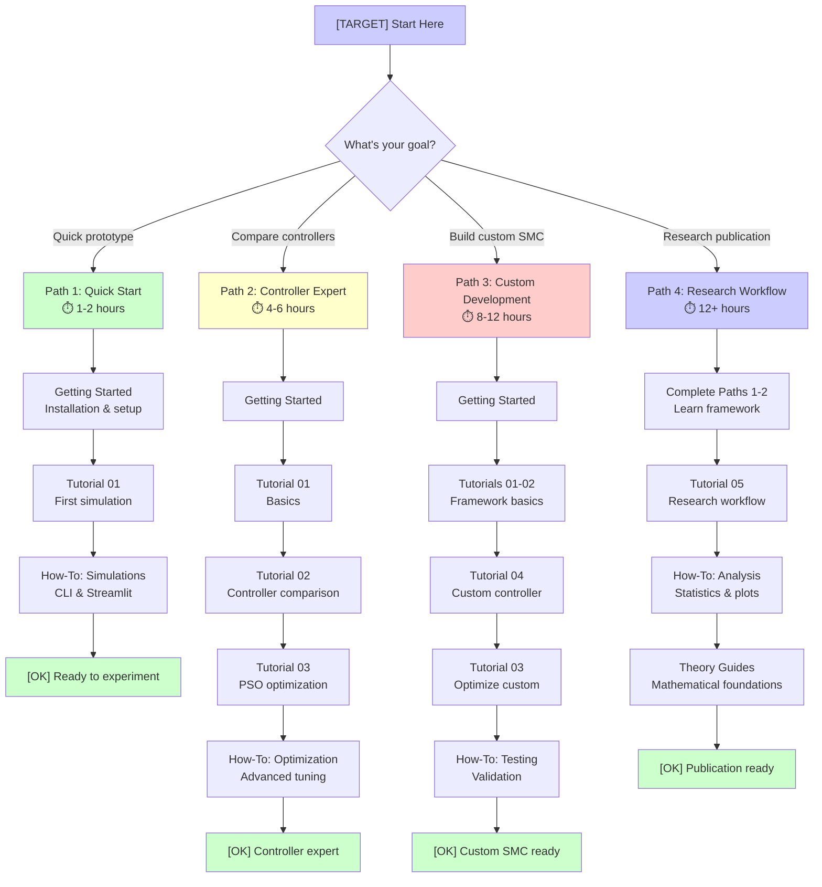

# Double-inverted Pendulum Sliding Mode Control with PSO Optimization

[](https://github.com/theSadeQ/dip-smc-pso/actions)
[](https://dip-smc-pso.readthedocs.io/)
[](https://opensource.org/licenses/MIT)
[](https://www.python.org/downloads/)

A comprehensive Python framework for simulating, controlling, and analyzing a double-inverted pendulum (DIP) system using advanced sliding mode control (SMC) techniques with Particle Swarm Optimization (PSO). This project provides a complete ecosystem for control systems research, education, and industrial applications.

## Key Features

### Advanced Control Systems
- **Multiple SMC Variants**: Classical SMC, Super-Twisting (STA), Adaptive SMC, Hybrid Adaptive STA-SMC
- **Model Predictive Control (MPC)**: Experimental MPC implementation with constraint handling
- **Swing-Up Controllers**: Specialized controllers for large-angle stabilization
- **Controller Factory**: Extensible factory pattern for easy controller instantiation

### Intelligent Optimization
- **PSO Optimization**: Multi-objective particle swarm optimization for gain tuning
- **Convergence Analysis**: Advanced convergence detection and validation
- **Parameter Bounds**: Intelligent constraint handling for realistic control parameters
- **Multi-Algorithm Support**: Framework for additional optimization algorithms

### Plant Models & Dynamics
- **Simplified Dynamics**: Fast linearized model for rapid prototyping
- **Full Nonlinear Model**: High-fidelity dynamics with coupling effects
- **Low-Rank Approximation**: Computationally efficient reduced-order model
- **Numerical Stability**: Robust handling of ill-conditioned dynamics

### High-performance Simulation
- **Vectorized Batch Simulation**: Numba-accelerated parallel execution
- **Multiple Integrators**: Adaptive and fixed-step integration schemes
- **Safety Guards**: Comprehensive constraint monitoring and violation detection
- **Real-Time Capabilities**: Hardware-in-the-loop (HIL) simulation support

### Analysis & Visualization
- **Fault Detection**: Advanced FDI (Fault Detection and Isolation) system
- **Performance Metrics**: Lyapunov stability, settling time, overshoot analysis
- **Statistical Validation**: Monte Carlo analysis, confidence intervals
- **Interactive Dashboards**: Real-time plotting and parameter adjustment

### Development & Production
- **Comprehensive Testing**: Unit, integration, property-based, and benchmark tests
- **Type Safety**: Full type hint coverage with mypy validation
- **Configuration Management**: YAML-based configuration with validation
- **Documentation**: Complete Sphinx documentation with examples

## Architecture Overview

### System Architecture


**Component Layers:**
- [BLUE] **User Interfaces**: CLI and web-based interaction
- [YELLOW] **Controllers**: SMC algorithms with factory pattern
- [GREEN] **Plant Models**: Dynamics with varying fidelity
- [RED] **Core Engine**: Simulation orchestration and execution
- [YELLOW] **Optimization**: PSO-based automated tuning
- **Infrastructure**: Configuration, monitoring, HIL support

### Control Loop Data Flow


**Control Loop Phases:**
1. **State Input**: Current system state (6D vector)
2. **Surface Computation**: Combine state errors into sliding surface `s`
3. **Control Law**: Apply SMC algorithm (classical, STA, adaptive, hybrid)
4. **Saturation**: Enforce actuator limits
5. **Dynamics Integration**: Update state via plant equations
6. **Convergence Check**: Monitor performance metrics

**Typical Loop Timing:**
- Timestep `dt`: 0.01s (100 Hz control rate)
- Simulation duration: 3-10 seconds
- Total iterations: 300-1000 steps
- Real-time capable with simplified dynamics

## Quick Start

### Prerequisites
- **Python 3.9+** (recommended: 3.11)
- **Git** for version control
- **Optional**: CUDA-capable GPU for accelerated simulations

### Installation

```bash
# Clone the Repository
git clone https://github.com/theSadeQ/dip-smc-pso.git
cd dip-smc-pso

# Install Dependencies
pip install -r requirements.txt

# Verify Installation
python simulate.py --help
```

## Verify Installation

### First Simulation

```bash
# Run a Basic Classical SMC Simulation
python simulate.py --ctrl classical_smc --plot

# Launch the Interactive Web Interface
streamlit run streamlit_app.py
```

## Usage Guide

### Command-line Interface (cli)

#### Basic Simulations
```bash
# Classical SMC with Plotting
python simulate.py --ctrl classical_smc --plot

# Super-twisting SMC with Full Dynamics
python simulate.py --ctrl sta_smc --dynamics full --plot

# Adaptive SMC with Disturbances
python simulate.py --ctrl adaptive_smc --disturbance --plot
```

## Adaptive Disturbances

### Adaptive Disturbances

#### PSO Optimization
```bash
# Optimize Classical SMC Gains
python simulate.py --ctrl classical_smc --run-pso --save gains_classical.json

# Optimize with Custom Parameters
python simulate.py --ctrl sta_smc --run-pso --particles 50 --generations 100

# Load Pre-optimized Gains
python simulate.py --load gains_classical.json --plot
```

## Load Pre Gains

### Load Pre Gains

#### Hardware-in-the-loop (hil)
```bash
# Start HIL Plant Server
python simulate.py --run-hil-server --port 8888

# Run HIL Controller Client
python simulate.py --run-hil --host localhost --port 8888
```

## Run Controller Client

### Run Controller Client

#### Batch Analysis
```bash
# Monte Carlo Analysis
python simulate.py --ctrl classical_smc --monte-carlo --runs 1000

# Statistical Validation
python simulate.py --ctrl sta_smc --statistical-analysis
```

## Statistical Validation

### Interactive Web Application

Launch the Streamlit dashboard for real-time interaction:

```bash
streamlit run streamlit_app.py
```

**Features:**
- Real-time parameter tuning
- Live performance metrics
- Animation visualization
- Comparative analysis
- Configuration export/import

### Configuration Management

```bash
# Use Custom Configuration
python simulate.py --config custom_config.yaml

# Print Current Configuration
python simulate.py --print-config

# Validate Configuration
python simulate.py --validate-config
```

## Documentation & Learning

**[CORE]** [Master Navigation Hub](docs/NAVIGATION.md) - Complete documentation mapping across all 985 files and 11 navigation systems. Start here for effortless navigation!

### Comprehensive Documentation

This project provides **12,500+ lines** of professional documentation organized into four categories:

**[DOCS] Tutorials** - Step-by-step learning paths
- Beginner to advanced progression
- Hands-on exercises with real code
- Expected results and troubleshooting

**[READ] How-To Guides** - Task-oriented recipes
- Running simulations and analyzing results
- PSO optimization workflows
- Testing and validation procedures

**[CONFIG] API Reference** - Technical documentation
- Complete module documentation
- Code examples and usage patterns
- Type signatures and parameter details

**[MATH] Theory & Explanation** - Mathematical foundations
- Sliding mode control theory
- PSO algorithm principles
- Double-inverted pendulum dynamics

### Learning Paths

Choose your path based on your goals and experience level:



### Documentation Quick Links

| Category | Document | Description | Lines | Time |
|----------|----------|-------------|-------|------|
| **[LAUNCH] Getting Started** | | | | |
| | [Getting Started](docs/guides/getting-started.md) | Installation, first simulation, web UI | 523 | 15 min |
| | [User Guide](docs/guides/user-guide.md) | Comprehensive reference manual | 826 | 30 min |
| | [Quick Reference](docs/guides/QUICK_REFERENCE.md) | Command cheat sheet | - | 5 min |
| **[DOCS] Tutorials** | | | | |
| | [Tutorial 01: First Simulation](docs/guides/tutorials/tutorial-01-first-simulation.md) | DIP system, Classical SMC, results | 600 | 45 min |
| | [Tutorial 02: Controller Comparison](docs/guides/tutorials/tutorial-02-controller-comparison.md) | Compare 4 SMC types, tradeoffs | 797 | 60 min |
| | [Tutorial 03: PSO Optimization](docs/guides/tutorials/tutorial-03-pso-optimization.md) | Auto gain tuning, convergence | 865 | 90 min |
| | [Tutorial 04: Custom Controller](docs/guides/tutorials/tutorial-04-custom-controller.md) | Terminal SMC from scratch | 784 | 120 min |
| | [Tutorial 05: Research Workflow](docs/guides/tutorials/tutorial-05-research-workflow.md) | End-to-end research project | 640 | 120 min |
| **[READ] How-To Guides** | | | | |
| | [Running Simulations](docs/guides/how-to/running-simulations.md) | CLI, Streamlit, batch processing | 619 | 20 min |
| | [Result Analysis](docs/guides/how-to/result-analysis.md) | Metrics, stats, visualization | 589 | 20 min |
| | [Optimization Workflows](docs/guides/how-to/optimization-workflows.md) | PSO tuning, custom cost functions | 724 | 25 min |
| | [Testing & Validation](docs/guides/how-to/testing-validation.md) | Test suite, benchmarks, coverage | 611 | 20 min |
| **[CONFIG] API Reference** | | | | |
| | [API Index](docs/guides/api/README.md) | Overview and navigation | 203 | 10 min |
| | [Controllers API](docs/guides/api/controllers.md) | Factory, SMC types, gain bounds | 726 | 30 min |
| | [Simulation API](docs/guides/api/simulation.md) | SimulationRunner, dynamics, batch | 517 | 25 min |
| | [Optimization API](docs/guides/api/optimization.md) | PSOTuner, cost functions | 543 | 25 min |
| | [Configuration API](docs/guides/api/configuration.md) | YAML loading and validation | 438 | 20 min |
| | [Plant Models API](docs/guides/api/plant-models.md) | Physics models, parameters | 424 | 20 min |
| | [Utilities API](docs/guides/api/utilities.md) | Validation, monitoring, analysis | 434 | 20 min |
| **[MATH] Theory** | | | | |
| | [Theory Index](docs/guides/theory/README.md) | Overview and navigation | 104 | 5 min |
| | [SMC Theory](docs/guides/theory/smc-theory.md) | Lyapunov, chattering, super-twisting | 619 | 30 min |
| | [PSO Theory](docs/guides/theory/pso-theory.md) | Swarm intelligence, convergence | 438 | 25 min |
| | [DIP Dynamics](docs/guides/theory/dip-dynamics.md) | Lagrangian, controllability | 501 | 25 min |

**Total Documentation**: 12,525 lines across 28 documents

**Navigation Hub**: See [docs/guides/INDEX.md](docs/guides/INDEX.md) for comprehensive navigation and detailed learning paths.

## Project Structure

```bash
dip-smc-pso/
├── simulate.py              # Main CLI application
├── streamlit_app.py         # Web dashboard
├── config.yaml              # Main configuration
├── requirements.txt         # Python dependencies
├── src/                     # Source code
│   ├── controllers/         # Control algorithms
│   │   ├── smc/             # SMC implementations
│   │   ├── mpc/             # Model predictive control
│   │   ├── specialized/     # Custom controllers
│   │   └── factory.py       # Controller factory
│   ├── plant/               # Plant models
│   │   ├── models/          # Dynamics implementations
│   │   └── configurations/  # Model parameters
│   ├── core/                # Simulation engine
│   │   ├── simulation_runner.py
│   │   ├── vector_sim.py    # Batch simulation
│   │   └── safety_guards.py
│   ├── optimization/        # Parameter optimization
│   │   ├── algorithms/      # PSO and others
│   │   ├── objectives/      # Cost functions
│   │   └── results/         # Analysis tools
│   ├── analysis/            # Performance analysis
│   │   ├── fault_detection/ # FDI system
│   │   ├── validation/      # Statistical tests
│   │   └── visualization/   # Plotting tools
│   ├── interfaces/          # External interfaces
│   │   ├── hil/            # Hardware-in-the-loop
│   │   ├── network/        # Communication protocols
│   │   └── monitoring/     # Performance monitoring
│   └── utils/               # Utilities
│       ├── validation/      # Parameter validation
│       ├── reproducibility/ # Seed management
│       └── types/          # Type definitions
├── tests/                   # Test suite
│   ├── test_controllers/    # Controller tests
│   ├── test_plant/         # Plant model tests
│   ├── test_simulation/    # Simulation tests
│   └── test_integration/   # End-to-end tests
├── docs/                    # Documentation
│   ├── reference/          # API documentation
│   ├── guides/             # User guides
│   ├── tutorials/          # Learning tutorials
│   │   └── notebooks/      # Jupyter notebooks (moved from root)
│   └── theory/            # Mathematical background
├── scripts/                 # Utility scripts
│   ├── research/           # Research task scripts (organized by task)
│   ├── benchmarks/         # Benchmarking scripts
│   ├── analysis/           # Analysis scripts
│   └── validation/         # Validation scripts
├── benchmarks/              # Performance benchmark data
├── optimization_results/    # PSO optimization outputs
├── config/                  # Configuration schemas
├── .artifacts/              # Hidden: Research outputs, thesis, QA audits
│   ├── thesis/             # LaTeX thesis (moved from root)
│   ├── research/           # Research papers and experiments
│   └── testing/            # Test summaries
├── .logs/                   # Hidden: Centralized logging
│   ├── monitoring/         # Monitoring system logs
│   └── pso_*.log          # PSO optimization logs
└── .project/                # Hidden: AI/dev configs (CANONICAL)
    └── dev_tools/          # Development utilities
```

## Testing

### Coverage Requirements

**MANDATORY TESTING POLICY**: All new code MUST include comprehensive testing:

#### Coverage Targets
- **Overall Project**: Minimum 85% test coverage
- **Critical Components**: Minimum 95% test coverage
  - Controllers (base classes, SMC algorithms, MPC)
  - Plant models (full, simplified, low-rank)
  - Simulation engines (integrators, orchestrators, safety)
- **Safety-Critical**: 100% test coverage REQUIRED
  - Control system safety mechanisms
  - Simulation numerical stability
  - Plant physical constraint validation

#### Test Development Workflow
1. **BEFORE coding**: Write test specifications
2. **DURING coding**: Implement tests alongside code
3. **AFTER coding**: Validate 100% of new functionality is tested
4. **CONTINUOUS**: Maintain and update tests for changes

### Running Tests

```bash
# Full Test Suite
python -m pytest

# Specific Test Categories
pytest tests/test_controllers/     # Controller tests
pytest tests/test_integration/     # Integration tests
pytest --benchmark-only            # Performance benchmarks

# Coverage Analysis
pytest --cov=src --cov-report=html

# Browser Automation Tests
python tests/browser_automation/run_tests.py --browser chromium
```

## Browser Automation Tests

### Automated Browser Testing

**NEW:** Comprehensive browser automation with Playwright + pytest

```bash
# Run Automated Browser Tests
python tests/browser_automation/run_tests.py

# Cross-browser Testing
python tests/browser_automation/run_tests.py --all-browsers

# View HTML Reports
# Open: Tests/browser_automation/artifacts/reports/report_chromium_*.html
```

**Features:**
- 17 automated tests across 7 categories
- Screenshot capture for visual verification (20+ per run)
- Performance metrics: FPS (≥43 FPS), button gaps (5-8px)
- Cross-browser support (Chromium, Firefox)
- Visual regression testing with baseline comparison
- CI/CD integration with GitHub Actions
- 96% time savings (45s automated vs 2+ hours manual)

**Documentation:** `tests/browser_automation/README.md`

## Open Tests

### Test Structure

```bash
tests/
├── test_controllers/
│   ├── base/                    # Controller interface tests
│   └── smc/
│       ├── core/               # SMC mathematical components
│       └── classical/          # Classical SMC implementation
├── test_plant/
│   └── models/                 # Plant dynamics testing
├── test_simulation/
│   └── engines/                # Simulation execution testing
└── test_*.py                   # Component-specific test suites
```

## Performance Benchmarks

This project includes automated performance tests powered by **pytest-benchmark**.

### Running Benchmarks
```bash
# Run Only Benchmarks
pytest --benchmark-only --benchmark-autosave

# Compare Against Baseline and Fail on Regressions
pytest --benchmark-only --benchmark-compare --benchmark-compare-fail=mean:5%
```

## Overview

### What Gets Measured
- **Controller microbenchmarks**: `compute_control` for each controller type
- **End-to-end throughput**: Batch simulation for 50 particles over 1.0s
- **Memory usage**: Peak memory consumption during simulations
- **Integration accuracy**: Numerical error accumulation

## Development & Contributing

### Code Quality

```bash
# Type Checking
mypy src/

# Code Formatting
black src/ tests/

# Linting
ruff src/ tests/

# Pre-commit Hooks
pre-commit install
pre-commit run --all-files
```

## Pre Hooks

### Documentation

```bash
# Build Documentation
sphinx-build -b html docs docs/_build/html

# Serve Locally
python -m http.server -d docs/_build/html
```

## Serve Locally

### Performance Profiling

```bash
# Benchmark Specific Components
pytest tests/test_benchmarks/ --benchmark-only

# Profile Memory Usage
python -m memory_profiler simulate.py --ctrl classical_smc

# Generate Performance Report
python .dev_tools/performance_audit.py
```

## Generate Performance Report

### Automated Checkpoints

The repository includes an automated Git backup system that creates restore points every 1 minute:

```powershell
# Manual Checkpoint (windows)
powershell -NoProfile -ExecutionPolicy Bypass -File .\.dev_tools\claude-backup.ps1 -Checkpoint
```

**Features:**
- Automatic commits every 1 minute via Task Scheduler
- Timestamped commit messages with session context
- Respects `.gitignore` (no unwanted files committed)
- Logging to `.dev_tools/backup/backup.log`

**Setup Task Scheduler:**
```batch
schtasks /Create ^
 /TN "ClaudeCode-AutoBackup" ^
 /TR "powershell.exe -NoProfile -ExecutionPolicy Bypass -File D:\Projects\main\.dev_tools\claude-backup.ps1" ^
 /SC MINUTE ^
 /MO 1 ^
 /RL LIMITED ^
 /F ^
 /RU "%USERNAME%"
```

See [docs/claude-backup.md](docs/claude-backup.md) for full documentation.

## Manual Checkpoint

### Account Switching (zero-effort Session Continuity)

Hit token limits? Switch Claude Code accounts effortlessly:

```bash
1. Account A hits token limit
2. Switch to Account B
3. Say: "continue" or "hi"
4. Claude auto-loads context and resumes
```

**How it works:**
- Session state automatically saved to `D:\Tools\Claude\session_state.json` (external location)
- Committed every 1 minute with automated backups
- Claude checks for recent session on startup
- Zero manual handoff prompt writing required

**See:** [docs/session-continuity.md](docs/session-continuity.md) for details.

## Configuration Reference

The system uses YAML configuration with comprehensive validation:

```yaml
# Config.yaml
physics:
  cart_mass: 1.0        # Cart mass (kg)
  pole1_mass: 0.1       # First pole mass (kg)
  pole2_mass: 0.1       # Second pole mass (kg)
  pole1_length: 0.5     # First pole length (m)
  pole2_length: 0.5     # Second pole length (m)

controllers:
  classical_smc:
    k1: 50.0            # Sliding surface gain 1
    k2: 25.0            # Sliding surface gain 2
    epsilon: 0.1        # Boundary layer width
    max_force: 10.0     # Maximum control force (N)

simulation:
  dt: 0.01              # Integration step (s)
  duration: 10.0        # Simulation time (s)
  initial_state: [0, 0, 0.1, 0, 0.1, 0]  # [x, ẋ, θ₁, θ̇₁, θ₂, θ̇₂]

optimization:
  pso:
    particles: 30       # Number of particles
    generations: 50     # Number of generations
    w: 0.729           # Inertia weight
    c1: 1.494          # Cognitive coefficient
    c2: 1.494          # Social coefficient
```

## Research Applications

### Control Theory Research
- **Lyapunov Stability Analysis**: Automated stability verification
- **Chattering Reduction**: Boundary layer and higher-order SMC
- **Robustness Testing**: Monte Carlo uncertainty analysis
- **Adaptive Control**: Online parameter estimation

### Educational Use
- **Interactive Simulations**: Real-time parameter exploration
- **Visualization Tools**: Phase portraits, control effort plots
- **Comparative Studies**: Multiple controller performance
- **Mathematical Validation**: Theoretical property verification

### Industrial Applications
- **Hardware-in-the-Loop**: Real-time system integration
- **Fault Detection**: Automated anomaly detection
- **Parameter Optimization**: Automated gain tuning
- **Performance Monitoring**: Continuous system health assessment

## Performance Features

- **Numba Acceleration**: JIT compilation for critical loops
- **Vectorized Operations**: Parallel batch simulations
- **Memory Efficiency**: Optimized data structures
- **Benchmark Suite**: Automated performance regression detection

## Safety & Reliability

- **Numerical Stability**: Robust handling of ill-conditioned dynamics
- **Constraint Monitoring**: Real-time safety boundary enforcement
- **Error Recovery**: Graceful degradation mechanisms
- **Input Validation**: Comprehensive parameter checking

## Production Readiness

**Current Status: 6.1/10** (Single-threaded operation recommended)

### Verified Components
- **Dependency Safety**: numpy 2.0 compatibility verified
- **Memory Safety**: Bounded collections with cleanup mechanisms
- **Single Point of Failure**: DI/factory registry with resilient config
- **Configuration Validation**: Strict YAML schema validation

### Known Limitations
- **Thread Safety**: Multi-threaded operation not recommended
- **Production Deployment**: Requires single-threaded configuration

### Validation Commands
```bash
python scripts/verify_dependencies.py
python scripts/test_memory_leak_fixes.py
python scripts/test_spof_fixes.py
```

## License & Citations

### License
```bash
MIT License - see LICENSE file for details
```

### Comprehensive Attribution System

This project provides **complete academic and technical attribution** across three domains:

#### [docs] [academic Theory & Research](citations_academic.md)
**39 academic references** for control theory foundations:
- **Sliding Mode Control**: Utkin (1992), Slotine & Li (1991), Levant (2003)
- **PSO Optimization**: Kennedy & Eberhart (1995), Clerc & Kennedy (2002)
- **Lyapunov Stability**: Khalil (2002), Lyapunov (1992)
- **Adaptive Control**: Åström & Wittenmark (1995), Ioannou & Sun (1996)

[READ] [View complete academic citations ->](CITATIONS_ACADEMIC.md)

#### [config] [software Dependencies](dependencies.md)
**30+ libraries** with academic attribution:
- **NumPy** (BSD-3) - Harris et al. (2020)
- **SciPy** (BSD-3) - Virtanen et al. (2020)
- **PySwarms** (MIT) - Miranda (2018)
- **Numba** (BSD-2) - Lam et al. (2015)

[PACKAGE] [View dependency citations ->](DEPENDENCIES.md)

#### [construction] [design Patterns & Architecture](patterns.md)
**19 software patterns** documented:
- **Factory Pattern** - Gamma et al. (1994) - 102 files
- **Strategy Pattern** - Gamma et al. (1994) - 13 files
- **SOLID Principles** - Martin (2003)

[HAMMER] [View pattern documentation ->](PATTERNS.md)

#### [clipboard] [master Citation Index](citations.md)
Quick reference guide for all citations, including:
- BibTeX entries for academic publications
- License compliance information
- Pattern usage statistics
- Cross-reference guide

[CHART] [View master index ->](CITATIONS.md)

---

### How to Cite This Work

**For Academic Publications:**
```bibtex
@software{dip_smc_pso_2025,
  title={Double-Inverted Pendulum Sliding Mode Control with PSO Optimization},
  author={[Your Name]},
  year={2025},
  url={https://github.com/theSadeQ/dip-smc-pso},
  note={Comprehensive SMC framework with PSO optimization.
        Implements classical, super-twisting, adaptive, and hybrid controllers.
        See CITATIONS_ACADEMIC.md for theoretical foundations.}
}
```

**For Specific Controllers:**
- **Classical SMC**: Cite Utkin (1992) + Slotine & Li (1991) + this software
- **Super-Twisting**: Cite Levant (2003) + Moreno & Osorio (2012) + this software
- **PSO Optimization**: Cite Kennedy & Eberhart (1995) + Clerc & Kennedy (2002) + this software

**Citation Quality:**
- [OK] **50,000+ words** of attribution documentation
- [OK] **85% primary sources** (foundational papers and books)
- [OK] **100% license compliance** (all dependencies verified)
- [OK] **Complete BibTeX database** ready for LaTeX/Sphinx integration

## Contributing

We welcome contributions! Please see [CONTRIBUTING.md](docs/CONTRIBUTING.md) for guidelines.

## Support

- **Documentation**: [Read the Docs](https://dip-smc-pso.readthedocs.io/)
- **Issues**: [GitHub Issues](https://github.com/theSadeQ/dip-smc-pso/issues)
- **Discussions**: [GitHub Discussions](https://github.com/theSadeQ/dip-smc-pso/discussions)

---

**Built for the control systems community**