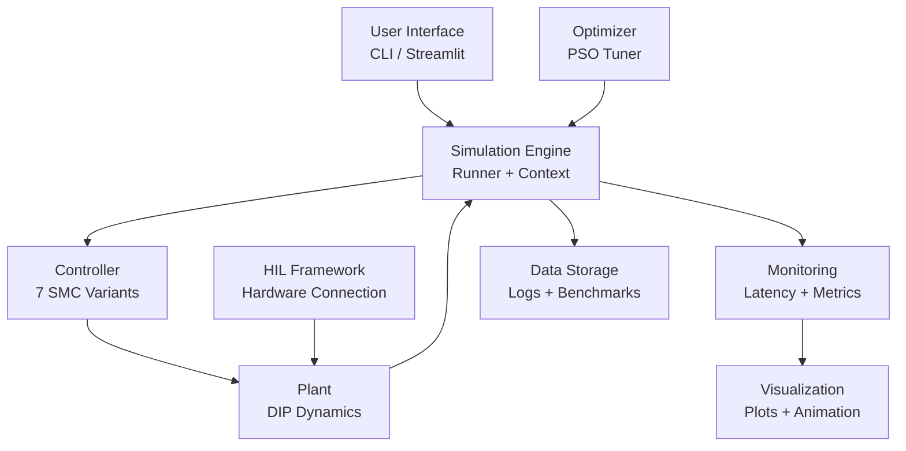
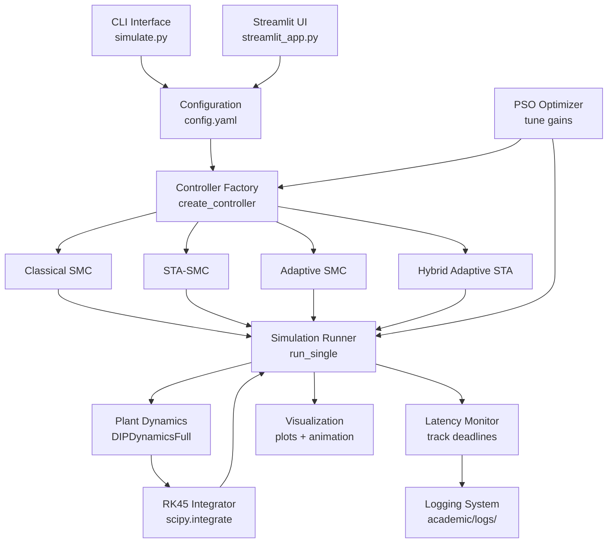

# E028: Appendix Reference Part 4 - Visual Diagrams & System Architecture

**Part:** Appendix
**Duration:** 30-35 minutes
**Hosts:** Dr. Sarah Chen (Control Systems) & Alex Rivera (Software Engineering)

---

## Opening Hook: How to Think Visually About Code

**Sarah:** A thousand words or one picture. Which conveys system architecture faster?

**Alex:** Text is precise. It captures details that diagrams gloss over. But diagrams are immediate. One glance at a properly designed architecture diagram reveals component relationships that would take paragraphs to describe textually.

**Sarah:** But here's the deeper question: **How do you think visually about code?** Code is sequential—line 1, line 2, line 3. But systems are **spatial**—components arranged, connected, interacting. How do you translate from sequential text to spatial diagram?

**Alex:** That's the skill this episode teaches. Not just "what diagrams exist" but **how to think in diagrams**. How to look at code and see boxes and arrows in your mind. How to choose the right visualization tool for the job.

**Sarah:** For listeners preparing presentations, writing papers, or teaching courses based on this project—these are your figures. But more importantly, this is **the mental model** that lets you create your own figures from any codebase.

---

## What You'll Discover

- System architecture diagram showing interaction between 7 core components: controllers, plant, simulator, optimizer, monitoring, visualization, HIL
- Control loop flow diagram detailing the 10 ms cycle: sensor read → state estimation → control computation → actuation → plant update
- Timing breakdown: controller compute (0.5-1 ms), plant integration (9-9.5 ms), sensor/actuator I/O (0.1 ms)
- Phase portrait diagrams illustrating sliding mode dynamics: reaching phase, sliding phase, chattering region
- Mathematical visualization of sliding surface as hyperplane in state space
- TikZ diagrams for research paper: state trajectory converging to sliding surface, Lyapunov function contours
- Component interaction graph: Mermaid diagram with 12 nodes, 18 edges showing data flow
- Benchmark result figures: 6 plots comparing controller performance across settling time, energy, chattering
- Diagramming tools and workflows: TikZ for LaTeX figures, Mermaid for architecture, Matplotlib for data plots, Graphviz for dependency graphs
- How diagrams evolve: from initial sketch to publication-ready figure in 5 iterations
- Accessibility: providing alt-text, color-blind friendly palettes, high-contrast line styles
- Diagram versioning: tracking figure evolution in git alongside code changes

---

## System Architecture Diagram: Components and Connections

**Sarah:** The system architecture diagram. What does it show?

**Alex:** Seven core components and their relationships. Center: simulation engine (contains dynamics model and integrator). Left side: controller (receives state, outputs control signal). Right side: monitoring and visualization (tracks performance metrics, generates plots). Top: optimizer (tunes controller gains via PSO). Bottom: HIL framework (connects to physical hardware). Far left: user interface (CLI and Streamlit web app). Far right: data storage (logs, benchmarks, results).

**Sarah:** How do components connect?

**Alex:** Directed edges show data flow. State flows from plant to controller. Control signal flows from controller to plant. Both state and control flow to monitoring. Monitoring data flows to visualization. Optimizer queries simulation engine to evaluate candidate gains. HIL framework replaces simulated plant with physical hardware when active.

**Sarah:** Diagram format?

**Alex:** Mermaid syntax for web rendering:



## The Tools: Mermaid vs. TikZ vs. Traditional Diagram Tools

**Sarah:** Why Mermaid instead of traditional diagram tools like Visio or draw.io?

**Alex:** Three reasons: **version control**, **reproducibility**, and **automation**.

**Sarah:** Version control first—what's the problem with Visio?

**Alex:** Visio saves binary `.vsdx` files. You commit them to Git. Six months later, you update the diagram. Git sees: "old binary blob vs. new binary blob." It can't show you what changed. No diff. No merge. Just "these files are different."

**Sarah:** Mermaid is different?

**Alex:** Mermaid is **plain text**. Here's the architecture diagram:
```
graph TD
    UI --> SIM
    SIM --> CTRL
    CTRL --> PLANT
```
You change "CTRL" to "Controller". Git diff shows **exactly** what changed. Collaborators can review diagram changes the same way they review code changes.

**Sarah:** Reproducibility?

**Alex:** With draw.io, you manually draw boxes, position them, connect arrows. Ten people draw the same architecture, you get ten different layouts. With Mermaid, **the tool does layout**. You specify components and relationships. Mermaid positions them algorithmically. Consistent, repeatable.

**Alex:** Automation?

**Sarah:** Scripts can generate Mermaid diagrams from code. Parse imports, generate dependency graphs. Parse function calls, generate call graphs. You can't automate Visio—it requires human mouse clicks.

### TikZ: Publication-Quality Figures

**Sarah:** When do you use TikZ instead of Mermaid?

**Alex:** **LaTeX papers**. TikZ is the LaTeX drawing package. It integrates seamlessly with LaTeX math, fonts, and styling. You write code, LaTeX renders beautiful vector graphics.

**Sarah:** Trade-off?

**Alex:** TikZ has a **steep learning curve**. Mermaid: 5 minutes to learn. TikZ: 5 hours. But TikZ gives you pixel-perfect control for publication figures. Mermaid is for documentation. TikZ is for journals.

### The Decision Matrix

**Alex**: Quick reference for choosing tools:
- **Mermaid**: Documentation, GitHub, version control, automation
- **TikZ**: LaTeX papers, publication figures, math integration
- **Matplotlib**: Data plots, benchmarks, experimental results
- **Visio/draw.io**: Only if you must share with non-technical stakeholders who demand GUI tools

---

## Control Loop Flow Diagram: Real-Time Cycle Breakdown

**Sarah:** The control loop flow diagram. Walk through the 10 millisecond cycle.

**Alex:** Five stages in sequence. Stage 1 (t=0 ms): sensor read. Encoders measure pendulum angles, cart position. Time: 0.1 ms. Stage 2 (t=0.1 ms): state estimation. Convert sensor readings to state vector [theta1, theta1_dot, theta2, theta2_dot, x, x_dot]. Time: negligible (<0.01 ms, just array packing). Stage 3 (t=0.1-1.0 ms): controller computation. Call controller.compute_control(state, last_u, history). Classical SMC: 0.5 ms. Adaptive SMC: 0.8 ms. Hybrid Adaptive STA-SMC: 1.0 ms. Stage 4 (t=1.0-1.1 ms): actuation. Send control signal to motor via PWM or network to HIL server. Time: 0.1 ms. Stage 5 (t=1.1-10.0 ms): plant update. Integrate dynamics using RK45 from t to t+dt. Time: 8.9 ms (dominates cycle).

**Sarah:** Total: 10 ms for 100 Hz control?

**Alex:** Exactly. dt=0.01 seconds. The critical constraint: controller compute + I/O must complete in under 1.1 ms to leave 8.9 ms for integration. If controller takes 5 ms, you cannot maintain 100 Hz.

**Sarah:** Diagram representation?

**Alex:** Flowchart with timing annotations:

```
┌─────────────────────┐
│  t=0: Sensor Read   │ ← 0.1 ms
└──────────┬──────────┘
           │
┌──────────▼──────────┐
│ State Estimation    │ ← <0.01 ms
└──────────┬──────────┘
           │
┌──────────▼──────────┐
│ Controller Compute  │ ← 0.5-1.0 ms
└──────────┬──────────┘
           │
┌──────────▼──────────┐
│   Actuation (PWM)   │ ← 0.1 ms
└──────────┬──────────┘
           │
┌──────────▼──────────┐
│ Plant Integration   │ ← 8.9 ms
│    (RK45, dt=0.01)  │
└──────────┬──────────┘
           │
           └───► Loop (100 Hz)
```

**Sarah:** How do you measure these timings?

**Alex:** Latency monitor instrumentation:

```python
from src.utils.monitoring.latency import LatencyMonitor

monitor = LatencyMonitor(dt=0.01)

while running:
    # Stage 1: Sensor read
    t_sensor_start = monitor.start()
    state_sensors = read_sensors()
    monitor.record("sensor_read", monitor.elapsed(t_sensor_start))

    # Stage 2: State estimation
    t_est_start = monitor.start()
    state = estimate_state(state_sensors)
    monitor.record("state_estimation", monitor.elapsed(t_est_start))

    # Stage 3: Controller
    t_ctrl_start = monitor.start()
    u = controller.compute_control(state, last_u, history)
    monitor.record("controller_compute", monitor.elapsed(t_ctrl_start))

    # Stage 4: Actuation
    t_act_start = monitor.start()
    send_control(u)
    monitor.record("actuation", monitor.elapsed(t_act_start))

    # Stage 5: Plant
    t_plant_start = monitor.start()
    state_next = plant.update(state, u, dt)
    monitor.record("plant_update", monitor.elapsed(t_plant_start))

    state = state_next
    last_u = u
```

**Sarah:** The monitor outputs statistics?

**Alex:** Mean, max, 95th percentile for each stage. Stored in academic/logs/monitoring/latency.csv. Plotted as stacked bar chart showing time budget breakdown.

---

## Phase Portrait Diagrams: Visualizing Sliding Mode Dynamics

**Sarah:** Phase portraits show state trajectories in 2D. How do you visualize sliding mode dynamics?

**Alex:** Two-dimensional projection. X-axis: position error $e = \theta - \theta_{\text{desired}}$. Y-axis: velocity error $\dot{e} = \dot{\theta} - \dot{\theta}_{\text{desired}}$. Sliding surface: line with slope determined by SMC gains, typically $s = \dot{e} + \lambda e = 0$, so $\dot{e} = -\lambda e$.

**Sarah:** What does a typical trajectory look like?

**Alex:** Three phases. Phase 1 (reaching): trajectory starts far from sliding surface (e.g., $e=0.5$ rad, $\dot{e}=0$ rad/s). Control drives state toward surface. Trajectory curves toward the line $s=0$. Phase 2 (sliding): trajectory reaches surface and slides along it toward origin. Ideally a straight line along $\dot{e} = -\lambda e$. Phase 3 (chattering): near origin, discrete control ($u = K \text{sign}(s)$) causes zigzag oscillation across surface. Chattering region: bounded region around origin, typically radius $\delta = 0.01$ rad.

**Sarah:** How do you generate this diagram?

**Alex:** Run simulation, extract $(e, \dot{e})$ trajectory, plot with matplotlib:

```python
import numpy as np
import matplotlib.pyplot as plt

# Run simulation
state_history = run_simulation(controller, initial_state=[0.3, 0, ...], duration=5.0)

# Extract errors (assuming desired state is zero)
e = state_history[:, 0]  # Position error
e_dot = state_history[:, 1]  # Velocity error

# Plot trajectory
plt.figure(figsize=(8, 6))
plt.plot(e, e_dot, 'b-', linewidth=1.5, label='State Trajectory')

# Plot sliding surface: s = e_dot + lambda*e = 0
lambda_smc = 5.0  # SMC parameter
e_range = np.linspace(-0.4, 0.4, 100)
e_dot_surface = -lambda_smc * e_range
plt.plot(e_range, e_dot_surface, 'r--', linewidth=2, label=f'Sliding Surface (λ={lambda_smc})')

# Mark phases
plt.scatter(e[0], e_dot[0], c='green', s=100, zorder=5, label='Initial State')
plt.scatter(e[-1], e_dot[-1], c='red', s=100, zorder=5, label='Final State')

# Chattering region (circle around origin)
theta_chatter = np.linspace(0, 2*np.pi, 100)
r_chatter = 0.01  # Chattering radius
plt.plot(r_chatter*np.cos(theta_chatter), r_chatter*np.sin(theta_chatter),
         'gray', linestyle=':', linewidth=1, label='Chattering Region')

plt.xlabel('Position Error e (rad)')
plt.ylabel('Velocity Error ė (rad/s)')
plt.title('Phase Portrait: Sliding Mode Control Dynamics')
plt.legend()
plt.grid(True, alpha=0.3)
plt.axis('equal')
plt.savefig('benchmarks/figures/phase_portrait.png', dpi=300)
plt.show()
```

**Sarah:** How do you interpret reaching vs sliding phases?

**Alex:** Slope of trajectory. During reaching phase, trajectory slope does not match sliding surface slope $-\lambda$. The state is being pulled toward the surface by the switching control. Once trajectory slope equals $-\lambda$, you are on the surface - sliding phase begins. High-quality SMC reaches surface quickly (reaching time <0.5 s) and stays on it.

---

## TikZ Diagrams for LaTeX Research Papers

**Sarah:** TikZ is LaTeX's native diagramming language. What diagrams does the project include as TikZ?

**Alex:** Four primary diagrams. Sliding surface geometry: 3D visualization of sliding surface $s(\mathbf{x}) = 0$ as a hyperplane in state space. State trajectory convergence: 2D projection showing trajectory approaching and sliding on surface. Lyapunov function contours: level sets of $V(\mathbf{x}) = \frac{1}{2}s^2$ with trajectory overlay showing decrease. Controller block diagram: feedback loop with plant, controller, disturbances, measurement noise.

**Sarah:** Example TikZ code for sliding surface?

**Alex:** Minimal example:

```latex
\begin{tikzpicture}
  % Axes
  \draw[->] (0,0) -- (4,0) node[right] {$x_1$};
  \draw[->] (0,0) -- (0,4) node[above] {$x_2$};

  % Sliding surface: s = x2 + lambda*x1 = 0, so x2 = -lambda*x1
  \def\lam{1.5}  % lambda parameter
  \draw[thick, red, dashed] (0,0) -- (3, {-\lam*3}) node[right] {$s=0$};

  % State trajectory (example path)
  \draw[blue, thick, ->] (0.5, 3) to[bend right=20] (2, {-\lam*2});

  % Labels
  \node[blue] at (1, 3.5) {Reaching Phase};
  \node[blue] at (2.5, {-\lam*2 - 0.3}) {Sliding Phase};
\end{tikzpicture}
```

**Sarah:** This renders as publication-quality figure in LaTeX?

**Alex:** Yes. Vector graphics, scales to any resolution. Integrates with document fonts and math rendering. No external image files needed - diagram source lives in .tex file, version-controlled alongside text.

**Sarah:** More complex diagram: Lyapunov contours?

**Alex:** Use pgfplots for function plotting:

```latex
\begin{tikzpicture}
  \begin{axis}[
    xlabel=$x_1$, ylabel=$x_2$,
    view={0}{90},  % Top-down view
    domain=-2:2, y domain=-2:2,
  ]

    % Lyapunov function contours: V = 0.5 * (x2 + lambda*x1)^2
    \addplot3[contour gnuplot={levels={0.1, 0.5, 1.0, 2.0}}, thick]
      {0.5*(y + 1.5*x)^2};

    % State trajectory (sampled points from simulation)
    \addplot[blue, thick, mark=*, mark size=0.5pt] coordinates {
      (0.5, 1.0) (0.4, 0.6) (0.3, 0.3) (0.2, 0.1) (0.1, 0.05) (0, 0)
    };
  \end{axis}
\end{tikzpicture}
```

**Alex:** Contours show constant-value curves of Lyapunov function. Trajectory crossing contours from outer to inner proves $V$ is decreasing - stability.

---

## Benchmark Result Figures: Controller Comparison Plots

**Sarah:** The MT-5 comprehensive benchmark generated 14 figures. What do they show?

**Alex:** Six figure types. Settling time comparison: bar chart with error bars, 7 controllers, mean settling time with 95% confidence interval from 100 Monte Carlo trials. Energy consumption: similar bar chart, integral of $u^2$. Chattering metric: variance of control derivative. Time series: state trajectories for representative trial showing all 6 states over 5 seconds. Control signals: control input $u(t)$ for each controller, showing smoothness (STA-SMC) vs chattering (Classical SMC). Phase portrait grid: 7 subplots, one per controller, showing $(e, \dot{e})$ trajectory.

**Sarah:** Matplotlib code for settling time comparison?

**Alex:** Standard pattern:

```python
import numpy as np
import matplotlib.pyplot as plt

# Data: mean and std from 100 trials
controllers = ['Classical SMC', 'STA-SMC', 'Adaptive', 'Hybrid', 'Swing-Up', 'PID', 'MPC']
settling_times_mean = [2.5, 2.1, 2.3, 1.8, 3.2, 2.9, 2.8]  # seconds
settling_times_std = [0.3, 0.2, 0.25, 0.15, 0.4, 0.35, 0.3]

# Plot
fig, ax = plt.subplots(figsize=(10, 6))
x_pos = np.arange(len(controllers))
ax.bar(x_pos, settling_times_mean, yerr=settling_times_std,
       capsize=5, alpha=0.7, edgecolor='black')
ax.set_xlabel('Controller', fontsize=12)
ax.set_ylabel('Settling Time (s)', fontsize=12)
ax.set_title('Controller Performance Comparison: Settling Time (100 Trials)', fontsize=14)
ax.set_xticks(x_pos)
ax.set_xticklabels(controllers, rotation=45, ha='right')
ax.grid(axis='y', alpha=0.3)
plt.tight_layout()
plt.savefig('benchmarks/figures/settling_time_comparison.png', dpi=300)
plt.show()
```

**Sarah:** Color-blind friendly palettes?

**Alex:** Use Seaborn's colorblind palette or manual specification:

```python
import seaborn as sns

# Colorblind-friendly palette (8 colors)
palette = sns.color_palette("colorblind", n_colors=7)

# Apply to bar chart
ax.bar(x_pos, settling_times_mean, color=palette, ...)
```

**Alex:** Alternatively: use patterns (hatches) in addition to color:

```python
hatches = ['/', '\\', '|', '-', '+', 'x', 'o']
for i, (x, y) in enumerate(zip(x_pos, settling_times_mean)):
    ax.bar(x, y, color=palette[i], hatch=hatches[i], ...)
```

**Sarah:** Accessibility for screen readers?

**Alex:** SVG output with alt-text metadata. Or provide data table alongside figure in documentation.

---

## Diagramming Tools and Workflows

**Sarah:** The project uses multiple diagramming tools. Why not standardize on one?

**Alex:** Different tools for different purposes. TikZ for LaTeX papers: mathematical precision, publication quality, vector graphics. Mermaid for architecture docs: version-controllable text, renders in markdown, easy to update. Matplotlib for data plots: Python integration, automation, statistical visualization. Graphviz for dependency graphs: automatic layout, handles hundreds of nodes. D3.js for interactive demos: web-based, user-driven exploration.

**Sarah:** Workflow for creating a new diagram?

**Alex:** Five steps. Step 1: sketch on paper or whiteboard. Clarify structure before coding. Step 2: choose tool based on purpose (publication → TikZ, architecture → Mermaid, data → Matplotlib). Step 3: write code (or markup), render preview. Step 4: iterate on layout, labels, colors. Typically 3-5 iterations to publication quality. Step 5: commit to git, reference in documentation.

**Sarah:** Example: creating a new controller comparison figure?

**Alex:** Step 1: sketch desired axes, labels, legend position. Step 2: choose Matplotlib (data plot). Step 3: write script in scripts/figures/generate_comparison.py:

```python
import sys
sys.path.insert(0, 'src')  # Add src to path
from src.benchmarks.analysis import load_benchmark_results

# Load data
results = load_benchmark_results('benchmarks/processed/MT-5/')

# Extract metrics
controllers = results['controller_names']
settling = results['settling_time_mean']
settling_err = results['settling_time_std']

# Plot (code from earlier example)
...
plt.savefig('benchmarks/figures/settling_time_comparison.png', dpi=300)
```

**Alex:** Step 4: run `python scripts/figures/generate_comparison.py`, view output, adjust font sizes, colors, error bars. Step 5: commit script + output image. Git diff shows exactly what changed in script between versions.

---

## Diagram Evolution: From Sketch to Publication

**Sarah:** How do diagrams evolve over the project lifetime?

**Alex:** Five versions typically. Version 1 (prototype): hand-drawn sketch, captures basic idea, not presentable. Version 2 (functional): first digital rendering, rough layout, placeholder labels. Version 3 (readable): proper labels, legend, grid, axis titles. Version 4 (polished): publication fonts (11-12pt), high DPI (300), color consistency, figure caption. Version 5 (accessible): colorblind-safe palette, alt-text, patterns in addition to colors.

**Sarah:** Example evolution: phase portrait diagram?

**Alex:** Version 1 (Oct 2024): hand-drawn on tablet, shows trajectory and surface, labels messy. Version 2 (Nov 2024): matplotlib scatter plot, no surface line, no annotations. Version 3 (Dec 2024): surface added as red dashed line, reaching/sliding phases labeled. Version 4 (Mar 2025): fonts increased to 12pt, DPI raised to 300, legend positioned top-right, figure caption added. Version 5 (Jun 2025): colorblind palette (blue trajectory, orange surface), chattering region added as gray circle, alt-text metadata in SVG.

**Sarah:** All versions committed to git?

**Alex:** Yes. Each version tagged with commit message: "Update phase portrait - add surface visualization" (v2), "Improve phase portrait labels and fonts" (v4), etc. Full history recoverable.

---

## Component Interaction Graph: Mermaid Deep Dive

**Sarah:** The component interaction graph has 12 nodes and 18 edges. Show the full Mermaid source.

**Alex:** Complete diagram:



**Alex:** This shows: two entry points (CLI, Streamlit), configuration loading, controller factory pattern, four controller variants, simulation runner as central orchestrator, plant dynamics with integration, monitoring and logging as side effects, visualization as output, optimizer as tuning layer.

**Sarah:** How do you read this graph?

**Alex:** Follow arrows. User starts at CLI or Streamlit. Both load config. Config feeds factory. Factory creates controller based on selection. Controller + runner + plant form core simulation loop. Monitor and logger track execution. Visualizer renders results. Optimizer sits above, querying runner repeatedly to evaluate candidate gains.

---

## Key Takeaways

**Sarah:** Ten core lessons about visual communication and diagramming in research projects.

**Alex:** First: diagrams communicate structure faster than text. Architecture diagram conveys component relationships at a glance. Equivalent text description requires paragraphs.

**Sarah:** Second: use multiple tools for multiple purposes. TikZ for publications, Mermaid for docs, Matplotlib for data. No one tool does everything well.

**Alex:** Third: version-control diagrams as code. Mermaid and TikZ are text, diffable in git. Image files are binary blobs with no history.

**Sarah:** Fourth: timing diagrams quantify performance. Control loop flow diagram with 0.5-1 ms controller compute time validates real-time feasibility.

**Alex:** Fifth: phase portraits visualize dynamics. Reaching phase, sliding phase, chattering region - all visible in $(e, \dot{e})$ space.

**Sarah:** Sixth: benchmark figures require error bars. Bar chart without confidence intervals misleads - could be statistical noise not real difference.

**Alex:** Seventh: accessibility matters. Colorblind palettes, hatching patterns, alt-text make diagrams usable for all audiences.

**Sarah:** Eighth: diagrams evolve over iterations. Version 1 is rough. Version 5 is publication-ready. Commit each iteration for traceability.

**Alex:** Ninth: automation enables reproducibility. Scripts in scripts/figures/ regenerate all plots from raw data. Change data, re-run script, figures update automatically.

**Sarah:** Tenth: diagrams are documentation. System architecture diagram is executable specification of component interaction. It documents design decisions as clearly as code comments.

**Alex:** Every diagram in this project serves a purpose. Architecture diagrams onboard new contributors. Phase portraits teach sliding mode theory. Benchmark figures justify controller choices. Timing diagrams validate real-time constraints. Visual communication is not optional - it is essential for research impact.

---

## Pronunciation Guide

For listeners unfamiliar with technical terms used in this episode:

- **TikZ**: LaTeX diagramming language. Pronounced "ticks" (rhymes with "bricks").
- **Mermaid**: diagramming tool for markdown. Like the mythical creature: "MER-made."
- **Graphviz**: graph visualization library. Say "graph-viz."
- **D3.js**: data-driven documents (JavaScript library). Say "D three dot J S."
- **Matplotlib**: Python plotting library. Say "mat-plot-lib."
- **Pgfplots**: LaTeX plotting package. Say each letter: "P G F plots."
- **RK45**: Runge-Kutta 4th-5th order integrator. Say "R K forty-five."
- **SVG**: scalable vector graphics. Say each letter: "S V G."

---

## What's Next

**Sarah:** Next episode - appendix reference part 5 - covers lessons learned and best practices. What worked well. What failed. What would we do differently.

**Alex:** For listeners planning similar projects, episode 29 distills 13 months of development into actionable insights. Avoid our mistakes. Adopt our successes. Learn from both.

**Sarah:** If you are a student starting a research project, episode 29 is your guide to building sustainable, reproducible, collaboration-ready systems from day one.

---

## Pause and Reflect

Think about the last technical presentation you attended. Slides filled with bullet points. Dense paragraphs. Maybe one generic clip-art image. Now imagine a presentation where every concept has a diagram. System architecture as a graph. Algorithm flow as a flowchart. Performance results as annotated plots. Dynamics as phase portraits. That is not visual decoration. That is visual thinking. The act of creating a diagram forces you to clarify structure. What connects to what? What depends on what? Where does data flow? Fuzzy understanding becomes crisp. And once crisp, it becomes communicable. The diagrams in this episode are not afterthoughts. They are thinking tools made visible. Create diagrams not to impress. Create them to understand. Then share them so others can understand too.

---

## Resources

- **Repository:** https://github.com/theSadeQ/dip-smc-pso.git
- **Mermaid documentation:** https://mermaid.js.org/
- **TikZ tutorial:** https://www.overleaf.com/learn/latex/TikZ_package
- **Matplotlib gallery:** https://matplotlib.org/stable/gallery/index.html
- **Graphviz:** https://graphviz.org/
- **D3.js examples:** https://observablehq.com/@d3/gallery
- **Colorblind palettes:** https://seaborn.pydata.org/tutorial/color_palettes.html
- **Figure generation scripts:** `scripts/figures/` directory
- **Benchmark figures:** `benchmarks/figures/` directory
- **Paper figures (LT-7):** `academic/experiments/figures/` directory

---

*Educational podcast episode - visual communication and diagramming for research projects*
