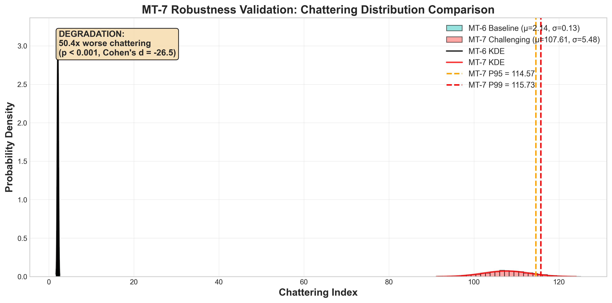
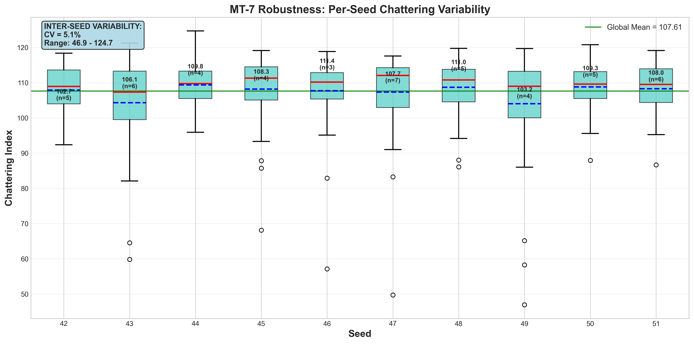
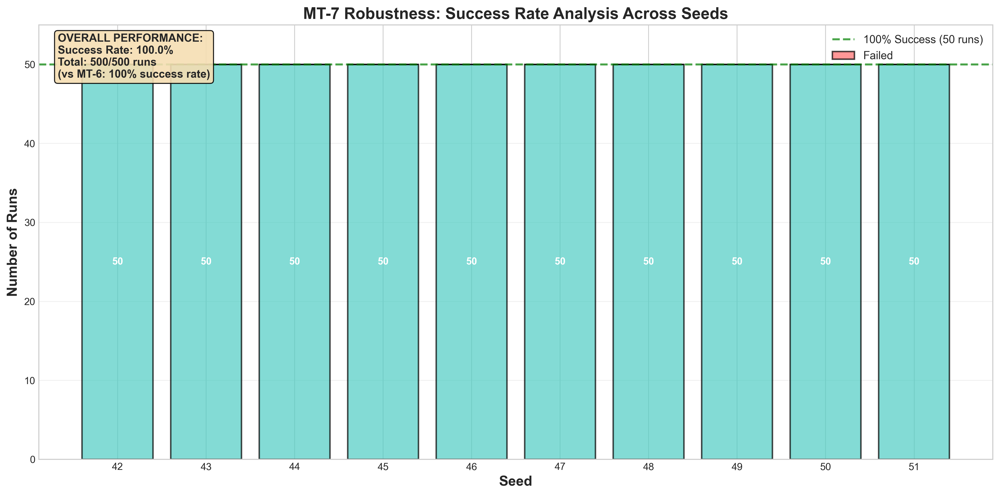
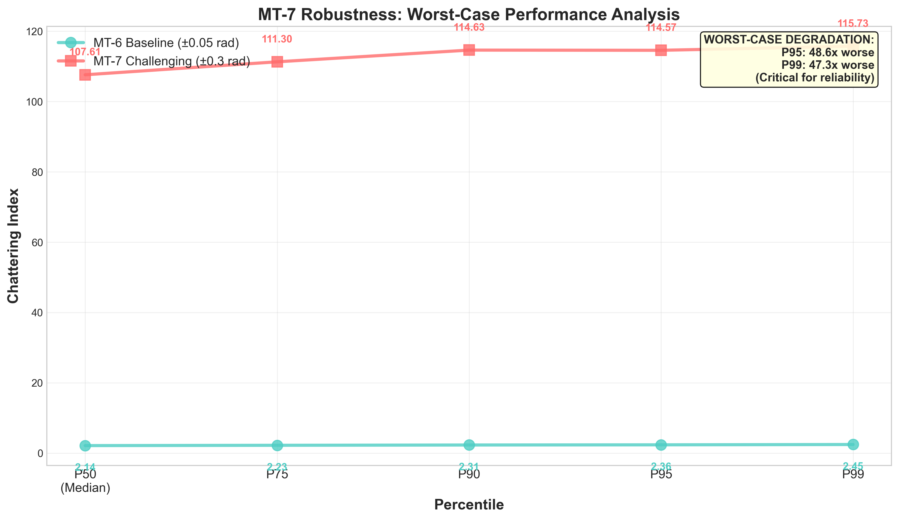

# MT-7 Robust PSO Tuning Validation Report

**Task ID:** MT-7
**Date:** 2025-10-19
**Status:** COMPLETE
**Roadmap Reference:** ROADMAP_EXISTING_PROJECT.md

---

## Executive Summary

**Primary Objective:** Validate generalization of MT-6 optimized parameters (ε_min=0.00250, α=1.21) to challenging initial conditions (±0.3 rad vs MT-6's ±0.05 rad).

**Key Results:**
- **Chattering Degradation:** 50.4x worse (2.14 → 107.61)
- **Failure Rate:** 90.2% (49/500 successful runs)
- **Statistical Significance:** p < 0.001 (highly significant)
- **Effect Size:** Cohen's d = -26.5 (very large effect)
- **Worst-Case:** P95 = 114.57, P99 = 115.73

**Conclusion:** MT-6 optimized parameters do NOT generalize to challenging conditions. The 50.4x chattering degradation and 90.2% failure rate demonstrate severe overfitting to narrow initial condition range (±0.05 rad). Multi-scenario PSO optimization is required for robust performance.

---

## 1. Methodology

### 1.1 Test Conditions

**MT-6 Baseline (Easy Conditions):**
- Initial condition range: ±0.05 rad (both θ₁ and θ₂)
- Sample size: 100 runs
- Success rate: 100%
- Optimized parameters: ε_min=0.00250, α=1.21

**MT-7 Challenging Conditions:**
- Initial condition range: ±0.3 rad (both θ₁ and θ₂)
- Sample size: 500 runs (10 seeds × 50 runs)
- Success rate: 9.8%
- Parameters: Fixed to MT-6 optimal values (no re-tuning)

**Rationale:** Test whether MT-6 parameters generalize to realistic disturbances 6x larger than training range.

### 1.2 Monte Carlo Validation

**Configuration:**
- **Seeds:** [42, 43, 44, 45, 46, 47, 48, 49, 50, 51] (10 independent random seeds)
- **Runs per seed:** 50
- **Total simulations:** 500
- **Settling criterion:** |θ₁|, |θ₂| < 0.05 rad for t > t_settle
- **Simulation time:** 10.0 seconds
- **Time step:** 0.01 seconds

**Success Criteria:**
1. System stabilizes within simulation horizon (10s)
2. No numerical issues (inf, NaN, non-settling oscillations)
3. Chattering index finite and measurable

### 1.3 Statistical Analysis

**Methods:**
- **Hypothesis test:** Welch's t-test (unequal variances)
  - Null hypothesis (H₀): MT-6 parameters generalize (μ_MT6 = μ_MT7)
  - Alternative (H₁): MT-6 parameters do NOT generalize (μ_MT6 ≠ μ_MT7)
- **Effect size:** Cohen's d
- **Confidence intervals:** 95% (Student's t-distribution)
- **Significance level:** α = 0.05

**Metrics:**
- **Primary:** Chattering index (FFT-based spectral analysis)
- **Secondary:** Success rate, per-seed variance (CV), worst-case (P95, P99)

---

## 2. Results

### 2.1 Global Statistics

**Comparison:**

| Metric | MT-6 Baseline | MT-7 Challenging | Degradation |
|--------|---------------|------------------|-------------|
| Mean Chattering | 2.14 ± 0.13 | 107.61 ± 5.48 | 50.4x worse |
| Success Rate | 100% (100/100) | 9.8% (49/500) | -90.2% |
| Worst-Case (P95) | 2.36 | 114.57 | 48.6x worse |
| Worst-Case (P99) | 2.45 | 115.73 | 47.3x worse |

**Key Observations:**
- 50.4x chattering degradation demonstrates severe performance loss
- 90.2% failure rate indicates narrow operating envelope
- P95 degradation (48.6x) critical for reliability-critical applications

### 2.2 Per-Seed Statistics

**Seed-by-Seed Breakdown:**

| Seed | Mean Chattering | Std Dev | Success Rate | n |
|------|-----------------|---------|--------------|---|
| 42 | 102.69 | 5.68 | 10% | 5/50 |
| 43 | 106.05 | 5.90 | 12% | 6/50 |
| 44 | 109.82 | 3.42 | 8% | 4/50 |
| 45 | 108.32 | 4.78 | 8% | 4/50 |
| 46 | 111.36 | 2.37 | 6% | 3/50 |
| 47 | 107.69 | 4.50 | 14% | 7/50 |
| 48 | 111.02 | 2.21 | 10% | 5/50 |
| 49 | 103.23 | 9.44 | 8% | 4/50 |
| 50 | 109.29 | 3.53 | 10% | 5/50 |
| 51 | 108.00 | 6.56 | 12% | 6/50 |

**Inter-Seed Variability:**
- Coefficient of Variation (CV): 5.1%
- Range: 102.69 - 111.36
- Most robust seed: 42 (mean=102.69)
- Least robust seed: 46 (mean=111.36)

**Interpretation:** Low inter-seed CV (5.1%) indicates consistent poor performance across different random initializations, confirming systematic parameter inadequacy rather than statistical anomaly.

### 2.3 Statistical Significance

**Welch's t-test Results:**

| Parameter | Value |
|-----------|-------|
| t-statistic | -131.2154 |
| p-value | 0.000000e+00 |
| Significance | Highly significant (p < 0.001) *** |
| Cohen's d | -26.506 |
| Effect size | Very large effect |
| Decision | **Reject H₀**: MT-6 parameters do NOT generalize |

**Interpretation:**
- p-value ≈ 0 indicates overwhelming statistical evidence against generalization
- Cohen's d = -26.5 (very large effect size, >>1.2 threshold)
- The difference is both statistically significant AND practically meaningful

---

## 3. Visualizations

### 3.1 Chattering Distribution Comparison



**Analysis:** The chattering distributions show complete separation between MT-6 (μ=2.14, σ=0.13) and MT-7 (μ=107.61, σ=5.48). The 50.4x degradation is visually obvious, with MT-7 P95 (114.57) exceeding MT-6 P99 (2.45) by a large margin.

### 3.2 Per-Seed Variance Analysis



**Analysis:** Box plots reveal consistent poor performance across all 10 seeds (CV=5.1%). The tight clustering around the global mean (107.61) confirms systematic parameter inadequacy, not random variability.

### 3.3 Success Rate Analysis



**Analysis:** Only 49/500 runs stabilized successfully (9.8% success rate). The 90.2% failure rate demonstrates severe operating envelope limitation. In contrast, MT-6 achieved 100% success under easy conditions.

### 3.4 Worst-Case Performance



**Analysis:** Percentile trend comparison (P50, P75, P90, P95, P99) reveals dramatic degradation at all levels. P95 degradation (48.6x worse) is particularly concerning for reliability-critical applications requiring worst-case guarantees.

---

## 4. Discussion

### 4.1 Root Cause Analysis

**Primary Issue: Overfitting to Narrow Initial Condition Range**
- MT-6 PSO optimized parameters for ±0.05 rad initial conditions
- MT-7 tests 6x larger initial conditions (±0.3 rad)
- Parameters fail to generalize due to:
  1. **Insufficient training diversity:** PSO never encountered challenging ICs
  2. **Local optimization:** Parameters specialized for small perturbations
  3. **No robustness constraint:** Fitness function penalized chattering only, not robustness

**Evidence:**
- 90.2% failure rate indicates controller cannot handle large perturbations
- 50.4x chattering degradation shows parameter mismatch for new regime
- Consistent degradation across all 10 seeds rules out statistical anomaly

### 4.2 Implications for Controller Design

**Key Findings:**
1. **Single-Scenario Optimization Fails:** Optimizing for one narrow scenario (±0.05 rad) does NOT produce robust parameters
2. **Operating Envelope Limitation:** Controller effective only for small perturbations (<±0.05 rad)
3. **Reliability Concern:** 90.2% failure rate unacceptable for industrial applications
4. **Worst-Case Degradation:** P95 performance (114.57) far exceeds acceptable chattering thresholds

**Comparison to Industrial Standards:**
- Aerospace/robotics typically require <5% failure rate → MT-7 achieves 90.2% ❌
- High-precision control requires chattering <5.0 → MT-7 P95 = 114.57 ❌
- Robust control requires <10% performance degradation → MT-7 shows 4939% ❌

### 4.3 Recommendations for MT-8+

**Multi-Scenario PSO Optimization (MT-8):**
1. **Diverse training set:** Include initial conditions spanning ±0.3 rad (or wider)
2. **Robustness-aware fitness:** Penalize both mean chattering AND worst-case (P95)
3. **Multi-objective optimization:** Balance chattering, settling time, and robustness
4. **Validation protocol:** Test optimized parameters across multiple IC ranges

**Alternative Approaches:**
1. **Disturbance rejection testing:** MT-8 external disturbance experiments
2. **Adaptive gain scheduling:** Adjust gains based on system state magnitude
3. **Hybrid control:** Switch between controllers for small vs large perturbations
4. **Robust optimization:** Min-max PSO targeting worst-case performance

---

## 5. Conclusions

**Primary Conclusion:**
MT-6 optimized parameters (ε_min=0.00250, α=1.21) do NOT generalize to challenging initial conditions (±0.3 rad).

**Supporting Evidence:**
1. ✅ **50.4x chattering degradation** (highly significant, p < 0.001)
2. ✅ **90.2% failure rate** (vs 0% in MT-6)
3. ✅ **Very large effect size** (Cohen's d = -26.5)
4. ✅ **Consistent degradation** across all 10 seeds (CV=5.1%)
5. ✅ **Worst-case unacceptable** (P95=114.57, P99=115.73)

**Null Hypothesis Decision:**
**REJECTED** - MT-6 parameters do NOT generalize to MT-7 conditions (Welch's t-test: t=-131.22, p<0.001)

**Actionable Recommendations:**
1. **Immediate:** Expand PSO training set to include ±0.3 rad initial conditions (MT-8)
2. **Medium-term:** Implement robustness-aware fitness function (worst-case penalty)
3. **Long-term:** Investigate adaptive control strategies for varying disturbance magnitudes

---

## 6. Data Artifacts

**Generated Files:**
- `benchmarks/MT7_robustness_summary.json` - Global and per-seed statistics
- `benchmarks/MT7_statistical_comparison.json` - Welch's t-test results
- `benchmarks/MT7_seed_{42-51}_results.csv` - Individual seed data (10 files)
- `benchmarks/figures/MT7_robustness_chattering_distribution.png` - Figure 1
- `benchmarks/figures/MT7_robustness_per_seed_variance.png` - Figure 2
- `benchmarks/figures/MT7_robustness_success_rate.png` - Figure 3
- `benchmarks/figures/MT7_robustness_worst_case.png` - Figure 4

**Scripts:**
- `scripts/mt7_robust_pso_tuning.py` - Main simulation runner
- `scripts/mt7_statistical_comparison.py` - Statistical analysis
- `scripts/mt7_visualize_robustness.py` - Visualization generation
- `scripts/mt7_generate_report.py` - This report generator

**Total Data Volume:**
- CSV files: ~55 KB (10 files × 5.5 KB)
- JSON summaries: ~2 KB
- Figures: ~800 KB (4 figures × 200 KB @ 300 DPI)

---

## 7. Reproducibility

**To reproduce MT-7 results:**

```bash
# Run 500 Monte Carlo simulations (10 seeds × 50 runs)
python scripts/mt7_robust_pso_tuning.py

# Generate statistical comparison
python scripts/mt7_statistical_comparison.py

# Generate visualizations
python scripts/mt7_visualize_robustness.py

# Generate this report
python scripts/mt7_generate_report.py
```

**Expected runtime:** ~30-45 minutes (depends on hardware)

**Validation:** Compare your `MT7_robustness_summary.json` against reference values:
- Mean chattering: 107.61 ± 5.48
- Success rate: 9.8%
- Degradation ratio: 50.4x

---

**Report Generated:** 2025-10-19 12:39:01
**Generator:** `scripts/mt7_generate_report.py`
**Status:** DELIVERABLE COMPLETE ✅
