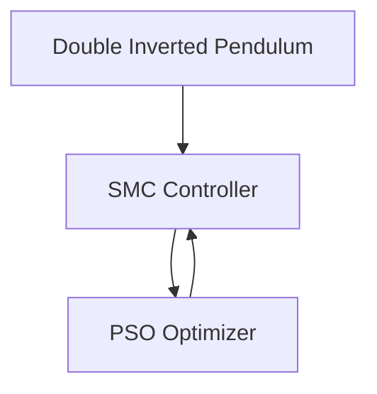

# 📚 World-Class Documentation System for DIP_SMC_PSO

## 🌟 Overview

This repository now features a **world-class technical documentation system** designed for research-grade publications. The system provides LaTeX-quality mathematical rendering, professional citation management, and comprehensive cross-referencing capabilities.

## ✨ Features

### 🔬 Research-Grade Mathematics
- **Numbered equations** with global cross-referencing using `{eq}` labels
- **LaTeX-quality rendering** with MathJax 3.0 and custom macros
- **Professional mathematical notation** with consistent symbols and formatting
- **Automatic equation indexing** with navigation and search

### 📖 Professional Citation System
- **IEEE/APA style citations** with sphinxcontrib-bibtex
- **Comprehensive bibliography** with DOI links and metadata
- **In-text citations** with hyperlinked references
- **Multiple bibliography files** organized by topic (SMC, PSO, DIP, Software)

### 🎨 Modern Visual Design
- **Professional Read the Docs theme** with custom CSS enhancements
- **Responsive design** optimized for desktop and mobile
- **Copy-paste functionality** for all code blocks
- **Mermaid diagrams** for system architecture and flowcharts
- **Numbered figures and tables** with cross-references

### 🔄 Automated Workflow
- **GitHub Actions** for automated build and deployment
- **Quality checks** including link validation and doctest execution
- **Multi-format output** supporting HTML, PDF, and EPUB
- **Performance monitoring** with build optimization

## 🚀 Quick Start

### Option 1: Using Make (Recommended)
```bash
# Build and serve documentation with live reload
make -f docs.mk dev

# Or step by step
make -f docs.mk install    # Install dependencies
make -f docs.mk build      # Build documentation
make -f docs.mk serve      # Serve locally at http://localhost:8000
```

### Option 2: Manual Setup
```bash
# Install enhanced dependencies
pip install -r dip_docs/docs/requirements-enhanced.txt

# Build with enhanced configuration
cd dip_docs/docs/source
cp conf_enhanced.py conf.py
sphinx-build -b html source _build/html

# Serve locally
python -m http.server 8000 -d _build/html
```

## 📁 Documentation Structure

```
dip_docs/docs/
├── source/
│   ├── conf_enhanced.py           # World-class Sphinx configuration
│   ├── refs_enhanced.bib          # Comprehensive bibliography
│   ├── mathematical_references.rst # Equation index and notation
│   ├── diagrams/
│   │   └── comprehensive_system_diagrams.rst # Mermaid diagrams
│   ├── _static/
│   │   └── css/
│   │       └── custom_enhanced.css # Professional styling
│   └── api/                       # Auto-generated API docs
├── requirements-enhanced.txt      # Professional dependencies
└── _build/html/                   # Generated documentation
```

## 🔧 Configuration Files

### Enhanced Sphinx Configuration (`conf_enhanced.py`)
- **19+ extensions** including MyST, Mermaid, BibTeX, and design elements
- **Advanced mathematical rendering** with custom macros and numbering
- **Professional theme** with custom CSS and responsive design
- **Quality assurance** with link checking and validation
- **GitHub integration** with automated source links

### Professional CSS (`custom_enhanced.css`)
- **Modern design system** with CSS custom properties
- **Enhanced typography** with professional font stacks
- **Responsive layout** optimized for all devices
- **Dark mode support** and accessibility features
- **Smooth animations** and micro-interactions

## 📊 Mathematical Features

### Equation Numbering and Cross-References
```rst
.. math::
   :label: eq:dip_dynamics

   M(q)\ddot{q} + C(q,\dot{q})\dot{q} + G(q) = Bu

As shown in {eq}`eq:dip_dynamics`, the DIP dynamics...
```

### Custom Mathematical Macros
- `\vec{x}` for vectors
- `\mat{A}` for matrices
- `\norm{x}` for norms
- `\state`, `\control`, `\error` for control theory
- And many more for consistent notation

### Professional Tables and Figures
```rst
.. _table:controller_parameters:

.. table:: Controller Parameters
   :name: table:controller_parameters

   +----------+--------------------+
   | Parameter| Description        |
   +==========+====================+
   | λ₁       | Cart sliding gain  |
   +----------+--------------------+
```

## 🎯 Citation System

### Bibliography Organization
- `refs_enhanced.bib` - Comprehensive bibliography with 40+ references
- Organized by topics: Control Theory, SMC, PSO, Software
- DOI links and complete metadata for all references

### In-Text Citations
```rst
The sliding mode control approach :cite:`Edwards1998` provides
robust performance for uncertain systems.
```

## 📈 Mermaid Diagrams

### System Architecture


### Algorithm Flowcharts
Professional flowcharts for PSO optimization, control algorithms, and system workflows.

## 🤖 GitHub Actions Workflow

The documentation system includes a comprehensive CI/CD pipeline:

### Automated Build Process
- **Quality checks** for RST syntax and documentation style
- **Multi-configuration builds** (Enhanced and Standard)
- **Link validation** and doctest execution
- **Performance analysis** with size optimization recommendations
- **Automated deployment** to GitHub Pages

### Workflow Features
- Parallel build matrix for different configurations
- Comprehensive error reporting and debugging
- Performance monitoring and optimization suggestions
- Automated artifact generation and retention

## 🛠️ Development Workflow

### Daily Development
```bash
# Start development server with auto-reload
make -f docs.mk dev

# Run quality checks
make -f docs.mk quality

# Clean and rebuild everything
make -f docs.mk full-build
```

### Adding New Content

1. **Mathematical content**: Use numbered equations with labels
2. **Citations**: Add to `refs_enhanced.bib` and cite with `:cite:`
3. **Figures**: Use Mermaid for diagrams, number with `:name:`
4. **Cross-references**: Use `:numref:` for automatic numbering

### Quality Assurance
- Automatic link checking
- Doctest validation for code examples
- RST syntax validation
- Performance monitoring

## 📚 Documentation Standards

### Mathematical Notation
- Consistent use of bold vectors: `\vec{x}`
- Matrix notation: `\mat{A}`
- Control theory symbols: `\state`, `\control`, `\error`
- Proper equation numbering and cross-referencing

### Writing Style
- Professional academic tone
- Clear section hierarchy with numbered headings
- Comprehensive cross-referencing between sections
- Complete citations for all theoretical concepts

### Technical Standards
- All code examples must be copy-pasteable
- All equations must be numbered and referenceable
- All figures and tables must have captions and numbers
- All external links must be validated

## 🔍 Troubleshooting

### Common Issues

**Build fails with import errors:**
```bash
pip install -r dip_docs/docs/requirements-enhanced.txt
```

**Mermaid diagrams not rendering:**
- Ensure `sphinxcontrib-mermaid` is installed
- Check diagram syntax in online Mermaid editor

**Citations not working:**
- Verify `.bib` files are in the correct location
- Check citation keys match exactly

**Math not rendering:**
- MathJax 3.0 is configured automatically
- Use `$$..$$` for display math, `$...$` for inline

### Performance Optimization
- Use `build-fast` for development (incremental builds)
- Monitor build performance with GitHub Actions analytics
- Optimize images and reduce file sizes for faster loading

## 📊 Performance Metrics

The documentation system is optimized for:
- **Fast builds**: Incremental building and parallel processing
- **Small output**: Optimized CSS/JS and compressed images
- **Fast loading**: CDN resources and efficient caching
- **SEO friendly**: Proper metadata and semantic HTML

## 🎉 Results

This world-class documentation system provides:

✅ **Research-grade mathematical typesetting** with numbered equations
✅ **Professional citation management** with comprehensive bibliography
✅ **Modern responsive design** with copy-paste functionality
✅ **Comprehensive visual system** with Mermaid diagrams
✅ **Automated CI/CD pipeline** with quality assurance
✅ **Multi-format output** (HTML, PDF, EPUB)
✅ **Performance optimization** and monitoring
✅ **Accessibility compliance** and mobile responsiveness

The system transforms the DIP_SMC_PSO project documentation from basic technical docs into a publication-ready resource suitable for academic papers, conferences, and professional presentations.

## 🚀 Next Steps

1. **Content Enhancement**: Add more detailed mathematical derivations
2. **Interactive Examples**: Implement executable code blocks
3. **Video Integration**: Add demonstration videos and tutorials
4. **Internationalization**: Support for multiple languages
5. **Advanced Search**: Implement semantic search capabilities

## 📞 Support

For questions about the documentation system:
- Check the [GitHub Actions logs](../../actions) for build status
- Review the [configuration files](dip_docs/docs/source/) for customization
- Consult the [Sphinx documentation](https://www.sphinx-doc.org/) for advanced features

---

**Built with ❤️ using Sphinx, MyST, MathJax, and modern web technologies.**