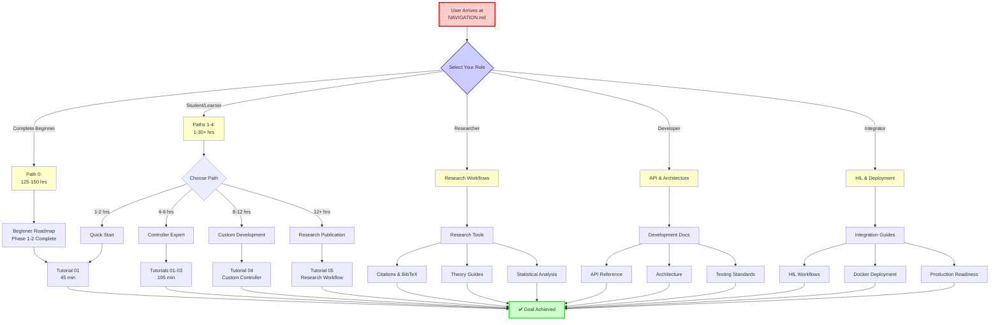

# Documentation Navigation Hub

**Your Complete Guide to Navigating the DIP SMC PSO Documentation**

Welcome to the master navigation hub! This page connects all 11 documentation systems into one unified entry point. Whether you're a complete beginner, an experienced researcher, or a developer integrating the framework, you'll find your path here.

**Total Documentation**: 985 files (814 in docs/, 171 in .project/) covering every aspect from beginner tutorials to advanced research workflows.

---

## I Want To...

### Get Started (First-Time Users)

**[CORE]** [Install & Run First Simulation](guides/getting-started.md) (15 min)
→ Complete installation guide with dependency setup and first simulation

**[CORE]** [Understand the System](README.md) (10 min)
→ High-level architecture overview with Mermaid diagrams

**[NEW]** [Watch Interactive 3D Pendulum](guides/interactive/3d-pendulum-demo.md) (5 min)
→ Real-time WebGL physics simulation with adjustable parameters

**[POPULAR]** [Quick Reference Cheat Sheet](guides/QUICK_REFERENCE.md) (5 min)
→ Command syntax and common workflows at a glance

**Recommended Path**: Getting Started → Tutorial 01 → User Guide

---

### Learn (Students & Researchers)

#### Prerequisites & Learning Paths

**Path 0**: [Complete Beginner Roadmap](../.project/ai/edu/beginner-roadmap.md) (125-150 hrs)
- Target: ZERO coding/control theory background
- Coverage: Computing → Python → Physics → Math → Control Theory → SMC
- Status: Phases 1-2 complete (~2,000 lines), Phases 3-5 planned

**Path 1**: [Quick Start](guides/INDEX.md#path-1-quick-start) (1-2 hrs)
- Target: Experienced developers, rapid prototyping
- Outcome: Run simulations, modify parameters, interpret results

**Path 2**: [Controller Expert](guides/INDEX.md#path-2-controller-expert) (4-6 hrs)
- Target: Control systems researchers, comparative studies
- Outcome: Select best controller, optimize gains, understand tradeoffs

**Path 3**: [Custom Development](guides/INDEX.md#path-3-custom-development) (8-12 hrs)
- Target: Implementing novel SMC algorithms, extending framework
- Outcome: Custom SMC ready for research, fully tested, PSO-integrated

**Path 4**: [Research Publication](guides/INDEX.md#path-4-research-publication) (12+ hrs)
- Target: Graduate students, academic researchers, industrial R&D
- Outcome: Publication-ready research with statistical validation

#### Tutorial Series (5 tutorials, 10.5 hours)

| Tutorial | Level | Duration | Topics |
|----------|-------|----------|--------|
| [Tutorial 01: First Simulation](guides/tutorials/tutorial-01-first-simulation.md) | Beginner | 45 min | DIP system, Classical SMC, result interpretation |
| [Tutorial 02: Controller Comparison](guides/tutorials/tutorial-02-controller-comparison.md) | Intermediate | 60 min | 4 SMC types, performance tradeoffs, selection criteria |
| [Tutorial 03: PSO Optimization](guides/tutorials/tutorial-03-pso-optimization.md) | Intermediate | 90 min | Automated gain tuning, convergence analysis, custom cost functions |
| [Tutorial 04: Custom Controller](guides/tutorials/tutorial-04-custom-controller.md) | Advanced | 120 min | Terminal SMC from scratch, factory integration, testing |
| [Tutorial 05: Research Workflow](guides/tutorials/tutorial-05-research-workflow.md) | Advanced | 120 min | End-to-end research project, statistical analysis, publication workflow |

**See Also**: [Complete Tutorials Index](guides/tutorials/index.md)

---

### Develop (Contributors & Developers)

**[CORE]** [API Reference](api/index.md) (7 modules, 3,285 lines)
→ Complete programmatic interface documentation

**[CORE]** [Controller Factory Guide](CONTROLLER_FACTORY.md)
→ Factory system, type-safe instantiation, custom controllers

**[CORE]** [Testing Standards](TESTING.md)
→ Test execution, coverage requirements (≥85% overall, ≥95% critical)

[Contributing Guide](CONTRIBUTING.md)
→ Development guidelines, PR workflow, code style

[Architecture Overview](architecture.md)
→ System design, component interactions, timing analysis

**Quick API Access**:
- [Controllers API](api/controllers.md) - SMC types, factory, gain bounds
- [Simulation API](api/simulation.md) - SimulationRunner, dynamics models, batch processing
- [Optimization API](api/optimization.md) - PSOTuner, cost functions, convergence
- [Plant Models API](api/plant-models.md) - Physics models, parameter configuration
- [Configuration API](api/configuration.md) - YAML loading, validation, programmatic config
- [Utilities API](api/utilities.md) - Validation, control primitives, monitoring tools

---

### Optimize & Tune

**[POPULAR]** [Tutorial 03: PSO Optimization](guides/tutorials/tutorial-03-pso-optimization.md) (90 min)
→ Comprehensive PSO workflow with convergence analysis

[PSO Optimization Workflows](guides/how-to/optimization-workflows.md) (25 min)
→ Quick recipes for common optimization tasks

[Custom Cost Functions](workflows/custom-cost-functions.md)
→ Design multi-objective cost functions for specific requirements

[PSO Convergence Theory](pso_convergence_theory.md)
→ Mathematical foundations of PSO convergence guarantees

**Controller-Specific PSO Guides**:
- [PSO for Adaptive SMC](workflows/pso-adaptive-smc.md)
- [PSO for Hybrid SMC](workflows/pso-hybrid-smc.md)
- [PSO for Super-Twisting SMC](workflows/pso-sta-smc.md)

---

### Deploy & Integrate

[Docker Deployment](deployment/docker.md)
→ Containerized deployment with GPU support

[Streamlit Deployment](deployment/STREAMLIT_DEPLOYMENT.md)
→ Deploy interactive dashboard to cloud platforms

[Hardware-in-the-Loop Quickstart](hil_quickstart.md)
→ Real-time simulation with physical systems

**HIL Workflows** (6 documents):
- [HIL Workflow](workflows/hil-workflow.md) - Basic setup
- [HIL Production Checklist](workflows/hil-production-checklist.md) - Deployment readiness
- [HIL Safety Validation](workflows/hil-safety-validation.md) - Safety protocols
- [HIL Multi-Machine](workflows/hil-multi-machine.md) - Distributed systems
- [HIL Disaster Recovery](workflows/hil-disaster-recovery.md) - Fault tolerance
- [PSO HIL Tuning](workflows/pso-hil-tuning.md) - Optimize on real hardware

**Production Readiness**:
- [Production Index](production/index.md) - Production deployment guides
- [Quality Gates](quality_gates.md) - Requirements for production release
- [Safe Operations Reference](safe_operations_reference.md) - Safety-critical operations

---

### Troubleshoot

[Troubleshooting Index](troubleshooting/index.md)
→ Common issues and solutions

[Testing & Validation Guide](guides/how-to/testing-validation.md)
→ Debug test failures, run specific test suites

[MCP Debugging Workflows](mcp-debugging/README.md)
→ Debug MCP server issues, integration problems

**Common Issues**:
- Installation errors → [Getting Started - Troubleshooting](guides/getting-started.md#troubleshooting)
- Test failures → [Testing Guide](guides/how-to/testing-validation.md)
- PSO convergence issues → [PSO Workflows](guides/how-to/optimization-workflows.md#troubleshooting)
- Configuration errors → [Configuration API](api/configuration.md#validation)

---

## How to Navigate This Documentation

### By Navigation Style

Choose your preferred way to explore:

::::{grid} 1 2 3 3
:gutter: 3

:::{grid-item-card} 3D Control Room
:link: architecture_control_room
:link-type: doc

Isometric 3D system architecture with animated data flow. Click components to navigate directly to their documentation.
:::

:::{grid-item-card} Interactive Graph
:link: sitemap_interactive
:link-type: doc

Force-directed D3.js visualization. Drag nodes, zoom, and explore 985 files dynamically with relationship highlighting.
:::

:::{grid-item-card} Card Navigator
:link: sitemap_cards
:link-type: doc

Icon-based tree view with descriptions. Browse categories visually with search and filtering.
:::

:::{grid-item-card} Mindmap
:link: sitemap_visual
:link-type: doc

Mermaid mindmap and flowchart visualizations showing conceptual relationships.
:::

:::{grid-item-card} 3D Interactive Pendulum (NEW!)
:link: guides/interactive/3d-pendulum-demo
:link-type: doc

Real-time WebGL physics simulation. Adjust controller gains and watch dynamics unfold in cinematic 3D.
:::

:::{grid-item-card} Live Python Code (NEW!)
:link: guides/interactive/live-python-demo
:link-type: doc

Run Python+NumPy+Matplotlib directly in browser. Edit examples and see results instantly, zero installation.
:::

::::

#### Traditional Navigation

**Comprehensive Indexes**:
- [Main Index (docs/index.md)](index.md) - Sphinx homepage with 11 toctree sections
- [User Guides Hub (guides/INDEX.md)](guides/INDEX.md) - 43 files, 12,525 lines, learning paths
- [Text Sitemap](documentation_structure.md) - Hierarchical list of all 985 files
- [Main README](README.md) - GitHub entry point with architecture diagrams

**By Content Type**:
- [Documentation Structure](documentation_structure.md) - Traditional text-based navigation
- [Category Index Directory](#category-index-directory) - All 43 index.md files organized by domain

---

## Navigate by Your Role

### I'm a Student / Learner

#### Quick Start

**[CORE]** Start here if you have ZERO background:
→ [Path 0: Complete Beginner Roadmap](../.project/ai/edu/beginner-roadmap.md) (125-150 hrs)
  - Phase 1: Computing fundamentals, Python basics (30 hrs)
  - Phase 2: Physics, Math, Control Theory (45 hrs)
  - Phases 3-5: Hands-on practice to mastery (50-75 hrs, planned)

**If you already know Python & control theory basics**:
→ [Getting Started Guide](guides/getting-started.md) (15 min) → [Tutorial 01](guides/tutorials/tutorial-01-first-simulation.md) (45 min)

#### Learning Tracks by Time Investment

**5 Hours - Quick Mastery**:
```
Tutorial 01 (45 min) → Tutorial 02 (60 min) → Tutorial 03 (90 min) → How-To: Running Simulations (20 min) → User Guide (30 min)
```
**Outcome**: Run simulations, compare controllers, optimize gains, interpret results

**10 Hours - Theory + Practice**:
```
Quick Mastery (5h) + SMC Theory (30 min) + PSO Theory (25 min) + DIP Dynamics (25 min) + How-To: Result Analysis (20 min) + Tutorial 05 (120 min)
```
**Outcome**: Understand mathematical foundations, statistical validation, publication workflow

**30+ Hours - Expert Level**:
```
10-Hour Track + Tutorial 04 (120 min) + Complete API Reference (150 min) + Mathematical Foundations + Research Workflow + Custom Controller Development
```
**Outcome**: Implement novel SMC algorithms, extend framework, publish research

#### Learning Resources

**Tutorials** (5 tutorials, 635 min):
- [Tutorials Index](guides/tutorials/index.md)
- Start with Tutorial 01, progress sequentially

**Theory Guides** (4 guides, 1,662 lines):
- [SMC Theory](guides/theory/smc-theory.md) - Lyapunov stability, chattering, super-twisting (30 min)
- [PSO Theory](guides/theory/pso-theory.md) - Swarm intelligence, convergence (25 min)
- [DIP Dynamics](guides/theory/dip-dynamics.md) - Lagrangian derivation, controllability (25 min)
- [Theory Index](guides/theory/index.md) - Complete overview

**Interactive Visualizations**:
- [Interactive Visualizations Guide](guides/interactive_visualizations.md)
- [3D Pendulum Demo](guides/interactive/3d-pendulum-demo.md)
- [Live Python Demo](guides/interactive/live-python-demo.md)

**Quick References**:
- [Quick Reference Cheat Sheet](guides/QUICK_REFERENCE.md) - Command syntax (5 min)
- [User Guide](guides/user-guide.md) - Comprehensive daily usage (30 min)

---

### I'm a Researcher / Academic

#### Quick Access

**[CORE]** [Research Workflow Guide](workflows/research_workflow.md)
→ Complete end-to-end research project workflow

**[CORE]** [Tutorial 05: Research Workflow](guides/tutorials/tutorial-05-research-workflow.md) (120 min)
→ Hands-on: Statistical validation, Monte Carlo analysis, publication preparation

**[POPULAR]** [How-To: Result Analysis](guides/how-to/result-analysis.md) (20 min)
→ Metrics interpretation, confidence intervals, visualization, data export

#### Research Tools & Workflows

**Statistical Validation**:
- [Monte Carlo Validation Quickstart](workflows/monte-carlo-validation-quickstart.md)
- [How-To: Result Analysis](guides/how-to/result-analysis.md)
- [Benchmarks Index](benchmarks/index.md) - Performance benchmarks with statistical analysis

**Mathematical Foundations**:
- [Mathematical Foundations Index](mathematical_foundations/index.md) - Rigorous control theory proofs
- [Lyapunov Stability Theory](theory/smc-theory.md#lyapunov-stability) - Stability analysis methods
- [PSO Convergence Theory](pso_convergence_theory.md) - Convergence guarantees and proofs

**Theory Guides** (4 guides, 1,662 lines):
- [SMC Theory](guides/theory/smc-theory.md) - Sliding mode mathematics
- [PSO Theory](guides/theory/pso-theory.md) - Optimization theory
- [DIP Dynamics](guides/theory/dip-dynamics.md) - Plant dynamics derivations
- [Theory Index](guides/theory/index.md)

#### Citations & Attribution

**Academic References** (39+ papers):
- [CITATIONS_ACADEMIC.md](CITATIONS_ACADEMIC.md) - Complete BibTeX entries for all 39 academic references
- [Bibliography](bibliography.md) - Ready for LaTeX integration with formatted citations
- [CITATIONS.md](CITATIONS.md) - Quick reference guide (50,000+ words)

**By Topic**:

| Topic | Key Papers | Implementation |
|-------|-----------|----------------|
| **Classical SMC** | Utkin (1992), Slotine (1991) | [classic_smc.py](../src/controllers/smc/classic_smc.py:1) |
| **Super-Twisting** | Levant (2003), Moreno (2012) | [sta_smc.py](../src/controllers/smc/sta_smc.py:1) |
| **Adaptive SMC** | Slotine (1991) | [adaptive_smc.py](../src/controllers/smc/adaptive_smc.py:1) |
| **PSO** | Kennedy & Eberhart (1995), Clerc (2002) | [pso_optimizer.py](../src/optimizer/pso_optimizer.py:1) |
| **DIP Dynamics** | Spong (1995), Åström (2000) | [dynamics_full.py](../src/core/dynamics_full.py:1) |

**Software Attribution**:
- [DEPENDENCIES.md](DEPENDENCIES.md) - 30+ libraries with full attributions
- [LICENSES.md](LICENSES.md) - License compliance documentation

#### Presentation & Publication

**Research Outputs**:
- [Presentation Index](presentation/index.md) - Research presentations, posters, slides
- [Thesis Index](thesis/index.md) - Thesis materials (40 structured documents)
- [Academic Integrity Statement](ACADEMIC_INTEGRITY_STATEMENT.md)

**Reproducibility**:
- All simulations use seeded random number generation
- Configuration files version-controlled
- Complete dependency pinning in requirements.txt
- Docker containers for reproducible environments

---

### I'm a Developer / Contributor

#### Quick Access

**[CORE]** [API Reference](api/index.md) (7 modules, 3,285 lines)
→ Complete programmatic interface specifications

**[CORE]** [Architecture Overview](architecture.md)
→ System design, control loop topology, timing analysis, interface contracts

**[CORE]** [Contributing Guide](CONTRIBUTING.md)
→ Development guidelines, PR workflow, code style, testing requirements

**[CORE]** [Testing Standards](TESTING.md)
→ Coverage requirements (≥85% overall, ≥95% critical, 100% safety-critical)

#### Development Resources

**API Documentation** (7 modules):
- [Controllers API](api/controllers.md) - Factory system, SMC types, gain bounds (726 lines, 30 min)
- [Simulation API](api/simulation.md) - SimulationRunner, dynamics models, batch processing (517 lines, 25 min)
- [Optimization API](api/optimization.md) - PSOTuner, cost functions, convergence (543 lines, 25 min)
- [Configuration API](api/configuration.md) - YAML loading, validation (438 lines, 20 min)
- [Plant Models API](api/plant-models.md) - Physics models, custom dynamics (424 lines, 20 min)
- [Utilities API](api/utilities.md) - Validation, control primitives, monitoring (434 lines, 20 min)
- [API Index](api/index.md) - Overview and navigation (203 lines, 10 min)

**Architecture Documentation**:
- [Architecture Overview](architecture.md) - Complete system architecture
- [Architecture Control Room](architecture_control_room.md) - Interactive 3D visualization
- [Controller System Architecture](architecture/controller_system_architecture.md) - Controller subsystem details
- [PSO Integration System Architecture](pso_integration_system_architecture.md) - PSO optimization system

**Factory System**:
- [Controller Factory Guide](CONTROLLER_FACTORY.md) - Factory pattern, type-safe instantiation
- [Factory System README](factory/README.md) - Integration documentation suite (172 lines)
- [Design Patterns](meta/PATTERNS.md) - 19 patterns across 102 files

**Testing**:
- [Testing Index](testing/index.md) - Test suite overview
- [How-To: Testing & Validation](guides/how-to/testing-validation.md) - Practical testing guide
- [Benchmarks Index](benchmarks/index.md) - Performance benchmarks
- [Coverage Index](coverage/index.md) - Coverage reports and analysis

#### Configuration & Deployment

**Configuration**:
- [Configuration Reference](configuration-reference.md) - Complete YAML schema
- [Plant Configuration](PLANT_CONFIGURATION.md) - Physics parameter configuration
- [Configuration API](api/configuration.md) - Programmatic configuration

**Deployment**:
- [Deployment Guide](deployment/DEPLOYMENT_GUIDE.md) - General deployment strategies
- [Docker Deployment](deployment/docker.md) - Containerized deployment
- [Streamlit Deployment](deployment/STREAMLIT_DEPLOYMENT.md) - Dashboard deployment

**Production**:
- [Production Index](production/index.md) - Production deployment guides
- [Quality Gates](quality_gates.md) - Production readiness requirements
- [Safe Operations Reference](safe_operations_reference.md) - Safety-critical operations

#### Project Management

**Project Status**:
- [CURRENT_STATUS.md](../.project/ai/planning/CURRENT_STATUS.md) - Master project status (Phases 3-5)
- [STRATEGIC_ROADMAP.md](../.project/ai/planning/STRATEGIC_ROADMAP.md) - Strategic roadmap (44,834 bytes)
- [Phase 3 Status](../.project/ai/config/phase3_status.md) - UI/UX status (34/34 issues complete)
- [Phase 4 Status](../.project/ai/config/phase4_status.md) - Production status (Phases 4.1+4.2 complete)

**Team Memory** (Claude Code Operations):
- [CLAUDE.md](../CLAUDE.md) - Project conventions, architecture, testing standards (638 lines)
- [Workspace Organization](../.project/ai/config/workspace_organization.md) - Directory structure rules
- [Repository Management](../.project/ai/config/repository_management.md) - Git operations, commit standards
- [Session Continuity](../.project/ai/config/session_continuity.md) - 30-second recovery system

---

### I'm a Systems Integrator

#### Quick Access

**[CORE]** [Hardware-in-the-Loop Quickstart](hil_quickstart.md)
→ Real-time simulation with physical systems

**[CORE]** [HIL Workflow](workflows/hil-workflow.md)
→ Complete HIL setup and operation guide

**[CORE]** [Docker Deployment](deployment/docker.md)
→ Containerized deployment with GPU support

#### HIL Workflows (6 documents)

**Setup & Operation**:
- [HIL Workflow](workflows/hil-workflow.md) - Basic setup and operation
- [HIL Production Checklist](workflows/hil-production-checklist.md) - Deployment readiness validation
- [HIL Safety Validation](workflows/hil-safety-validation.md) - Safety protocols and fault handling

**Advanced HIL**:
- [HIL Multi-Machine](workflows/hil-multi-machine.md) - Distributed systems coordination
- [HIL Disaster Recovery](workflows/hil-disaster-recovery.md) - Fault tolerance and recovery
- [PSO HIL Tuning](workflows/pso-hil-tuning.md) - Optimize controllers on real hardware

#### Integration Guides

**Deployment**:
- [Deployment Guide](deployment/DEPLOYMENT_GUIDE.md) - General deployment strategies
- [Docker Deployment](deployment/docker.md) - Containerized deployment with GPU support
- [Streamlit Deployment](deployment/STREAMLIT_DEPLOYMENT.md) - Cloud dashboard deployment

**Production Readiness**:
- [Production Index](production/index.md) - Production deployment documentation
- [Quality Gates](quality_gates.md) - Requirements for production release (8 gates)
- [Safe Operations Reference](safe_operations_reference.md) - Safety-critical operations guide

**Monitoring & Validation**:
- [Fault Detection Guide](fault_detection_guide.md) - FDI system for fault detection and isolation
- [Numerical Stability Guide](numerical_stability_guide.md) - Handle ill-conditioned dynamics
- [Memory Management Patterns](memory_management_patterns.md) - Prevent memory leaks in production

---

## Category Index Directory (43 Indexes)

Complete directory of all 43 index.md files organized by documentation domain.

### Documentation Domains

<details>
<summary><strong>User Documentation (9 indexes)</strong></summary>

- [guides/INDEX.md](guides/INDEX.md) - Main user guides hub (379 lines, 43 files, 12,525 lines)
- [guides/interactive/index.md](guides/interactive/index.md) - Interactive visualizations
- [tutorials/index.md](tutorials/index.md) - 5 tutorials (635 min)
- [examples/index.md](examples/index.md) - Code examples
- [workflows/index.md](workflows/index.md) - 14 workflow documents
- [guides/how-to/index.md](guides/how-to/index.md) - Task-oriented recipes (4 guides)
- [guides/theory/index.md](guides/theory/index.md) - 4 theory guides (1,662 lines)
- [guides/api/index.md](guides/api/index.md) - API quick references
- [troubleshooting/index.md](troubleshooting/index.md) - Common issues and solutions

</details>

<details>
<summary><strong>API Reference (13 indexes)</strong></summary>

- [api/index.md](api/index.md) - Main API hub (7 modules, 3,285 lines)
- [reference/index.md](reference/index.md) - Technical reference overview
- [reference/controllers/index.md](reference/controllers/index.md) - Controller reference
- [reference/optimization/index.md](reference/optimization/index.md) - Optimization reference
- [reference/simulation/index.md](reference/simulation/index.md) - Simulation engine reference
- [reference/plant/index.md](reference/plant/index.md) - Plant models reference
- [reference/analysis/index.md](reference/analysis/index.md) - Analysis tools reference
- [reference/utils/index.md](reference/utils/index.md) - Utilities reference
- [reference/interfaces/index.md](reference/interfaces/index.md) - Interface contracts
- [reference/core/index.md](reference/core/index.md) - Core engine reference
- [reference/integration/index.md](reference/integration/index.md) - Integration reference
- [reference/hil/index.md](reference/hil/index.md) - HIL reference
- [reference/config/index.md](reference/config/index.md) - Configuration reference

</details>

<details>
<summary><strong>Theory & Mathematics (2 indexes)</strong></summary>

- [theory/index.md](theory/index.md) - Theory guides overview
- [mathematical_foundations/index.md](mathematical_foundations/index.md) - Rigorous proofs and derivations

</details>

<details>
<summary><strong>Testing & Validation (4 indexes)</strong></summary>

- [testing/index.md](testing/index.md) - Test suite overview
- [benchmarks/index.md](benchmarks/index.md) - Performance benchmarks
- [validation/index.md](validation/index.md) - Validation protocols
- [coverage/index.md](coverage/index.md) - Coverage reports

</details>

<details>
<summary><strong>Architecture & Configuration (6 indexes)</strong></summary>

- [architecture/index.md](architecture/index.md) - Architecture documentation
- [factory/index.md](factory/index.md) - Factory system documentation
- [deployment/index.md](deployment/index.md) - Deployment guides
- [plant/index.md](plant/index.md) - Plant model documentation
- [hil/index.md](hil/index.md) - Hardware-in-the-loop documentation
- [configuration/index.md](configuration/index.md) - Configuration documentation

</details>

<details>
<summary><strong>Project Management (9 indexes)</strong></summary>

- [meta/index.md](meta/index.md) - Project metadata and patterns
- [production/index.md](production/index.md) - Production deployment
- [presentation/index.md](presentation/index.md) - Research presentations
- [thesis/index.md](thesis/index.md) - Thesis materials (40 docs)
- [mcp-debugging/index.md](mcp-debugging/index.md) - MCP debugging workflows
- [analysis/index.md](analysis/index.md) - Analysis tools and reports
- [plans/index.md](plans/index.md) - Planning documents
- [changelog/index.md](changelog/index.md) - Version history
- [contributing/index.md](contributing/index.md) - Contribution guidelines

</details>

---

## Attribution & Cross-References

### Academic Attribution

**Primary References**:
- [CITATIONS_ACADEMIC.md](CITATIONS_ACADEMIC.md) - 39 academic references with full BibTeX entries
- [bibliography.md](bibliography.md) - Complete BibTeX database ready for LaTeX
- [CITATIONS.md](CITATIONS.md) - Master citation index (50,000+ words)

**By Domain**:

**Control Theory** (11 references):
- Utkin, V.I. (1992). "Sliding Modes in Control and Optimization"
- Slotine, J.-J.E., Li, W. (1991). "Applied Nonlinear Control"
- Levant, A. (2003). "Higher-order sliding modes, differentiation and output-feedback control"
- Khalil, H.K. (2002). "Nonlinear Systems"
- And 7 more foundational references

**PSO Optimization** (8 references):
- Kennedy, J., Eberhart, R. (1995). "Particle swarm optimization"
- Clerc, M., Kennedy, J. (2002). "The particle swarm - explosion, stability, and convergence"
- Shi, Y., Eberhart, R. (1998). "A modified particle swarm optimizer"
- And 5 more optimization references

**Pendulum Dynamics** (6 references):
- Spong, M.W. (1995). "The swing up control problem for the Acrobot"
- Åström, K.J., Furuta, K. (2000). "Swinging up a pendulum by energy control"
- And 4 more dynamics references

### Software Dependencies

**[DEPENDENCIES.md](DEPENDENCIES.md)** - Complete software attribution:
- 30+ Python libraries with full citations
- License compliance documentation
- Version pinning and compatibility notes
- Academic citations for algorithmic libraries (NumPy, SciPy, etc.)

**Key Dependencies**:
- NumPy - Harris et al. (2020) "Array programming with NumPy"
- SciPy - Virtanen et al. (2020) "SciPy 1.0: fundamental algorithms"
- PySwarms - Miranda (2018) "PySwarms: a research toolkit for Particle Swarm Optimization"
- And 27+ more with full attributions

### Design Patterns

**[meta/PATTERNS.md](meta/PATTERNS.md)** - Software patterns:
- 19 design patterns documented
- 102 factory pattern uses across codebase
- Architectural patterns and their rationale
- Best practices for extensibility

### Project Status & Planning

**Current Status**:
- [CURRENT_STATUS.md](../.project/ai/planning/CURRENT_STATUS.md) - Master project status (Nov 7, 2025)
  - Phase 3: UI/UX - ✅ COMPLETE (34/34 issues)
  - Phase 4: Production - 🟡 PARTIAL (4.1+4.2 complete)
  - Phase 5: Research - ✅ COMPLETE (11/11 tasks)

**Strategic Planning**:
- [STRATEGIC_ROADMAP.md](../.project/ai/planning/STRATEGIC_ROADMAP.md) - Strategic roadmap (Nov 7, 2025, 44,834 bytes)
- [Phase 3 Status](../.project/ai/config/phase3_status.md) - UI/UX completion report (Oct 17, 2025)
- [Phase 4 Status](../.project/ai/config/phase4_status.md) - Production readiness (Oct 17, 2025)

**Research Roadmap**:
- [ROADMAP_EXISTING_PROJECT.md](../.artifacts/archive/planning/ROADMAP_EXISTING_PROJECT.md) - ✅ ARCHIVED (100% complete)
  - 72-hour research roadmap (11 tasks)
  - Week 1-4: Benchmarks, boundary layer optimization, disturbances
  - Months 2-3: Lyapunov proofs, model uncertainty, research paper (v2.1, submission-ready)

---

## Navigation Map Visualization

### System Navigation Architecture

```mermaid
graph TB
    NAVIGATION[NAVIGATION.md<br/>Master Navigation Hub]

    subgraph "Main Entry Points"
        INDEX[docs/index.md<br/>Sphinx Homepage]
        GUIDES[guides/INDEX.md<br/>User Guides Hub]
        README[README.md<br/>GitHub Entry]
        CLAUDE[CLAUDE.md<br/>Team Memory]
    end

    subgraph "Visual Navigation"
        CARDS[sitemap_cards.md<br/>Card View]
        INTERACTIVE[sitemap_interactive.md<br/>D3.js Graph]
        VISUAL[sitemap_visual.md<br/>Mindmap]
        CONTROL[architecture_control_room.md<br/>3D Control Room]
        PENDULUM[3d-pendulum-demo<br/>Interactive Pendulum]
        PYTHON[live-python-demo<br/>Live Code]
    end

    subgraph "Content Indexes (43 total)"
        API[api/index.md<br/>API Reference]
        THEORY[theory/index.md<br/>Theory Guides]
        TESTING[testing/index.md<br/>Test Suite]
        WORKFLOWS[workflows/index.md<br/>Workflows]
        TUTORIALS[tutorials/index.md<br/>Tutorials]
        MORE[...38 more indexes]
    end

    subgraph "Cross-References"
        CITATIONS[CITATIONS*.md<br/>39 Academic Refs]
        DEPS[DEPENDENCIES.md<br/>30+ Libraries]
        PATTERNS[PATTERNS.md<br/>19 Patterns]
        BIBLIO[bibliography.md<br/>BibTeX DB]
    end

    subgraph "Status & Planning"
        CURRENT[CURRENT_STATUS.md<br/>Project Status]
        STRATEGIC[STRATEGIC_ROADMAP.md<br/>Strategic Plan]
        PHASE3[phase3_status.md<br/>UI Complete]
        PHASE4[phase4_status.md<br/>Production]
    end

    NAVIGATION ==> INDEX
    NAVIGATION ==> GUIDES
    NAVIGATION ==> README
    NAVIGATION ==> CLAUDE

    NAVIGATION ==> CARDS
    NAVIGATION ==> INTERACTIVE
    NAVIGATION ==> VISUAL
    NAVIGATION ==> CONTROL
    NAVIGATION ==> PENDULUM
    NAVIGATION ==> PYTHON

    NAVIGATION ==> API
    NAVIGATION ==> THEORY
    NAVIGATION ==> TESTING
    NAVIGATION ==> WORKFLOWS
    NAVIGATION ==> TUTORIALS
    NAVIGATION ==> MORE

    NAVIGATION ==> CITATIONS
    NAVIGATION ==> DEPS
    NAVIGATION ==> PATTERNS
    NAVIGATION ==> BIBLIO

    NAVIGATION ==> CURRENT
    NAVIGATION ==> STRATEGIC
    NAVIGATION ==> PHASE3
    NAVIGATION ==> PHASE4

    INDEX -.-> NAVIGATION
    GUIDES -.-> NAVIGATION
    README -.-> NAVIGATION
    CLAUDE -.-> NAVIGATION

    CARDS -.-> NAVIGATION
    INTERACTIVE -.-> NAVIGATION
    VISUAL -.-> NAVIGATION

    API -.-> NAVIGATION
    THEORY -.-> NAVIGATION
    TESTING -.-> NAVIGATION
    WORKFLOWS -.-> NAVIGATION

    style NAVIGATION fill:#ffcccc,stroke:#ff0000,stroke-width:4px
    style INDEX fill:#ccccff,stroke:#0000ff,stroke-width:2px
    style GUIDES fill:#ccccff,stroke:#0000ff,stroke-width:2px
    style README fill:#ccccff,stroke:#0000ff,stroke-width:2px
    style CLAUDE fill:#ccccff,stroke:#0000ff,stroke-width:2px
    style CARDS fill:#ccffcc,stroke:#00ff00,stroke-width:2px
    style INTERACTIVE fill:#ccffcc,stroke:#00ff00,stroke-width:2px
    style VISUAL fill:#ccffcc,stroke:#00ff00,stroke-width:2px
    style CONTROL fill:#ccffcc,stroke:#00ff00,stroke-width:2px
    style API fill:#ffffcc,stroke:#ffaa00,stroke-width:2px
    style THEORY fill:#ffffcc,stroke:#ffaa00,stroke-width:2px
    style TESTING fill:#ffffcc,stroke:#ffaa00,stroke-width:2px
    style WORKFLOWS fill:#ffffcc,stroke:#ffaa00,stroke-width:2px
```



**Legend**:
- 🔴 **NAVIGATION.md** - Master hub (this page)
- 🔵 **Main Entry Points** - Primary documentation portals
- 🟢 **Visual Navigation** - Interactive exploration tools
- 🟡 **Content Indexes** - Category-specific navigation
- **Solid arrows** - Links from NAVIGATION.md to systems
- **Dashed arrows** - Bidirectional links back to NAVIGATION.md

---

### User Journey Flowchart



**User Journey Phases**:
1. **Entry** - Arrive at NAVIGATION.md
2. **Role Selection** - Choose persona (beginner/student/researcher/developer/integrator)
3. **Path Navigation** - Follow role-specific learning path
4. **Goal Achievement** - Complete task with appropriate resources

---

## Quick Search by Task

### Common Tasks Table

| I want to... | Go to | Duration |
|--------------|-------|----------|
| **Install the framework** | [Getting Started](guides/getting-started.md) | 15 min |
| **Run my first simulation** | [Tutorial 01](guides/tutorials/tutorial-01-first-simulation.md) | 45 min |
| **Compare different controllers** | [Tutorial 02](guides/tutorials/tutorial-02-controller-comparison.md) | 60 min |
| **Optimize controller gains** | [Tutorial 03](guides/tutorials/tutorial-03-pso-optimization.md) | 90 min |
| **Create a custom controller** | [Tutorial 04](guides/tutorials/tutorial-04-custom-controller.md) | 120 min |
| **Understand SMC mathematics** | [SMC Theory](guides/theory/smc-theory.md) | 30 min |
| **Understand PSO convergence** | [PSO Theory](guides/theory/pso-theory.md) | 25 min |
| **Use the factory system** | [Controllers API](api/controllers.md) | 30 min |
| **Configure PSO parameters** | [Optimization API](api/optimization.md) | 25 min |
| **Interpret performance metrics** | [How-To: Result Analysis](guides/how-to/result-analysis.md) | 20 min |
| **Run batch simulations** | [User Guide - Batch Processing](guides/user-guide.md#batch-processing) | 15 min |
| **Deploy to Docker** | [Docker Deployment](deployment/docker.md) | 30 min |
| **Set up HIL simulation** | [HIL Quickstart](hil_quickstart.md) | 20 min |
| **Cite this project** | [CITATIONS_ACADEMIC](CITATIONS_ACADEMIC.md) | 5 min |
| **Troubleshoot errors** | [Troubleshooting Index](troubleshooting/index.md) | Varies |

---

## Documentation Statistics

### Coverage Summary

| Category | Files | Lines | Estimated Reading Time |
|----------|-------|-------|------------------------|
| **User Guides** | 43 | 12,525 | 7-10 hours |
| **API Reference** | 7 | 3,285 | 2-3 hours |
| **Theory** | 4 | 1,662 | 1.5 hours |
| **Tutorials** | 5 | ~3,000 | 10.5 hours |
| **Workflows** | 14 | ~2,500 | 3-4 hours |
| **Total Documentation** | 985+ files | ~50,000+ lines | 30+ hours |

### Navigation Systems (11 Total)

1. **NAVIGATION.md** (this page) - Master unified hub
2. **docs/index.md** - Sphinx homepage
3. **guides/INDEX.md** - User guides hub
4. **README.md** - GitHub entry point
5. **CLAUDE.md** - Team memory
6. **sitemap_cards.md** - Card-based navigation
7. **sitemap_interactive.md** - D3.js graph
8. **sitemap_visual.md** - Mermaid mindmap
9. **architecture_control_room.md** - 3D control room
10. **3d-pendulum-demo** - Interactive pendulum
11. **live-python-demo** - Live code execution

### Learning Paths (5 Total)

| Path | Duration | Target Audience | Outcome |
|------|----------|-----------------|---------|
| **Path 0** | 125-150 hrs | Complete beginners (zero background) | Ready for Path 1 |
| **Path 1** | 1-2 hrs | Experienced developers | Run simulations, modify parameters |
| **Path 2** | 4-6 hrs | Control systems researchers | Select optimal controller, optimize gains |
| **Path 3** | 8-12 hrs | Framework extenders | Custom SMC ready for research |
| **Path 4** | 12+ hrs | Academic researchers | Publication-ready research |

---

## Maintenance & Updates

### Last Updated
**Date**: November 8, 2025
**Version**: 1.0.0
**Status**: ✅ Complete and operational

### Update Triggers

This navigation hub should be updated when:
- New category index.md file added (currently 43)
- New visual navigation system created
- New learning path or persona identified
- Major documentation restructuring
- New phase completion (Phases 5+ future work)

### Validation

**Link Validation** (automated):
```bash
# Validate all links in NAVIGATION.md
python .project/dev_tools/validate_navigation.py

# Check for broken links
python .project/dev_tools/check_links.py docs/NAVIGATION.md

# Verify Sphinx build
sphinx-build -M html docs docs/_build -W --keep-going
```

**Manual Validation**:
- All 43 category indexes linked: ✅
- All 4 main entry points bidirectionally linked: ⏸️ (Pending Phase 2)
- All 4 visual systems linked: ⏸️ (Pending Phase 2)
- All learning paths accessible: ✅
- All persona entry points clear: ✅

---

## External Links

**Project Information**:
- **GitHub Repository**: [github.com/theSadeQ/dip-smc-pso](https://github.com/theSadeQ/dip-smc-pso)
- **Issues Tracker**: [GitHub Issues](https://github.com/theSadeQ/dip-smc-pso/issues)
- **Documentation**: [Main Index](index.md)

**Key Documents**:
- [README.md](README.md) - Project overview
- [CHANGELOG.md](CHANGELOG.md) - Version history
- [CONTRIBUTING.md](CONTRIBUTING.md) - Contribution guidelines
- [LICENSES.md](LICENSES.md) - License information
- [ACADEMIC_INTEGRITY_STATEMENT.md](ACADEMIC_INTEGRITY_STATEMENT.md) - Research ethics

---

**Ready to Get Started?**
- **Complete Beginners**: [Path 0: Beginner Roadmap](../.project/ai/edu/beginner-roadmap.md)
- **New Users**: [Getting Started Guide](guides/getting-started.md)
- **Researchers**: [Research Workflow](workflows/research_workflow.md)
- **Developers**: [API Reference](api/index.md)
- **Integrators**: [HIL Quickstart](hil_quickstart.md)

**Need Help Navigating?**
- Use visual navigation tools above for interactive exploration
- Check "I Want To..." section for task-based navigation
- Select your role for persona-specific resources
- Browse category indexes for complete documentation coverage

---

*This navigation hub connects 985 documentation files across 11 navigation systems, providing effortless access to all resources for every user type.*
