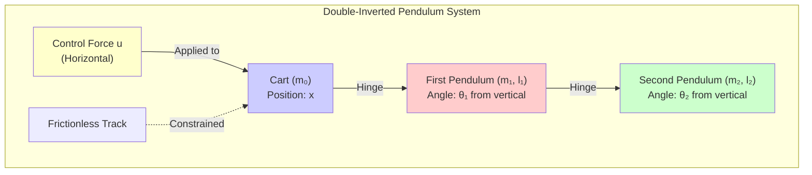
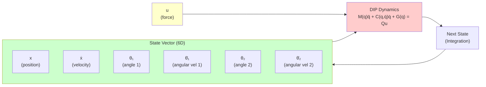
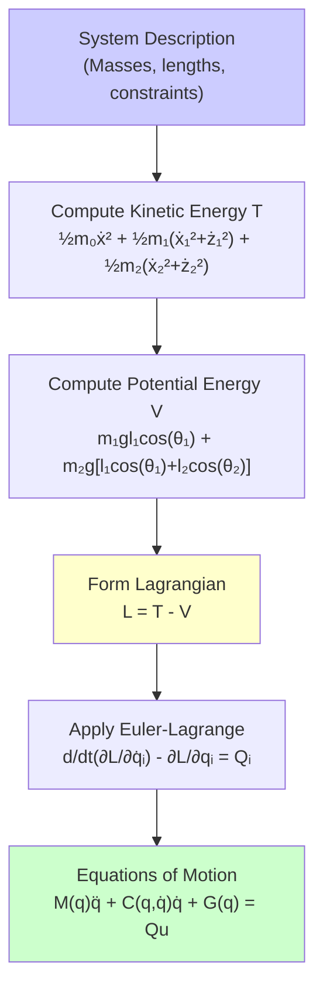
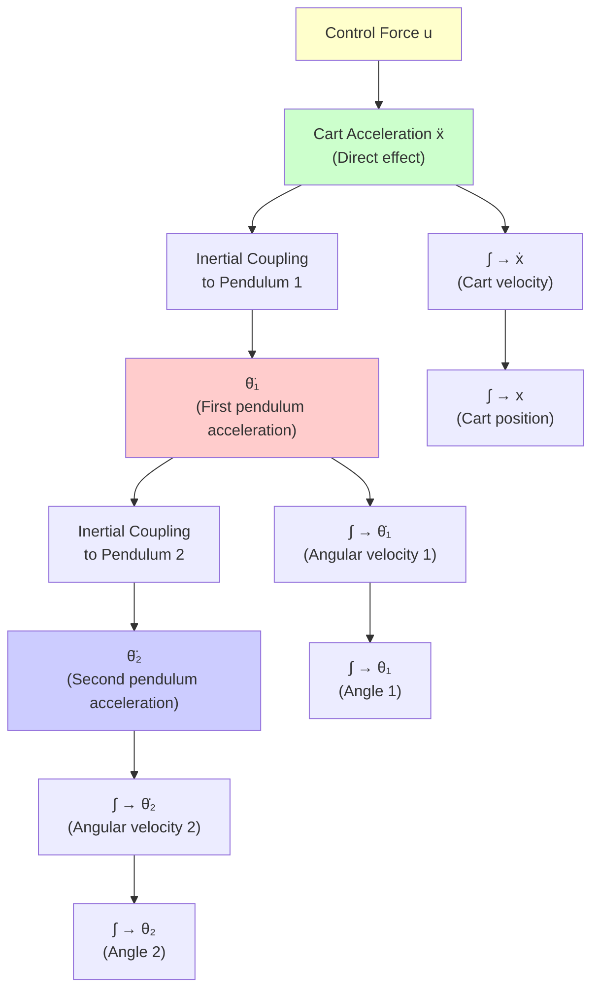

# Double-Inverted Pendulum Dynamics

**Understanding the Physics and Mathematics of the DIP System**

This guide derives the mathematical model of the double-inverted pendulum from first principles. You'll learn how Lagrangian mechanics produces the equations of motion, when linearization is valid, and why the system is controllable despite underactuation.

---

## Table of Contents

- [System Overview](#system-overview)
- [Lagrangian Derivation](#lagrangian-derivation)
- [Equations of Motion](#equations-of-motion)
- [Linearization for Control](#linearization-for-control)
- [Controllability Analysis](#controllability-analysis)

---

## System Overview

### Physical Description

The double-inverted pendulum (DIP) consists of:
- **Cart** (mass `m₀`): Moves horizontally on track
- **First Pendulum** (mass `m₁`, length `l₁`): Hinged to cart
- **Second Pendulum** (mass `m₂`, length `l₂`): Hinged to tip of first pendulum

**Control Objective**: Balance both pendulums upright (`θ₁ = θ₂ = 0`) using horizontal cart force `u`.

**Physical System Diagram**:



**System Components**:
- 🔵 **Cart**: Movable platform (1 DOF: position x)
- 🔴 **Pendulum 1**: First link (1 DOF: angle θ₁)
- 🟢 **Pendulum 2**: Second link (1 DOF: angle θ₂)
- 🟡 **Control**: Horizontal force u (single actuator)

### State Variables

**Generalized Coordinates** (3 DOF):
```
q = [x, θ₁, θ₂]ᵀ
```

Where:
- `x`: Cart position (m)
- `θ₁`: First pendulum angle from vertical (rad, 0 = upright)
- `θ₂`: Second pendulum angle from vertical (rad, 0 = upright)

**Full State Vector** (6 dimensions):
```
state = [x, ẋ, θ₁, θ̇₁, θ₂, θ̇₂]ᵀ
```

**Control Input**:
```
u = horizontal force on cart (N)
```

**State-Space Representation**:



**Dimensions**:
- **State space**: 6D (position + velocity for 3 coordinates)
- **Control space**: 1D (horizontal force only)
- **Underactuated**: 6 states, 1 control → dynamic coupling essential

### Why This System is Challenging

**Underactuated**: 3 DOF, 1 control input
- Cannot independently control all coordinates
- Must exploit dynamic coupling

**Unstable Equilibrium**: Upright position
- Small perturbations → pendulums fall
- Requires active stabilization

**Nonlinear Dynamics**: Trigonometric functions
- Linear control design requires approximations
- Full dynamics needed for large angles

**Coupled System**: Motion of one affects others
- Cart motion affects both pendulums
- Second pendulum motion affects first

---

## Lagrangian Derivation

### Why Lagrangian Mechanics?

**Newton's Laws**: Force-based approach
- Require constraint forces (reaction forces at joints)
- Complex for multi-body systems

**Lagrangian Mechanics**: Energy-based approach
- Automatically handles constraints
- Natural for deriving equations of motion
- Uses `L = T - V` (kinetic - potential energy)

**Lagrangian Derivation Process**:



**Advantages**:
- 🔵 **Systematic**: No need to derive constraint forces
- 🟡 **Lagrangian** L = T - V: Single scalar function
- 🟢 **Result**: Configuration-dependent dynamics M(q)

### Kinetic Energy

**Cart**:
```
T₀ = ½m₀ẋ²
```

**First Pendulum** (center of mass at `l₁/2`):

Position of COM:
```
x₁ = x + (l₁/2)sin(θ₁)
z₁ = (l₁/2)cos(θ₁)
```

Velocity:
```
ẋ₁ = ẋ + (l₁/2)θ̇₁cos(θ₁)
ż₁ = -(l₁/2)θ̇₁sin(θ₁)
```

Kinetic energy:
```
T₁ = ½m₁(ẋ₁² + ż₁²) + ½I₁θ̇₁²
   = ½m₁[ẋ² + (l₁/2)²θ̇₁² + l₁ẋθ̇₁cos(θ₁)] + ½I₁θ̇₁²
```

Where `I₁ = (1/3)m₁l₁²` (inertia of rod about end)

**Second Pendulum** (center of mass at `l₁ + l₂/2` from cart):

Position:
```
x₂ = x + l₁sin(θ₁) + (l₂/2)sin(θ₂)
z₂ = l₁cos(θ₁) + (l₂/2)cos(θ₂)
```

Velocity (chain rule):
```
ẋ₂ = ẋ + l₁θ̇₁cos(θ₁) + (l₂/2)θ̇₂cos(θ₂)
ż₂ = -l₁θ̇₁sin(θ₁) - (l₂/2)θ̇₂sin(θ₂)
```

Kinetic energy:
```
T₂ = ½m₂(ẋ₂² + ż₂²) + ½I₂θ̇₂²
```

**Total Kinetic Energy**:
```
T = T₀ + T₁ + T₂
```

### Potential Energy

Choose zero at cart level:

**First Pendulum**:
```
V₁ = m₁g(l₁/2)cos(θ₁)
```

**Second Pendulum**:
```
V₂ = m₂g[l₁cos(θ₁) + (l₂/2)cos(θ₂)]
```

**Total Potential Energy**:
```
V = V₁ + V₂
  = (m₁l₁/2 + m₂l₁)g·cos(θ₁) + (m₂l₂/2)g·cos(θ₂)
```

### Lagrangian

```
L = T - V
  = (kinetic energy) - (potential energy)
```

After substitution and simplification:
```
L = ½(m₀ + m₁ + m₂)ẋ²
  + ½(I₁ + m₁l₁²/4 + m₂l₁²)θ̇₁²
  + ½(I₂ + m₂l₂²/4)θ̇₂²
  + (m₁l₁/2 + m₂l₁)ẋθ̇₁cos(θ₁)
  + (m₂l₂/2)ẋθ̇₂cos(θ₂)
  + (m₂l₁l₂/2)θ̇₁θ̇₂cos(θ₁ - θ₂)
  - (m₁l₁/2 + m₂l₁)g·cos(θ₁)
  - (m₂l₂/2)g·cos(θ₂)
```

**Note**: This is a complex expression due to coupling terms!

---

## Equations of Motion

### Euler-Lagrange Equations

For each generalized coordinate `qᵢ`:
```
d/dt(∂L/∂q̇ᵢ) - ∂L/∂qᵢ = Qᵢ
```

Where `Qᵢ` are generalized forces.

**For DIP**:
- `q₁ = x`: Generalized force = `u` (cart force)
- `q₂ = θ₁`: Generalized force = `0` (no direct torque)
- `q₃ = θ₂`: Generalized force = `0` (no direct torque)

### Matrix Form

After applying Euler-Lagrange and simplifying:

```
M(q)q̈ + C(q, q̇)q̇ + G(q) = Qu
```

Where:
- `M(q)`: **Inertia matrix** (3×3, configuration-dependent)
- `C(q, q̇)`: **Coriolis/centrifugal matrix** (3×3)
- `G(q)`: **Gravitational vector** (3×1)
- `Q`: **Input matrix** (3×1)
- `u`: **Control force** (scalar)

**Inertia Matrix** (simplified):
```
M = [m_total           m_c1·cos(θ₁)      m_c2·cos(θ₂)    ]
    [m_c1·cos(θ₁)      I_eff1            m_12·cos(θ₁-θ₂)]
    [m_c2·cos(θ₂)      m_12·cos(θ₁-θ₂)   I_eff2          ]
```

**Gravitational Vector**:
```
G = [    0                            ]
    [(m₁l₁/2 + m₂l₁)g·sin(θ₁)        ]
    [(m₂l₂/2)g·sin(θ₂)                ]
```

**Input Matrix**:
```
Q = [1, 0, 0]ᵀ
```

### Properties of the Dynamics

**1. M(q) is Symmetric and Positive Definite**
- Always invertible (except at singularities)
- Energy considerations guarantee this

**2. Configuration-Dependent Inertia**
- `M` depends on `θ₁, θ₂` (not constant!)
- Coupling changes with pendulum angles

**3. Coriolis Matrix is Skew-Symmetric**
- `Ṁ - 2C` is skew-symmetric
- Important for energy-based control

---

## Linearization for Control

### Small Angle Approximation

Near upright position (`θ₁ ≈ 0, θ₂ ≈ 0`):

**Trigonometric Approximations**:
```
sin(θ) ≈ θ
cos(θ) ≈ 1
sin(θ)cos(θ) ≈ θ
```

**Validity**:
- |θ| < 0.2 rad (≈ 11°): Error < 2%
- |θ| < 0.3 rad (≈ 17°): Error < 5%
- |θ| > 0.5 rad (≈ 29°): Approximation breaks down

### Simplified Dynamics

**Assumptions**:
1. Small angles: `θ₁, θ₂ ≪ 1`
2. Small velocities: `θ̇₁, θ̇₂ ≪ 1`
3. Neglect products: `θᵢθⱼ ≈ 0`

**Result**: Linearized equations
```
M_lin·q̈ + G_lin·q = Q·u
```

Where:
- `M_lin`: Constant inertia matrix
- `G_lin`: Constant gravitational matrix (no sin/cos)

**State-Space Form**:
```
ẋ = Ax + Bu

A = [0   I  ]    B = [  0      ]
    [M⁻¹G 0]        [M⁻¹Q    ]
```

**Control Design Benefits**:
- Linear system → linear control methods (LQR, pole placement)
- Constant matrices → easier analysis
- Superposition applies → simple design

### Limitations of Linearization

**Invalid for**:
1. **Large angles**: Swing-up control (θ > 90°)
2. **Fast motion**: Large θ̇ violates small velocity assumption
3. **Extreme conditions**: Actuator saturation, disturbances

**When to Use Full Nonlinear**:
- Final validation
- Hardware testing
- Large disturbance scenarios
- Research publications

---

## Controllability Analysis

### Controllability Matrix

**Definition**: System is controllable if we can reach any state from any initial state.

**Test**: Controllability matrix has full rank:
```
C = [B  AB  A²B  ...  A⁵B]
```

For 6-state system, need rank(C) = 6.

### DIP Controllability

**Result**: DIP is controllable (rank = 6) despite underactuation!

**Why?**
- Cart force `u` affects cart acceleration: `ẍ ∝ u`
- Cart motion couples to pendulums via inertia matrix
- Dynamic coupling propagates control to all states

**Physical Intuition**:
- Move cart right → first pendulum tilts left (inertia)
- First pendulum motion → affects second pendulum
- Clever sequencing → control all angles

**Proof Sketch**:
1. Direct effect: `u → ẍ` (cart acceleration)
2. First-order coupling: `ẍ → θ̈₁` (first pendulum)
3. Second-order coupling: `θ̈₁ → θ̈₂` (second pendulum)
4. Three integration steps → reach all position states
5. Controllability matrix full rank ✓

**Control Propagation Diagram**:



**Key Insight**: Single control input reaches all 6 states via:
- 🟡 **Direct** effect on cart
- 🟢 **Inertial coupling** to pendulum 1
- 🔴 **Secondary coupling** to pendulum 2
- 🔵 **Integration** for position control

**Controllability Matrix**:
```
rank([B  AB  A²B  A³B  A⁴B  A⁵B]) = 6  ✓
```
System is **fully controllable** despite underactuation!

### Observability

**State Measurement**:
- Typically measure: `[x, θ₁, θ₂]` (positions only)
- Velocities: Computed from position derivatives

**Observability Test**:
```
O = [C  CA  CA²  ...  CA⁵]ᵀ
```

Where `C = [1 0 0 0 0 0; 0 0 1 0 0 0; 0 0 0 0 1 0]` (measure positions)

**Result**: Observable (rank = 6)

**Meaning**: Can estimate full state from position measurements

---

## Summary

**Key Takeaways**:

1. **Lagrangian Derivation**: Energy method naturally handles constraints
2. **Matrix Form**: `M(q)q̈ + C(q,q̇)q̇ + G(q) = Qu` (configuration-dependent)
3. **Linearization**: Valid for |θ| < 15°, enables linear control design
4. **Controllability**: Underactuated but controllable via dynamic coupling
5. **Observability**: Full state observable from position measurements

**Design Implications**:
- **Small angles**: Use simplified dynamics for fast control design
- **Large angles**: Must use full nonlinear dynamics
- **Control**: Exploit coupling to control all DOFs with one input
- **Estimation**: State observer feasible from position measurements

**Next Steps**:
- See linearization in action: [Tutorial 01](../tutorials/tutorial-01-first-simulation.md)
- Implement dynamics models: [Plant Models API](../api/plant-models.md)
- Deep dive: [Dynamics Derivations](../../mathematical_foundations/dynamics_derivations.md)

---

**Further Reading**:
- Goldstein, H. (2002). *Classical Mechanics*. Addison-Wesley.
- Spong, M. W., et al. (2006). *Robot Modeling and Control*. Wiley.
- Khalil, H. K. (2002). *Nonlinear Systems*. Prentice Hall.

---

**Last Updated**: October 2025
