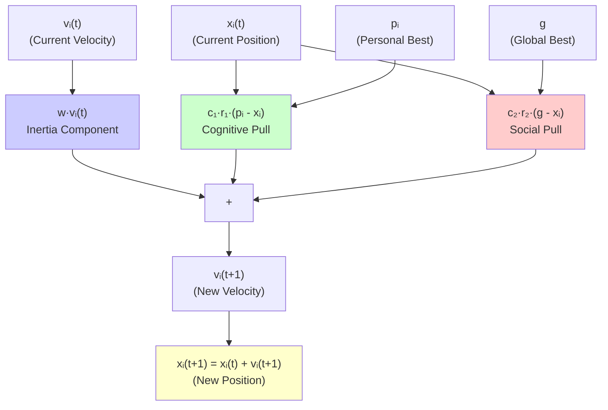
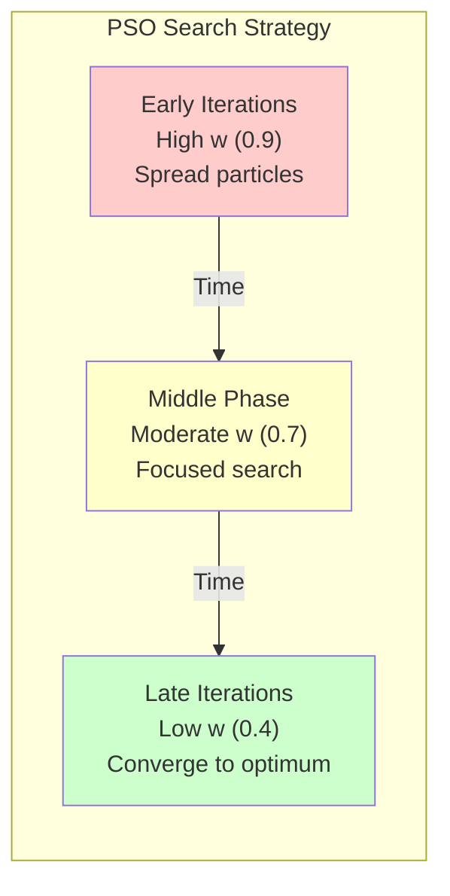
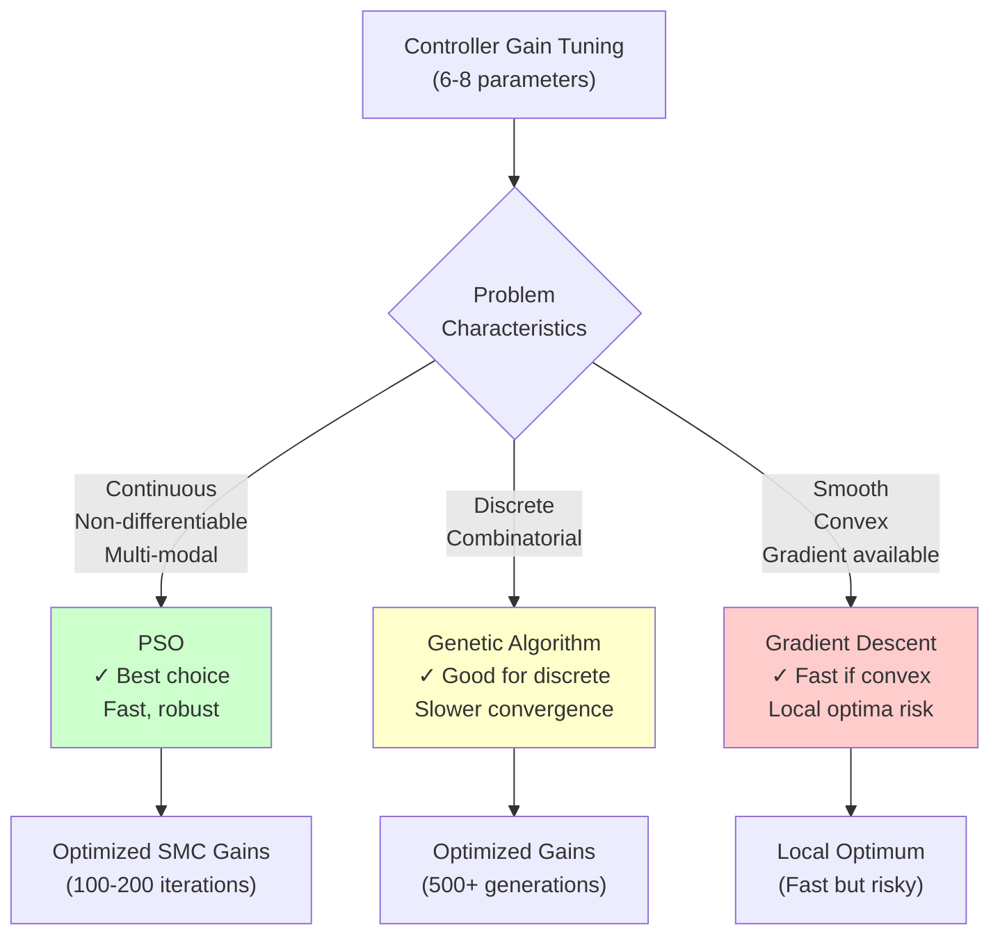

# PSO Algorithm Theory

**Understanding Swarm Intelligence and Optimization Principles**

This guide explains the theoretical foundations of Particle Swarm Optimization (PSO), from bio-inspired origins to convergence guarantees. You'll learn why PSO works, how to tune parameters, and when to use PSO vs other optimizers.

---

## Table of Contents

- [Swarm Intelligence Principles](#swarm-intelligence-principles)
- [PSO Convergence Theory](#pso-convergence-theory)
- [Parameter Selection Guidelines](#parameter-selection-guidelines)
- [Benchmark Comparisons](#benchmark-comparisons)

---

## Swarm Intelligence Principles

### Bio-Inspired Origins

PSO is inspired by **social behavior** of bird flocking and fish schooling:

**Observation in Nature**:
- Birds find food sources efficiently without central coordination
- Each bird adjusts based on:
  1. Its own best experience (cognitive component)
  2. The flock's best experience (social component)

**Translation to Optimization**:
- **Particles** = candidate solutions
- **Position** = solution in search space
- **Velocity** = direction and speed of search
- **Best positions** = best solutions found

### The PSO Algorithm

**Algorithm Overview**:

```mermaid
flowchart TD
    INIT[Initialize Swarm<br/>Random positions & velocities] --> EVAL1[Evaluate Fitness<br/>Run simulations]
    EVAL1 --> UPDATE_P[Update Personal Best<br/>pᵢ = best position for each particle]
    UPDATE_P --> UPDATE_G[Update Global Best<br/>g = best position overall]

    UPDATE_G --> UPDATE_V[Update Velocities<br/>vᵢ = w·vᵢ + c₁·r₁·(pᵢ-xᵢ) + c₂·r₂·(g-xᵢ)]
    UPDATE_V --> UPDATE_X[Update Positions<br/>xᵢ = xᵢ + vᵢ]

    UPDATE_X --> CHECK{Converged?<br/>(Max iterations<br/>or stagnation)}
    CHECK -->|No| EVAL2[Evaluate Fitness]
    EVAL2 --> UPDATE_P

    CHECK -->|Yes| DONE[Return Global Best<br/>Optimized gains]

    style INIT fill:#ccccff
    style DONE fill:#ccffcc
```

**Each particle `i` has**:
- Position: `xᵢ(t)` (current solution)
- Velocity: `vᵢ(t)` (search direction)
- Personal best: `pᵢ` (best position found by particle i)
- Global best: `g` (best position found by entire swarm)

**Update Equations**:
```
vᵢ(t+1) = w·vᵢ(t) + c₁·r₁·(pᵢ - xᵢ(t)) + c₂·r₂·(g - xᵢ(t))
xᵢ(t+1) = xᵢ(t) + vᵢ(t+1)
```

Where:
- `w`: Inertia weight (momentum)
- `c₁`: Cognitive coefficient (self-confidence)
- `c₂`: Social coefficient (swarm confidence)
- `r₁, r₂`: Random numbers in [0,1] (stochastic exploration)

**Intuitive Meaning**:
- **`w·vᵢ(t)`**: Keep moving in current direction (exploration)
- **`c₁·r₁·(pᵢ - xᵢ)`**: Move toward own best (personal experience)
- **`c₂·r₂·(g - xᵢ)`**: Move toward swarm best (social learning)

**Velocity Update Visualization**:



**Components**:
- 🔵 **Inertia**: Momentum from previous motion
- 🟢 **Cognitive**: Attraction to personal best experience
- 🔴 **Social**: Attraction to swarm's collective best
- 🟡 **Result**: Balanced exploration and exploitation

### Exploration vs Exploitation

**Exploration**: Search broadly to find new regions
- High inertia `w` → more exploration
- Randomness `r₁, r₂` → stochastic search

**Exploitation**: Search deeply in promising regions
- High cognitive/social `c₁, c₂` → focus on best solutions
- Decrease `w` over time → transition to exploitation

**Balanced Search**:
```
Early iterations: High w (explore) + low c₁,c₂
Late iterations: Low w (exploit) + high c₁,c₂
```

**Exploration vs Exploitation Balance**:



**Phases**:
- 🔴 **Exploration** (High w): Search broadly, discover promising regions
- 🟡 **Transition** (Medium w): Balance between search and convergence
- 🟢 **Exploitation** (Low w): Refine solution, converge to optimum

### Global vs Local Optima

**Multi-modal Functions**: Multiple peaks (local optima)

PSO finds **global optimum** because:
1. **Swarm diversity**: Particles spread across search space
2. **Information sharing**: Global best guides swarm
3. **Stochastic search**: Random components escape local traps

**Risk of Premature Convergence**:
- All particles cluster at local optimum
- Swarm loses diversity → stuck
- **Solution**: Maintain diversity (inertia decay, topology variants)

---

## PSO Convergence Theory

### Convergence Guarantees

**Theorem (Simplified)**: Under certain conditions, PSO converges to global optimum:

**Conditions**:
1. **Bounded search space**: `x ∈ [x_min, x_max]`
2. **Sufficient particles**: `N ≥ some threshold` (problem-dependent)
3. **Appropriate parameters**: `w, c₁, c₂` in stable region

**Convergence Rate**:
- **Linear convergence** for unimodal functions
- **Sublinear** for multi-modal functions
- Faster than random search, comparable to genetic algorithms

### Velocity Clamping

**Problem**: Velocities can grow unbounded → particles leave search space

**Solution**: Clamp velocities
```
if |vᵢ| > v_max:
    vᵢ = v_max · sign(vᵢ)
```

**Guideline**: `v_max = 0.1 to 0.5 × (x_max - x_min)`

**Effect on Convergence**:
- Too small `v_max` → slow convergence (limited exploration)
- Too large `v_max` → oscillations (overshoot optima)
- Optimal `v_max` → smooth convergence

### Constriction Factor

**Alternative to velocity clamping**: Constriction coefficient `χ`

**Update Equation**:
```
vᵢ(t+1) = χ · [vᵢ(t) + c₁·r₁·(pᵢ - xᵢ) + c₂·r₂·(g - xᵢ)]
```

Where:
```
χ = 2 / |2 - φ - √(φ² - 4φ)|
φ = c₁ + c₂ > 4
```

**Canonical Values**:
```
c₁ = c₂ = 2.05
φ = 4.1
χ ≈ 0.7298
```

**Advantage**: Guaranteed convergence (no velocity clamping needed)

### Stagnation and Premature Convergence

**Stagnation**: Particles stop improving

**Causes**:
1. **Swarm collapsed**: All particles at same location
2. **Local optimum trap**: Swarm stuck in basin of attraction
3. **Diversity loss**: Velocities → 0

**Detection**:
```
if std(positions) < threshold:
    stagnation = True
```

**Solutions**:
1. **Restart**: Re-initialize particles
2. **Repulsion**: Add repulsive forces between particles
3. **Topology**: Use local best instead of global (preserve diversity)

---

## Parameter Selection Guidelines

### Swarm Size

**Theory**: Larger swarm → better exploration, but more expensive

**Guidelines**:
```
N = 10 + 2√D
```
Where `D` = problem dimensionality

**For Controller Tuning**:
- Classical SMC (6 gains): `N = 10 + 2√6 ≈ 15` particles
- Adaptive SMC (5 gains): `N = 10 + 2√5 ≈ 15` particles
- Hybrid SMC (4 gains): `N = 10 + 2√4 ≈ 14` particles

**Practical Range**: 20-50 particles for most problems

### Iteration Count

**Theory**: More iterations → better convergence, but more time

**Convergence Indicators**:
1. **Fitness improvement** < threshold (e.g., 0.1% over 10 iterations)
2. **Swarm diversity** < threshold
3. **Maximum iterations** reached

**Guidelines**:
```
Quick tuning: 50 iterations
Standard: 100 iterations
Thorough: 200+ iterations
```

**For Controller Tuning**:
- Prototyping: 50 iterations (5-10 min)
- Development: 100 iterations (10-20 min)
- Publication: 200 iterations (20-40 min)

### Inertia Weight Strategies

**Constant Inertia**: `w = 0.7298` (constriction factor)
- Simple, works for many problems
- No adaptation to problem

**Linearly Decreasing**:
```
w(t) = w_max - (w_max - w_min) · t/T
```
- `w_max = 0.9` (initial exploration)
- `w_min = 0.4` (final exploitation)
- `T` = max iterations

**Adaptive**: Adjust based on convergence
```
if improving:
    w = w_max (explore more)
else:
    w = w_min (exploit current region)
```

### Cognitive/Social Coefficients

**Classical Values**: `c₁ = c₂ = 2.05` (balanced)

**Exploration-Heavy**: `c₁ = 2.5, c₂ = 1.5`
- Emphasize personal experience
- Slower convergence, better global search

**Exploitation-Heavy**: `c₁ = 1.5, c₂ = 2.5`
- Emphasize swarm best
- Faster convergence, risk of local traps

**Recommendation for Controller Tuning**:
```
c₁ = 1.49618  (cognitive)
c₂ = 1.49618  (social)
w = 0.7298    (inertia)
```

---

## Benchmark Comparisons

### PSO vs Genetic Algorithms (GA)

| Aspect | PSO | Genetic Algorithm |
|--------|-----|-------------------|
| **Inspiration** | Swarm behavior | Evolution |
| **Population** | Continuous evolution | Generational |
| **Operators** | Velocity updates | Crossover, mutation |
| **Convergence** | Fast (few iterations) | Slower (many generations) |
| **Parameters** | 3-4 (w, c₁, c₂, N) | Many (crossover rate, mutation, selection) |
| **Tuning Difficulty** | Easy | Harder |
| **Best For** | Continuous optimization | Discrete, combinatorial |

**For Controller Gain Tuning**: PSO is generally better
- Continuous search space (gain values)
- Fewer parameters to tune
- Faster convergence

**Algorithm Comparison for SMC Tuning**:



**Recommendation**: Use PSO for SMC gain tuning due to non-differentiable cost functions (sign, saturation) and multimodal landscapes.

### PSO vs Gradient-Based Methods

| Aspect | PSO | Gradient Methods |
|--------|-----|------------------|
| **Requirements** | Only function values | Gradient information |
| **Derivative-Free** | Yes | No |
| **Global Search** | Yes | No (local methods) |
| **Convergence Speed** | Moderate | Fast (if convex) |
| **Multimodal Functions** | Good | Poor (stuck in local) |
| **Noise Tolerance** | High | Low |

**When PSO Excels**:
1. **Non-differentiable** cost functions (e.g., thresholding, max operations)
2. **Multimodal** landscapes (many local optima)
3. **Noisy** evaluations (stochastic simulations)
4. **Black-box** problems (no gradient available)

**When Gradient Methods Excel**:
1. **Smooth, convex** functions (quadratic costs)
2. **High-dimensional** problems (PSO struggles >100 dimensions)
3. **Gradient available** (analytical or auto-diff)

### PSO vs Random Search

| Aspect | PSO | Random Search |
|--------|-----|---------------|
| **Intelligence** | Guided by best solutions | Purely random |
| **Convergence** | Faster (information sharing) | Slower |
| **Parallelization** | Moderate (some dependency) | Perfect (independent) |
| **Simplicity** | Moderate complexity | Very simple |

**Efficiency Comparison**:
```
Random Search: O(N²) samples to find optimum
PSO: O(N·log N) samples (empirical)
```

**For Controller Tuning**: PSO is 10-100× faster than random search

### When PSO Struggles

**High Dimensions** (D > 100):
- Curse of dimensionality
- Swarm size grows: `N ∝ √D`
- Consider: CMA-ES, differential evolution

**Discrete/Combinatorial** Problems:
- PSO designed for continuous
- Consider: GA, simulated annealing

**Tight Constraints**:
- PSO may violate constraints frequently
- Consider: penalty methods or constraint-handling variants

**Very Fast Evaluation** (< 1ms):
- PSO overhead dominates
- Consider: Gradient methods (if differentiable)

---

## Summary

**Key Takeaways**:

1. **PSO Principle**: Particles balance personal experience and swarm knowledge
2. **Convergence**: Guaranteed under proper parameter settings (constriction factor)
3. **Parameter Tuning**: Use canonical values (`w=0.73, c₁=c₂=1.5`) or adapt inertia
4. **vs GA**: Faster for continuous problems, easier to tune
5. **vs Gradient**: Better for multimodal, non-differentiable, noisy problems

**Best Practices for Controller Tuning**:
```python
N_particles = 30           # Sufficient for 4-6 gains
max_iters = 100            # Balance speed and quality
w = 0.7298                 # Constriction factor
c1 = c2 = 1.49618          # Balanced cognitive/social
```

**Next Steps**:
- Apply theory in [Tutorial 03: PSO Optimization](../tutorials/tutorial-03-pso-optimization.md)
- Tune controllers using [Optimization API](../api/optimization.md)
- Deep dive into [PSO Mathematical Theory](../../mathematical_foundations/pso_algorithm_theory.md)

---

**Further Reading**:
- Kennedy, J., & Eberhart, R. (1995). *Particle swarm optimization*. Proc. IEEE ICNN.
- Clerc, M., & Kennedy, J. (2002). *The particle swarm-explosion, stability, and convergence in a multidimensional complex space*. IEEE Trans. Evol. Comput.
- Poli, R., et al. (2007). *Particle swarm optimization: An overview*. Swarm Intelligence.

---

**Last Updated**: October 2025
