# Tutorial 01: Your First Simulation

**Level:** Beginner
**Duration:** 30-45 minutes
**Prerequisites:** Completed [Getting Started Guide](../getting-started.md)

## Learning Objectives

By the end of this tutorial, you will:

- [ ] Understand the double-inverted pendulum (DIP) control problem
- [ ] Run simulations with the Classical SMC controller
- [ ] Interpret simulation results and performance metrics
- [ ] Modify controller parameters and observe effects
- [ ] Understand the role of initial conditions
- [ ] Gain intuition for SMC control behavior

---

## Background: The Double-Inverted Pendulum

### System Description

The double-inverted pendulum (DIP) is a classic benchmark problem in control theory. It consists of:

**Physical Components:**
- **Cart:** Moves horizontally on a frictionless track
- **First Pendulum:** Attached to cart, free to rotate
- **Second Pendulum:** Attached to tip of first pendulum
- **Actuator:** Applies horizontal force to cart

**Control Objective:**
Stabilize both pendulums in the upright position (vertical) while regulating the cart's position, using only horizontal force on the cart.

**Why is this challenging?**

1. **Underactuated System:** One control input (cart force) but three degrees of freedom (cart position + 2 pendulum angles)
2. **Unstable Equilibrium:** Upright position is naturally unstable (like balancing a broomstick on your hand)
3. **Nonlinear Dynamics:** Equations of motion include sin/cos terms and coupling effects
4. **Coupled Motion:** Moving the cart affects both pendulums; pendulum motion affects cart

### State Variables

The system is described by 6 state variables:

```python
state = [x, dx, θ₁, dθ₁, θ₂, dθ₂]
```

| Variable | Description | Units | Typical Range |
|----------|-------------|-------|---------------|
| `x` | Cart position | m | ±2.0 |
| `dx` | Cart velocity | m/s | ±3.0 |
| `θ₁` | First pendulum angle from vertical | rad | ±π |
| `dθ₁` | First pendulum angular velocity | rad/s | ±10 |
| `θ₂` | Second pendulum angle from vertical | rad | ±π |
| `dθ₂` | Second pendulum angular velocity | rad/s | ±10 |

**Sign Conventions:**
- Positive `x`: Cart to the right
- Positive `θ₁`, `θ₂`: Pendulums tilted to the right (clockwise from vertical)
- Vertical upright: `θ₁ = θ₂ = 0`

### Physical Parameters

The default configuration uses realistic parameters:

```yaml
# config.yaml - dip_params section
m0: 1.0       # Cart mass (kg)
m1: 0.1       # First pendulum mass (kg)
m2: 0.1       # Second pendulum mass (kg)
l1: 0.5       # First pendulum length (m)
l2: 0.5       # Second pendulum length (m)
I1: 0.0083    # First pendulum inertia (kg·m²)
I2: 0.0083    # Second pendulum inertia (kg·m²)
g: 9.81       # Gravitational acceleration (m/s²)
```

**Total Height:** 1.0 m (both pendulums vertical)
**Total Mass:** 1.2 kg (cart + both pendulums)

### Classical SMC Overview

Sliding Mode Control (SMC) is a nonlinear control technique that:

1. **Defines a Sliding Surface:** A function of state errors
   ```
   s = k₁·θ₁ + k₂·dθ₁ + λ₁·θ₂ + λ₂·dθ₂
   ```

2. **Drives System to Surface:** Control law forces `s → 0`
   ```
   u = -K·sign(s)  or  u = -K·tanh(s/ε)  (smoothed)
   ```

3. **Maintains on Surface:** Once on surface, system slides to equilibrium

**Key Properties:**
- **Robustness:** Insensitive to model uncertainties and disturbances
- **Finite-Time Convergence:** Reaches sliding surface in finite time
- **Chattering:** High-frequency switching (mitigated by boundary layer ε)

> **📚 Deep Dive:** For detailed mathematical foundations, see:
> - [DIP Dynamics Theory](../theory/dip-dynamics.md) - Lagrangian derivation and controllability
> - [SMC Theory](../theory/smc-theory.md) - Lyapunov stability and sliding mode principles

---

## Step-by-Step Simulation

### Step 1: Verify Installation

Before starting, ensure the framework is properly installed:

```bash
# Check you're in the project directory
pwd
# Should show: .../dip-smc-pso

# Activate virtual environment (if using one)
source venv/bin/activate  # Linux/Mac
venv\Scripts\activate     # Windows

# Verify Python and dependencies
python -c "import numpy, matplotlib, yaml; print('Dependencies OK')"
```

**Expected output:** `Dependencies OK`

If you see errors, return to the [Getting Started Guide](../getting-started.md#installation).

### Step 2: Understand Default Configuration

Print the current configuration to see what parameters will be used:

```bash
python simulate.py --print-config
```

**Key sections to review:**

**Controller Defaults:**
```yaml
controller_defaults:
  classical_smc:
    gains:
      - 5.0    # k₁: First pendulum proportional gain
      - 5.0    # k₂: First pendulum derivative gain
      - 5.0    # λ₁: Second pendulum proportional gain
      - 0.5    # λ₂: Second pendulum derivative gain
      - 0.5    # K: Switching gain
      - 0.5    # ε: Boundary layer width
```

**Controller Configuration:**
```yaml
controllers:
  classical_smc:
    max_force: 150.0        # Actuator saturation limit (N)
    boundary_layer: 0.3     # Boundary layer for chattering reduction
    dt: 0.001               # Control timestep (s)
```

**Simulation Settings:**
```yaml
simulation:
  duration: 5.0           # Simulation time (seconds)
  dt: 0.001               # Integration timestep (seconds)
  initial_state:          # Starting condition
    - 0.1                 # x = 0.1 m (cart displaced right)
    - 0.0                 # dx = 0 m/s
    - 0.0                 # θ₁ = 0 rad (upright)
    - 0.0                 # dθ₁ = 0 rad/s
    - 0.0                 # θ₂ = 0 rad (upright)
    - 0.0                 # dθ₂ = 0 rad/s
```

**Physics Parameters:** (see `dip_params` section)

### Step 3: Run First Simulation

Execute the simulation with Classical SMC:

```bash
python simulate.py --ctrl classical_smc --plot
```

**What's happening:**

1. **Configuration Loading** (0.1s)
   - Reads `config.yaml`
   - Validates all parameters
   - Seeds random number generator (for reproducibility)

2. **Controller Creation** (0.01s)
   - Instantiates `ClassicalSMC` with default gains
   - Sets saturation limit and boundary layer

3. **Dynamics Model Initialization** (0.01s)
   - Creates simplified nonlinear dynamics model
   - Precomputes mass matrix and Coriolis terms

4. **Simulation Loop** (1-3s)
   - 5,000 integration steps (5.0s / 0.001s)
   - At each step:
     * Controller computes force `u` from current state
     * Dynamics integrates equations of motion
     * State updated and logged

5. **Post-Processing** (0.5s)
   - Computes performance metrics
   - Generates plots

**Expected terminal output:**

```
[INFO] 2025-10-05 15:30:12 - Loading configuration from config.yaml
[INFO] 2025-10-05 15:30:12 - Configuration hash: a8f3c2d1
[INFO] 2025-10-05 15:30:12 - Global seed: 42
[INFO] 2025-10-05 15:30:12 - Creating Classical SMC controller
[INFO] 2025-10-05 15:30:12 - Controller gains: [5.0, 5.0, 5.0, 0.5, 0.5, 0.5]
[INFO] 2025-10-05 15:30:12 - Max force: 150.0 N
[INFO] 2025-10-05 15:30:12 - Boundary layer: 0.3
[INFO] 2025-10-05 15:30:12 - Initializing DIP dynamics (simplified model)
[INFO] 2025-10-05 15:30:12 - Running simulation
[INFO] 2025-10-05 15:30:12 - Duration: 5.0 s, dt: 0.001 s, steps: 5000
[INFO] 2025-10-05 15:30:14 - Simulation complete in 2.3s
[INFO] 2025-10-05 15:30:14 - Computing performance metrics...
[INFO] 2025-10-05 15:30:14 - Performance Metrics:
       Settling Time: 2.45 s
       Max Overshoot: 3.2 %
       Steady-State Error: 0.008 rad (0.46°)
       RMS Control Effort: 12.4 N
       Peak Control: 45.3 N
       Control Saturation: 0.0% (no saturation events)
[INFO] 2025-10-05 15:30:14 - Generating plots...
[INFO] 2025-10-05 15:30:15 - Displaying plots
```

**⏱️ Total Time:** ~3-5 seconds

### Step 4: Interpret Results

Two plot windows will appear. Let's analyze each carefully.

#### Plot 1: State Trajectories

Six subplots showing the evolution of all state variables:

**Subplot 1: Cart Position `x(t)`**
- **Initial value:** 0.1 m (displaced right)
- **Behavior:** Slight oscillation, then settles near 0.1 m
- **Why not zero?** Steady-state regulation error due to pendulum stabilization priority

**Subplot 2: Cart Velocity `dx(t)`**
- **Initial value:** 0 m/s
- **Behavior:** Oscillates initially, converges to ~0 m/s
- **Peak:** ~0.3 m/s during transient

**Subplot 3: First Pendulum Angle `θ₁(t)`**
- **Initial value:** 0 rad (upright)
- **Behavior:** Remains near zero (pendulums start stable)
- **Observation:** Small oscillations (~±0.02 rad) due to cart motion coupling

**Subplot 4: First Pendulum Velocity `dθ₁(t)`**
- **Initial value:** 0 rad/s
- **Behavior:** Small oscillations, settles to zero
- **Peak:** ~±1.0 rad/s during transient

**Subplot 5: Second Pendulum Angle `θ₂(t)`**
- **Initial value:** 0 rad (upright)
- **Behavior:** Similar to θ₁, stays near zero
- **Coupling:** Notice correlation with θ₁ motion

**Subplot 6: Second Pendulum Velocity `dθ₂(t)`**
- **Initial value:** 0 rad/s
- **Behavior:** Oscillates, converges to zero
- **Peak:** ~±1.5 rad/s (higher than θ₁ due to being farther from pivot)

**Key Observations:**
1. **Transient phase:** 0-2.5 seconds (oscillations)
2. **Steady state:** 2.5-5.0 seconds (stable, small residual oscillations)
3. **Coupling:** Cart motion induces pendulum oscillations
4. **Stability:** All variables bounded and converging

#### Plot 2: Control Input `u(t)`

Single plot showing the force applied to the cart:

**Time Regions:**

**0-0.5s: Initial Response**
- Large force spike: ~40 N
- Direction: Negative (pushing cart left to counter displacement)
- Purpose: Rapid correction of initial perturbation

**0.5-2.5s: Active Stabilization**
- Oscillating force: ±20 N
- Frequency: ~2-3 Hz
- Purpose: Balancing pendulums while controlling cart

**2.5-5.0s: Steady-State Regulation**
- Small forces: ±5 N
- Purpose: Disturbance rejection and fine regulation
- Observation: Some chattering visible (rapid small oscillations)

**Saturation:**
- Max force: ~45 N
- Limit: ±150 N
- Utilization: 30% of available control authority

**Chattering:**
- Visible as high-frequency oscillation (~50-100 Hz)
- Magnitude: ~±2 N in steady state
- Mitigation: Boundary layer (ε=0.3) smooths control law

#### Performance Metrics Deep Dive

**Settling Time: 2.45 seconds**

*Definition:* Time until all state variables remain within 2% of their final values.

*Computation:*
```python
# For each state variable:
final_value = x[-1]
threshold = 0.02 * abs(final_value)
settling_idx = np.where(abs(x - final_value) > threshold)[0]
settling_time = t[settling_idx[-1]] if len(settling_idx) > 0 else 0
```

*Interpretation:*
- 2.45s is moderate (neither fast nor slow)
- Acceptable for many applications
- Depends on: gains, initial conditions, system inertia

**Max Overshoot: 3.2%**

*Definition:* Maximum percentage deviation beyond final value.

*Computation:*
```python
# For first pendulum angle θ₁:
final_angle = theta1[-1]  # ~0 rad
peak_angle = np.max(np.abs(theta1))
overshoot = (peak_angle - abs(final_angle)) / abs(final_angle) * 100
```

*Interpretation:*
- 3.2% is excellent (target: <5%)
- Indicates good damping
- Well-tuned controller (not too aggressive)

**Steady-State Error: 0.008 rad (0.46°)**

*Definition:* Final tracking error after settling.

*Computation:*
```python
# Average error in last 20% of simulation
steady_state_region = x[int(0.8*len(x)):]
steady_state_error = np.mean(np.abs(steady_state_region - desired_state))
```

*Interpretation:*
- 0.008 rad is very good (<1°)
- Sources: friction, model mismatch, discretization
- Acceptable for most control applications

**RMS Control Effort: 12.4 N**

*Definition:* Root-mean-square of control input over time.

*Computation:*
```python
rms_control = np.sqrt(np.mean(u**2))
```

*Interpretation:*
- 12.4 N is moderate
- Much less than saturation limit (150 N)
- Indicates energy-efficient control
- Actuator wear is low

#### Expected Results Summary

**Typical Performance Ranges** (Default Configuration)

| Metric | Expected Range | Interpretation |
|--------|----------------|----------------|
| **Settling Time** | 2.0-3.0 seconds | Time to stabilize both pendulums |
| **Max Overshoot** | 2-5% | Peak deviation from equilibrium |
| **Steady-State Error** | 0.005-0.01 rad | Final angular error (~0.3-0.6°) |
| **Peak Control** | 40-60 N | Maximum force during transient |
| **RMS Control** | 10-15 N | Average control effort |
| **Saturation Events** | 0-2% | Percentage of time at limits |

**Visual Behavior Pattern**:

```mermaid
flowchart LR
    subgraph "Simulation Timeline (0-5 seconds)"
        direction TB
        PHASE1["Phase 1: Initial Response<br/>0-0.5s<br/>⚡ Large control spike<br/>📊 Rapid state change"]
        PHASE2["Phase 2: Active Stabilization<br/>0.5-2.5s<br/>🔄 Oscillating control<br/>📉 Decreasing amplitude"]
        PHASE3["Phase 3: Steady State<br/>2.5-5.0s<br/>✅ Small corrections<br/>🎯 Near equilibrium"]
    end

    PHASE1 --> PHASE2
    PHASE2 --> PHASE3

    style PHASE1 fill:#ffcccc
    style PHASE2 fill:#ffffcc
    style PHASE3 fill:#ccffcc
```



**Phase Characteristics**:

- 🔴 **Phase 1** (Initial Response): Large control action, rapid state change, peak forces
- 🟡 **Phase 2** (Active Stabilization): Oscillatory behavior, gradually decreasing amplitude
- 🟢 **Phase 3** (Steady State): Minimal oscillations, small control effort, convergence achieved

**Good Results Checklist**:
- ✅ All state variables bounded (no divergence)
- ✅ Control input stays within ±150 N (no saturation)
- ✅ Settling time < 3 seconds
- ✅ Overshoot < 5%
- ✅ Steady-state error < 1°
- ✅ Smooth convergence (no instability)

**Warning Signs** (Results requiring investigation):
- ❌ States diverging to ±∞
- ❌ Settling time > 5 seconds
- ❌ Overshoot > 20%
- ❌ Control saturated > 10% of time
- ❌ Persistent high-frequency chattering

---

## Understanding Control Behavior

### The Sliding Surface

The classical SMC uses a sliding surface defined by:

```
s = k₁·θ₁ + k₂·dθ₁ + λ₁·θ₂ + λ₂·dθ₂
```

With default gains: `k₁=5, k₂=5, λ₁=5, λ₂=0.5`

**What does this mean?**

- When `s = 0`, the system is on the sliding surface
- Controller drives system to make `s → 0`
- Once on surface, pendulum angles converge to zero

**Visualize the sliding surface:**
```python
# Compute sliding surface value
s = 5.0*theta1 + 5.0*dtheta1 + 5.0*theta2 + 0.5*dtheta2

# Plot sliding surface over time
plt.plot(t, s)
plt.xlabel('Time (s)')
plt.ylabel('Sliding Surface s')
plt.title('Sliding Surface Evolution')
plt.grid(True)
plt.show()
```

**Expected behavior:**
- Initial spike: |s| ~ 2-3 (far from surface)
- Reaching phase: Exponential decay toward zero (0-1 s)
- Sliding phase: Oscillations around zero (1-5 s)
- Magnitude in steady state: |s| < 0.1

### Control Law Breakdown

The control force is computed as:

```python
u = -K · tanh(s / ε)
```

Where:
- `K = 0.5`: Switching gain (control authority)
- `ε = 0.3`: Boundary layer width (chattering reduction)
- `tanh()`: Smooth approximation to sign() function

**Without boundary layer (ε → 0):**
```
u = -K · sign(s)  # Pure switching (causes chattering)
```

**With boundary layer:**
```
u = -K · tanh(s / ε)  # Smooth transition (reduces chattering)
```

**Boundary layer effect:**
- When |s| > ε: Control ≈ ±K (full control)
- When |s| < ε: Control proportional to s (smooth transition)
- Larger ε: Less chattering, but more tracking error
- Smaller ε: Better tracking, but more chattering

---

## Experiment: Modify Parameters

### Experiment 1: Change Initial Conditions

Edit `config.yaml`:

```yaml
simulation:
  initial_state: [0.0, 0.0, 0.15, 0.0, 0.0, 0.0]
  # First pendulum tilted 0.15 rad (8.6°) to the right
```

Run simulation:
```bash
python simulate.py --ctrl classical_smc --plot
```

**Expected changes:**
- Larger pendulum oscillations
- Longer settling time (~3.0s)
- Higher control effort (~18 N RMS)
- Overshoot may increase to ~6-8%

**Why?** Larger initial perturbation requires more aggressive control response.

### Experiment 2: Increase Controller Gains

Edit `config.yaml`:

```yaml
controller_defaults:
  classical_smc:
    gains:
      - 10.0   # k₁ (was 5.0)
      - 10.0   # k₂ (was 5.0)
      - 10.0   # λ₁ (was 5.0)
      - 1.0    # λ₂ (was 0.5)
      - 1.0    # K (was 0.5)
      - 0.5    # ε (unchanged)
```

Run simulation:
```bash
python simulate.py --ctrl classical_smc --plot
```

**Expected changes:**
- ✅ Faster settling time (~1.8s)
- ❌ Higher overshoot (~8-10%)
- ❌ More chattering visible
- ❌ Higher control effort (~25 N RMS)

**Trade-off:** Speed vs smoothness

### Experiment 3: Wider Boundary Layer

Edit `config.yaml`:

```yaml
controllers:
  classical_smc:
    boundary_layer: 1.0  # Increased from 0.3
```

Run simulation:
```bash
python simulate.py --ctrl classical_smc --plot
```

**Expected changes:**
- ✅ Much less chattering (smoother control)
- ❌ Larger steady-state error (~0.02 rad)
- ≈ Similar settling time

**Trade-off:** Smoothness vs accuracy

### Experiment 4: Moving Cart Initial Condition

Edit `config.yaml`:

```yaml
simulation:
  initial_state: [0.0, 1.0, 0.05, 0.0, -0.05, 0.0]
  # Cart moving at 1.0 m/s, pendulums slightly perturbed
```

Run simulation:
```bash
python simulate.py --ctrl classical_smc --plot
```

**Expected changes:**
- Large initial cart velocity requires strong braking force
- Peak control may reach ~60-80 N
- Pendulums oscillate more due to cart deceleration
- Settling time may increase to ~3.5s

**Observation:** Controller handles moving initial conditions well.

---

## Common Issues and Solutions

### Issue 1: Simulation Diverges (State Variables Explode)

**Symptoms:** Angles grow to ±π, velocities increase without bound

**Causes:**
- Gains too low (insufficient control authority)
- Timestep too large (numerical instability)
- Initial condition too far from equilibrium

**Solutions:**
1. Increase gains (try doubling all gains)
2. Decrease timestep: `dt: 0.0005`
3. Reduce initial perturbation
4. Check for typos in configuration

### Issue 2: Excessive Chattering

**Symptoms:** Control input oscillates rapidly (100+ Hz), loud in plots

**Causes:**
- Boundary layer too small
- Switching gain too high
- Using `sign()` instead of `tanh()`

**Solutions:**
1. Increase boundary layer: `boundary_layer: 0.5` or higher
2. Reduce switching gain K
3. Verify smooth switching is enabled

### Issue 3: Slow Convergence

**Symptoms:** Settling time > 5 seconds, system still oscillating at t=5s

**Causes:**
- Gains too low
- System heavily damped (not typical for DIP)

**Solutions:**
1. Increase proportional gains (k₁, λ₁)
2. Increase derivative gains (k₂, λ₂)
3. Check physical parameters are correct

### Issue 4: High Overshoot

**Symptoms:** Overshoot > 20%, large oscillations

**Causes:**
- Gains too high (too aggressive)
- Insufficient damping

**Solutions:**
1. Reduce proportional gains slightly
2. Increase derivative gains (improve damping)
3. Follow PSO optimization (Tutorial 03)

---

## Next Steps

**Congratulations!** You've completed your first simulation tutorial.

### What You've Learned

✅ The double-inverted pendulum control problem
✅ How to run simulations with Classical SMC
✅ Interpreting state trajectories and control inputs
✅ Understanding performance metrics
✅ Modifying parameters and observing effects
✅ Troubleshooting common issues

### Continue Learning

**Next Tutorial:** [Tutorial 02: Controller Comparison](tutorial-02-controller-comparison.md)
- Compare all 4 SMC controller types side-by-side
- Quantitative performance analysis
- Learn when to use each controller

**Related Guides:**
- [User Guide](../user-guide.md): Comprehensive workflows
- [Running Simulations How-To](../how-to/running-simulations.md): CLI, Streamlit, and API usage
- [Simulation API](../api/simulation.md): Implementation details

**Theory & Foundations:**
- [DIP Dynamics Theory](../theory/dip-dynamics.md): Understand the physics and mathematics
- [SMC Theory](../theory/smc-theory.md): Deep dive into sliding mode control

**Advanced Topics:**
- [Tutorial 03: PSO Optimization](tutorial-03-pso-optimization.md): Automatic gain tuning
- [Tutorial 04: Custom Controllers](tutorial-04-custom-controller.md): Build your own
- [Tutorial 05: Research Workflows](tutorial-05-research-workflow.md): Publication-ready results

---

## Practice Exercises

Test your understanding with these exercises:

**Exercise 1: Find Optimal Gains**
Manually tune gains to achieve:
- Settling time < 2.0s
- Overshoot < 3%
- Steady-state error < 0.01 rad

**Exercise 2: Robustness Test**
Run simulations with 10 different random initial conditions:
```python
# Random initial angles: ±0.2 rad
initial_conditions = np.random.uniform(
    low=[0, 0, -0.2, 0, -0.2, 0],
    high=[0, 0, 0.2, 0, 0.2, 0],
    size=(10, 6)
)
```
Do all simulations succeed?

**Exercise 3: Saturation Analysis**
What is the maximum initial perturbation before control saturates?
Try increasing initial angles until peak control reaches 150 N.

**Exercise 4: Settling Time vs Boundary Layer**
Plot settling time as a function of boundary layer width (ε = 0.1, 0.3, 0.5, 1.0, 2.0).
Is there an optimal value?

---

**Ready for more?** Proceed to [Tutorial 02: Controller Comparison](tutorial-02-controller-comparison.md) to see how Classical SMC compares to Super-Twisting, Adaptive, and Hybrid controllers!
