# Tutorial 03: PSO Optimization for Controller Tuning

**Level:** Intermediate to Advanced
**Duration:** 60-90 minutes
**Prerequisites:**
- Completed [Tutorial 01: Your First Simulation](tutorial-01-first-simulation.md)
- Completed [Tutorial 02: Controller Comparison](tutorial-02-controller-comparison.md)
- Understanding of controller gains and performance metrics

## Learning Objectives

By the end of this tutorial, you will:

- [ ] Understand Particle Swarm Optimization (PSO) fundamentals
- [ ] Configure PSO parameters for controller tuning
- [ ] Run PSO optimization for all 4 core SMC controllers
- [ ] Interpret PSO convergence and results
- [ ] Validate optimized gains across different scenarios
- [ ] Customize cost functions for specific objectives
- [ ] Apply best practices for production-quality tuning

---

## Part 1: Introduction to PSO

### What is Particle Swarm Optimization?

**PSO** is a bio-inspired optimization algorithm that simulates the social behavior of bird flocking or fish schooling. It's particularly effective for **continuous, non-convex optimization problems** like controller gain tuning.

**Why PSO for Controller Tuning?**

1. **Derivative-free:** No need for gradient information (important for SMC with discontinuities)
2. **Global search:** Explores parameter space to avoid local minima
3. **Parallel evaluation:** Can uses multi-core processors
4. **Few hyperparameters:** Swarm size and iterations are the main tuning knobs
5. **Proven effectiveness:** Widely used in control engineering research

### PSO Algorithm Overview

```
Initialize swarm of N particles with random positions (candidate gains)
Initialize velocities to zero
Set personal best = current position
Set global best = best position in swarm

For each iteration:
    For each particle:
        Evaluate fitness (run simulation, compute cost)
        Update personal best if improved
    Update global best if any particle improved

    For each particle:
        Update velocity (cognitive + social components)
        Update position (apply velocity)
        Clamp position to bounds

Return global best (optimized gains)
```

**Key Concepts:**

- **Particle:** A candidate set of gains (e.g., `[10, 8, 15, 12, 50, 5]` for classical SMC)
- **Position:** Current gain values
- **Velocity:** Rate of change of gains between iterations
- **Personal Best (pbest):** Best gains found by this particle so far
- **Global Best (gbest):** Best gains found by entire swarm
- **Fitness/Cost:** Performance metric (lower is better)

### PSO Update Equations

```python
# Velocity update
v[i] = w·v[i] + c1·r1·(pbest[i] - x[i]) + c2·r2·(gbest - x[i])
       ↑        ↑                         ↑
       inertia  cognitive component       social component

# Position update
x[i] = x[i] + v[i]
```

**Parameters:**
- `w`: Inertia weight (0.4-0.9, balances exploration vs exploitation)
- `c1`: Cognitive coefficient (~2.0, attraction to personal best)
- `c2`: Social coefficient (~2.0, attraction to global best)
- `r1, r2`: Random numbers in [0, 1] (stochastic exploration)

> **📚 Theory Deep Dive:** For comprehensive PSO foundations, see:
> - [PSO Algorithm Theory](../theory/pso-theory.md) - Swarm intelligence, convergence theory, parameter selection

### PSO Optimization Workflow

**Complete PSO Process Visualization:**

```mermaid
flowchart TD
    START["🎯 Start PSO Optimization"] --> INIT["📍 Initialize Swarm<br/>Generate N random particles<br/>(candidate gain sets)"]

    INIT --> INIT_EVAL["📊 Initial Fitness Evaluation<br/>For each particle:<br/>- Run simulation<br/>- Compute cost function<br/>- Record performance"]

    INIT_EVAL --> SET_BEST["🏆 Set Initial Bests<br/>- Personal best (pbest) = current position<br/>- Global best (gbest) = best in swarm"]

    SET_BEST --> ITER_START{Iteration Loop<br/>i < max_iters?}

    ITER_START -->|Yes| UPDATE_VEL["⚡ Update Velocities<br/>v[i] = w·v[i] + c1·r1·(pbest - x)<br/>+ c2·r2·(gbest - x)<br/>(Cognitive + Social components)"]

    UPDATE_VEL --> UPDATE_POS["📍 Update Positions<br/>x[i] = x[i] + v[i]<br/>Clamp to bounds"]

    UPDATE_POS --> EVAL["📊 Evaluate Fitness<br/>For each particle:<br/>- Simulate with new gains<br/>- Compute cost function"]

    EVAL --> UPDATE_PBEST["🔄 Update Personal Best<br/>If cost < pbest_cost:<br/>pbest = current position"]

    UPDATE_PBEST --> UPDATE_GBEST["🏆 Update Global Best<br/>If cost < gbest_cost:<br/>gbest = current position"]

    UPDATE_GBEST --> CHECK_CONV{Convergence<br/>Check}

    CHECK_CONV -->|Converged<br/>or max iters| DONE["✅ PSO Complete<br/>Return gbest (optimized gains)"]
    CHECK_CONV -->|Not converged| ITER_START

    DONE --> VALIDATE["✔️ Validation<br/>Re-simulate with optimized gains<br/>Verify performance improvement"]

    VALIDATE --> FINAL["🎉 Optimized Controller Ready<br/>Save gains to JSON"]

    style START fill:#ccccff
    style INIT fill:#ffffcc
    style INIT_EVAL fill:#ffcccc
    style SET_BEST fill:#ccffcc
    style ITER_START fill:#ccccff
    style UPDATE_VEL fill:#ffffcc
    style UPDATE_POS fill:#ffcccc
    style EVAL fill:#ccffcc
    style UPDATE_PBEST fill:#ffffcc
    style UPDATE_GBEST fill:#ccffcc
    style CHECK_CONV fill:#ffcccc
    style DONE fill:#ccffcc
    style VALIDATE fill:#ffffcc
    style FINAL fill:#ccccff
```



**Workflow Stages:**

1. 🔵 **Initialization**: Create swarm with random candidate solutions
2. 🟡 **Velocity Update**: Adjust particle search direction (exploration + exploitation)
3. 🔴 **Position Update**: Move particles in search space
4. 🟢 **Fitness Evaluation**: Simulate and compute cost for each particle
5. 🟢 **Best Tracking**: Update personal and global bests
6. 🔴 **Convergence Check**: Stop if converged or max iterations reached
7. 🟡 **Validation**: Verify final optimized gains

**Typical Execution Times** (30 particles, 100 iterations):
- **Classical SMC** (6 gains): ~5-10 minutes
- **Super-Twisting** (6 gains): ~8-12 minutes
- **Adaptive SMC** (5 gains): ~6-10 minutes
- **Hybrid STA** (4 base gains): ~10-15 minutes

**Convergence Patterns:**



```mermaid
graph LR
    subgraph "Typical PSO Convergence"
        direction TB
        EARLY["Iterations 1-20<br/>🔴 Exploration Phase<br/>High cost variance<br/>Global search"]
        MID["Iterations 21-60<br/>🟡 Exploitation Phase<br/>Decreasing cost<br/>Focusing on best region"]
        LATE["Iterations 61-100<br/>🟢 Convergence Phase<br/>Minimal cost change<br/>Fine-tuning"]
    end

    EARLY --> MID
    MID --> LATE

    style EARLY fill:#ffcccc
    style MID fill:#ffffcc
    style LATE fill:#ccffcc
```

**Convergence Indicators**:
- 🔴 **Early iterations (1-20%)**: High cost variance, global exploration
- 🟡 **Mid iterations (20-60%)**: Cost decreasing, swarm converging
- 🟢 **Late iterations (60-100%)**: Minimal improvement, fine-tuning

**Good Convergence Signs**:
- ✅ Steady cost decrease (no plateaus early)
- ✅ gbest cost improves regularly
- ✅ Swarm diversity decreases gradually
- ✅ Final cost significantly lower than initial

**Poor Convergence Signs**:
- ❌ Cost plateaus at iteration 10-20 (premature convergence)
- ❌ High cost variance throughout (not converging)
- ❌ Oscillating gbest cost (unstable)
- ❌ Final cost similar to initial (no optimization)

---

## Part 2: PSO Configuration

### Default PSO Settings

The framework provides sensible defaults in `config.yaml`:

```yaml
# config.yaml - pso section
pso:
  n_particles: 30           # Swarm size
  iters: 100                # Maximum iterations

  # Velocity clamping (optional, prevents explosive velocities)
  options:
    c1: 2.05                # Cognitive coefficient
    c2: 2.05                # Social coefficient
    w: 0.729844             # Inertia weight (linearly decreasing)

  # Parameter bounds (controller-specific)
  bounds:
    - [0.1, 50.0]           # k₁ (surface gain 1)
    - [0.1, 50.0]           # k₂ (surface gain 2)
    - [0.1, 50.0]           # λ₁ (surface gain 3)
    - [0.1, 50.0]           # λ₂ (surface gain 4)
    - [1.0, 200.0]          # K (switching gain)
    - [0.0, 50.0]           # ε (boundary layer, classical only)

  # Cost function weights
  cost_function:
    weights:
      ise: 0.4              # Integral Squared Error
      itae: 0.3             # Integral Time-Absolute Error
      control_effort: 0.2   # Energy consumption
      overshoot: 0.1        # Peak overshoot penalty
```

### Understanding Parameter Bounds

**Surface Gains (k₁, k₂, λ₁, λ₂):**
- **Lower bound (0.1):** Prevents near-zero gains (no control authority)
- **Upper bound (50.0):** Prevents excessively aggressive control (chattering, instability)

**Switching Gain (K):**
- **Lower bound (1.0):** Minimum robustness margin
- **Upper bound (200.0):** Practical actuator limits

**Boundary Layer (ε, classical SMC only):**
- **Lower bound (0.0):** Allows discontinuous switching (if desired)
- **Upper bound (50.0):** Prevents excessive smoothing (loss of sliding mode)

**Customizing Bounds:**

```yaml
# Narrow bounds for fine-tuning around known good region
pso:
  bounds:
    - [8.0, 15.0]       # k₁ near 10
    - [6.0, 12.0]       # k₂ near 8
    - [12.0, 20.0]      # λ₁ near 15
    - [10.0, 16.0]      # λ₂ near 12
    - [40.0, 80.0]      # K near 60
    - [0.005, 0.05]     # ε near 0.01
```

### Cost Function Design

The **cost function** (also called objective or fitness) quantifies controller performance. Lower cost = better performance.

**Default Weighted Sum:**
```python
cost = w1·ISE + w2·ITAE + w3·control_effort + w4·overshoot_penalty
```

**Component Breakdown:**

| Component | Formula | Interpretation | Weight |
|-----------|---------|----------------|--------|
| **ISE** | ∫‖x‖² dt | Tracking error (quadratic) | 0.4 |
| **ITAE** | ∫t·‖x‖ dt | Time-weighted error (convergence speed) | 0.3 |
| **Control Effort** | ∫‖u‖ dt | Energy consumption | 0.2 |
| **Overshoot Penalty** | max(‖x‖) - threshold | Peak deviation | 0.1 |

**Design Principles:**

1. **Dominant term:** ISE (0.4) emphasizes steady-state accuracy
2. **Convergence:** ITAE (0.3) penalizes slow settling
3. **Efficiency:** Control effort (0.2) encourages energy-optimal solutions
4. **Constraints:** Overshoot (0.1) enforces safety margins

**Customizing Weights:**

```yaml
# Emphasize fast convergence over energy
cost_function:
  weights:
    ise: 0.3
    itae: 0.5            # Increased from 0.3
    control_effort: 0.1  # Decreased from 0.2
    overshoot: 0.1

# Emphasize energy efficiency (battery-powered systems)
cost_function:
  weights:
    ise: 0.2
    itae: 0.2
    control_effort: 0.5  # Dominant term
    overshoot: 0.1
```

---

## Part 3: Running PSO Optimization

### Basic PSO Workflow

**Step 1: Establish baseline**
```bash
# Run simulation with default gains
python simulate.py --ctrl classical_smc --plot --save baseline_classical.json
```

**Step 2: Run PSO optimization**
```bash
# Optimize gains (takes ~8 minutes with default settings)
python simulate.py --ctrl classical_smc --run-pso --save optimized_classical_gains.json
```

**Step 3: Test optimized gains**
```bash
# Load and simulate with optimized gains
python simulate.py --load optimized_classical_gains.json --plot --save optimized_classical_results.json
```

**Step 4: Compare performance**
```python
import json

baseline = json.load(open('baseline_classical.json'))
optimized = json.load(open('optimized_classical_results.json'))

print("Performance Improvement:")
print(f"ISE:        {baseline['metrics']['ise']:.4f} → {optimized['metrics']['ise']:.4f} "
      f"({(1 - optimized['metrics']['ise']/baseline['metrics']['ise'])*100:.1f}% better)")
print(f"Settling:   {baseline['metrics']['settling_time']:.2f}s → {optimized['metrics']['settling_time']:.2f}s")
print(f"Overshoot:  {baseline['metrics']['overshoot']:.2f}% → {optimized['metrics']['overshoot']:.2f}%")
```

**Expected Output:**
```
Performance Improvement:
ISE:        0.4523 → 0.2847 (37.1% better)
Settling:   3.18s → 2.65s
Overshoot:  8.47% → 4.32%
```

### PSO Progress Monitoring

During optimization, you'll see real-time progress:

```
PSO Optimization for classical_smc
Swarm Size: 30 particles
Max Iterations: 100
Parameter Bounds: 6 dimensions

Iteration 1/100:   Best Cost = 1.2345
Iteration 10/100:  Best Cost = 0.9821 (↓20.5%)
Iteration 25/100:  Best Cost = 0.7234 (↓41.4%)
Iteration 50/100:  Best Cost = 0.5623 (↓54.5%)
Iteration 75/100:  Best Cost = 0.4891 (↓60.4%)
Iteration 100/100: Best Cost = 0.4782 (↓61.3%)

Optimization Complete!
Best Gains: [15.23, 12.87, 22.14, 18.45, 85.32, 4.21]
Final Cost: 0.4782
Improvement over default: 61.3%

Saving optimized gains to: optimized_classical_gains.json
```

**Convergence Indicators:**

- **Good convergence:** Cost decreases steadily, flattens after 70-80% of iterations
- **Premature convergence:** Cost plateaus before iteration 50 (may be stuck in local minimum)
- **Poor convergence:** Cost oscillates wildly, no clear trend
- **Non-convergence:** Cost increases or stays constant

### Optimizing All 4 Controllers

```bash
# Classical SMC (6 gains)
python simulate.py --ctrl classical_smc --run-pso --save gains_classical.json

# Super-Twisting SMC (6 gains: k1, k2, λ1, λ2, α, β)
python simulate.py --ctrl sta_smc --run-pso --save gains_sta.json

# Adaptive SMC (5 gains: k1, k2, λ1, λ2, γ)
python simulate.py --ctrl adaptive_smc --run-pso --save gains_adaptive.json

# Hybrid Adaptive STA-SMC (4 base gains + auto-computed STA gains)
python simulate.py --ctrl hybrid_adaptive_sta_smc --run-pso --save gains_hybrid.json
```

**Execution Time Estimates (30 particles × 100 iterations):**

| Controller | Gain Count | Time per Iteration | Total Time |
|------------|------------|-------------------|------------|
| Classical | 6 | ~5 seconds | ~8 minutes |
| STA | 6 | ~6 seconds | ~10 minutes |
| Adaptive | 5 | ~7 seconds | ~12 minutes |
| Hybrid | 4 | ~8 seconds | ~14 minutes |

---

## Part 4: Interpreting PSO Results

### Analyzing Convergence

**Visualizing PSO Convergence:**

```python
import json
import matplotlib.pyplot as plt
import numpy as np

# Load PSO log (if saved during optimization)
pso_data = json.load(open('optimized_classical_gains.json'))

# Extract cost history
if 'pso_history' in pso_data:
    iterations = pso_data['pso_history']['iterations']
    best_costs = pso_data['pso_history']['best_costs']
    mean_costs = pso_data['pso_history']['mean_costs']

    plt.figure(figsize=(10, 6))
    plt.plot(iterations, best_costs, 'b-', linewidth=2, label='Global Best')
    plt.plot(iterations, mean_costs, 'r--', linewidth=1, label='Swarm Mean')
    plt.xlabel('Iteration')
    plt.ylabel('Cost')
    plt.title('PSO Convergence: Classical SMC')
    plt.legend()
    plt.grid(True)
    plt.semilogy()  # Log scale for better visibility
    plt.show()
```

**Convergence Patterns:**

1. **Healthy Convergence:**
   ```
   Best Cost: 1.2 → 0.8 → 0.6 → 0.5 → 0.48 → 0.47 → 0.47 (plateau)
   Mean Cost: 1.8 → 1.2 → 0.9 → 0.7 → 0.65 → 0.60 → 0.58
   ```
   - Best cost decreases smoothly and plateaus
   - Mean cost stays above best cost (diversity maintained)
   - Plateau indicates convergence

2. **Premature Convergence:**
   ```
   Best Cost: 1.2 → 0.9 → 0.85 → 0.84 → 0.84 → 0.84 → 0.84 (stuck at iteration 30)
   Mean Cost: 1.8 → 1.0 → 0.86 → 0.85 → 0.84 → 0.84 → 0.84 (swarm collapsed)
   ```
   - Best cost plateaus too early
   - Mean cost converges to best cost (loss of diversity)
   - **Solution:** Increase swarm size or adjust inertia weight

3. **Oscillatory Convergence:**
   ```
   Best Cost: 1.2 → 0.8 → 1.0 → 0.7 → 0.9 → 0.6 → 0.8 → 0.55
   Mean Cost: Highly variable
   ```
   - Best cost jumps around
   - **Solution:** Reduce cognitive/social coefficients or increase inertia

### Gain Interpretation

**Example Optimized Gains (Classical SMC):**

```json
{
  "controller_type": "classical_smc",
  "gains": [15.23, 12.87, 22.14, 18.45, 85.32, 4.21],
  "gain_names": ["k1", "k2", "lambda1", "lambda2", "K", "epsilon"],
  "pso_cost": 0.4782
}
```

**Comparing to Default:**

| Gain | Default | Optimized | Change | Interpretation |
|------|---------|-----------|--------|----------------|
| k₁ | 10.0 | 15.23 | +52% | More aggressive first pendulum control |
| k₂ | 8.0 | 12.87 | +61% | Stronger damping on first pendulum velocity |
| λ₁ | 15.0 | 22.14 | +48% | More aggressive second pendulum control |
| λ₂ | 12.0 | 18.45 | +54% | Stronger damping on second pendulum velocity |
| K | 50.0 | 85.32 | +71% | Higher switching gain (more robust) |
| ε | 5.0 | 4.21 | -16% | Thinner boundary layer (more precise) |

**Physical Insights:**

- **Increased surface gains:** PSO found that more aggressive control is beneficial (system can handle it)
- **Higher switching gain (K):** Improved robustness to disturbances
- **Reduced boundary layer (ε):** Less chattering reduction needed (higher gains provide better tracking)

### Validating Across Scenarios

**Never trust a single test!** Validate optimized gains on multiple scenarios:

```bash
# Scenario 1: Small perturbation (optimization scenario)
python simulate.py --load gains_classical.json \
    --override "simulation.initial_conditions=[0,0,0.1,0,0.15,0]" \
    --save test_small.json

# Scenario 2: Large perturbation
python simulate.py --load gains_classical.json \
    --override "simulation.initial_conditions=[0,0,0.3,0,0.4,0]" \
    --save test_large.json

# Scenario 3: Cart displacement
python simulate.py --load gains_classical.json \
    --override "simulation.initial_conditions=[0.5,0,0.1,0,0.15,0]" \
    --save test_cart.json

# Scenario 4: Non-zero velocities
python simulate.py --load gains_classical.json \
    --override "simulation.initial_conditions=[0,0.2,0.1,0.5,0.15,0.3]" \
    --save test_velocity.json
```

**Robustness Check:**

```python
# example-metadata:
# runnable: false

scenarios = ['small', 'large', 'cart', 'velocity']
results = {}

for scenario in scenarios:
    data = json.load(open(f'test_{scenario}.json'))
    results[scenario] = {
        'ise': data['metrics']['ise'],
        'settling': data['metrics']['settling_time'],
        'stable': data['metrics']['settling_time'] < 10.0  # Stability criterion
    }

# Print summary
print("Robustness Validation:")
for scenario, metrics in results.items():
    status = "✓" if metrics['stable'] else "✗"
    print(f"{status} {scenario:10s}: ISE={metrics['ise']:.3f}, Settling={metrics['settling']:.2f}s")
```

**Expected Output:**
```
Robustness Validation:
✓ small     : ISE=0.285, Settling=2.65s
✓ large     : ISE=1.234, Settling=4.82s
✓ cart      : ISE=0.312, Settling=2.89s
✓ velocity  : ISE=0.451, Settling=3.21s
```

**Red Flags:**
- Any scenario marked with ✗ (unstable)
- Settling time > 10 seconds
- ISE variance > 5× across scenarios (over-tuned to specific condition)

---

## Part 5: Advanced PSO Techniques

### Custom Cost Functions

**Scenario:** You want to minimize settling time as the primary objective.

**Step 1: Modify config.yaml**
```yaml
pso:
  cost_function:
    weights:
      ise: 0.1               # Reduced
      itae: 0.1              # Reduced
      settling_time: 0.6     # New dominant term
      control_effort: 0.1
      overshoot: 0.1
```

**Step 2: Implement custom cost (if needed for complex objectives)**

Create `custom_cost.py`:
```python
# example-metadata:
# runnable: false

def custom_cost_function(metrics: dict, config: dict) -> float:
    """
    Custom cost emphasizing settling time with hard constraints.

    Returns float('inf') if constraints violated.
    """
    # Hard constraints (return infinite cost if violated)
    if metrics['overshoot'] > 10.0:  # Max 10% overshoot
        return float('inf')

    if metrics['max_control'] > 100.0:  # Actuator limit
        return float('inf')

    # Primary objective: settling time
    cost = 0.6 * metrics['settling_time']

    # Secondary objectives
    cost += 0.2 * metrics['ise']
    cost += 0.1 * metrics['control_effort'] / 100.0  # Normalize
    cost += 0.1 * metrics['overshoot'] / 10.0        # Normalize

    return cost
```

**Step 3: Use custom cost in PSO**
```python
from src.optimizer.pso_optimizer import PSOTuner
from custom_cost import custom_cost_function

tuner = PSOTuner(
    controller_factory=controller_factory,
    config=config,
    cost_function=custom_cost_function  # Custom cost
)

best_gains, best_cost = tuner.optimize()
```

### Multi-Objective PSO

**Scenario:** Simultaneously optimize for performance AND energy efficiency.

**Pareto Front Approach:**

```python
from pyswarms.single import GlobalBestPSO
import numpy as np

def multi_objective_cost(gains_array):
    """
    Returns tuple: (performance_cost, energy_cost)
    PSO will optimize weighted sum, but we track both.
    """
    # Run simulation with candidate gains
    controller = create_smc_for_pso(SMCType.CLASSICAL, gains_array)
    result = simulate(controller, duration=5.0, dt=0.01)

    # Compute both objectives
    performance_cost = result['metrics']['ise'] + result['metrics']['itae']
    energy_cost = result['metrics']['control_effort']

    # Weighted sum for PSO (user-defined trade-off)
    alpha = 0.7  # Performance weight
    combined_cost = alpha * performance_cost + (1 - alpha) * energy_cost

    return combined_cost, performance_cost, energy_cost

# Run PSO and track Pareto front
pareto_solutions = []

for alpha in [0.1, 0.3, 0.5, 0.7, 0.9]:  # Different trade-offs
    # Re-run PSO with different alpha
    best_gains, best_cost = run_pso_with_alpha(alpha)
    pareto_solutions.append({
        'alpha': alpha,
        'gains': best_gains,
        'performance': performance_cost,
        'energy': energy_cost
    })

# Visualize Pareto front
import matplotlib.pyplot as plt

perf = [s['performance'] for s in pareto_solutions]
energy = [s['energy'] for s in pareto_solutions]

plt.plot(perf, energy, 'bo-')
plt.xlabel('Performance Cost (ISE + ITAE)')
plt.ylabel('Energy Cost')
plt.title('Pareto Front: Performance vs Energy Trade-off')
plt.grid(True)
plt.show()
```

### Adaptive PSO Parameters

**Problem:** Fixed PSO parameters may not be optimal for all problems.

**Solution:** Use adaptive inertia weight.

```yaml
pso:
  options:
    w: [0.9, 0.4]  # Linearly decrease from 0.9 to 0.4
    # Early iterations: high inertia (exploration)
    # Late iterations: low inertia (exploitation)
```

**Advanced: Dynamic swarm size**

```python
# Start with large swarm, reduce over time to save computation
initial_swarm = 50
final_swarm = 20

for iter in range(100):
    current_swarm_size = int(initial_swarm - (initial_swarm - final_swarm) * iter / 100)
    # Run PSO iteration with current_swarm_size
```

---

## Part 6: PSO Best Practices

### Pre-Optimization Checklist

Before running PSO, verify:

- [ ] **Baseline established:** Understand default performance
- [ ] **Bounds reasonable:** Not too narrow (local search) or too wide (inefficient exploration)
- [ ] **Cost function tested:** Manually verify cost correlates with actual performance
- [ ] **Simulation stable:** Default gains don't cause divergence
- [ ] **Computational budget:** Estimate total time (particles × iterations × sim_time)

### During Optimization

- **Monitor convergence:** Check if cost is decreasing or stuck
- **Parallel execution:** Run PSO on multiple cores if available
- **Save intermediate results:** Checkpoint best gains every 10-20 iterations
- **Multiple seeds:** Run PSO 3-5 times with different random seeds

```bash
# Run PSO with different seeds
for seed in 42 123 456 789 1337; do
    python simulate.py --ctrl classical_smc --run-pso --seed $seed --save "gains_seed_${seed}.json"
done

# Compare results
python -c "
import json
seeds = [42, 123, 456, 789, 1337]
costs = []
for seed in seeds:
    data = json.load(open(f'gains_seed_{seed}.json'))
    costs.append(data['pso_cost'])
    print(f'Seed {seed}: Cost = {data[\"pso_cost\"]:.4f}')
print(f'Mean: {sum(costs)/len(costs):.4f}, Std: {(sum((c-sum(costs)/len(costs))**2 for c in costs)/len(costs))**0.5:.4f}')
"
```

### Post-Optimization Validation

1. **Robustness testing:** Validate on multiple initial conditions
2. **Perturbation testing:** Add parameter uncertainties (±20% mass variation)
3. **Long-duration testing:** Run 20-60 second simulations for stability
4. **Comparison:** Compare optimized vs default vs hand-tuned

```bash
# Comprehensive validation
python validate_optimized_gains.py --gains gains_classical.json \
    --scenarios 10 \
    --duration 20.0 \
    --perturbations mass=0.8:1.2,friction=0:0.1
```

### Common Pitfalls

**1. Overfitting to specific initial conditions**
- **Symptom:** Excellent performance on optimization IC, poor on others
- **Solution:** Use diverse initial conditions in fitness evaluation

**2. Ignoring actuator constraints**
- **Symptom:** Optimized gains require >100N force (exceeds hardware limits)
- **Solution:** Add hard constraint to cost function

**3. Premature convergence**
- **Symptom:** PSO converges before iteration 50, suboptimal cost
- **Solution:** Increase swarm size, widen bounds, or adjust inertia

**4. Excessive chattering**
- **Symptom:** Optimized controller has high-frequency oscillations
- **Solution:** Add chattering penalty to cost function

**5. Unstable gains**
- **Symptom:** Simulation diverges with optimized gains
- **Solution:** Add stability margin constraint, reduce upper bounds

---

## Part 7: Hands-On Exercises

### Exercise 1: Quick vs Thorough Optimization

**Objective:** Compare PSO convergence with different computational budgets.

```bash
# Quick optimization (15 particles × 50 iterations = 750 evaluations)
python simulate.py --ctrl classical_smc \
    --override "pso.n_particles=15" \
    --override "pso.iters=50" \
    --run-pso --save gains_quick.json

# Standard optimization (30 particles × 100 iterations = 3000 evaluations)
python simulate.py --ctrl classical_smc --run-pso --save gains_standard.json

# Thorough optimization (50 particles × 200 iterations = 10000 evaluations)
python simulate.py --ctrl classical_smc \
    --override "pso.n_particles=50" \
    --override "pso.iters=200" \
    --run-pso --save gains_thorough.json
```

**Analysis:**
- Compare final costs
- Compare optimized gains
- Assess cost vs computation trade-off

---

### Exercise 2: Cost Function Sensitivity

**Objective:** Understand how cost weights affect optimized gains.

```bash
# Emphasize tracking (high ISE weight)
python simulate.py --ctrl classical_smc \
    --override "pso.cost_function.weights.ise=0.7" \
    --override "pso.cost_function.weights.itae=0.2" \
    --override "pso.cost_function.weights.control_effort=0.1" \
    --run-pso --save gains_tracking.json

# Emphasize energy (high control effort weight)
python simulate.py --ctrl classical_smc \
    --override "pso.cost_function.weights.ise=0.2" \
    --override "pso.cost_function.weights.itae=0.2" \
    --override "pso.cost_function.weights.control_effort=0.6" \
    --run-pso --save gains_energy.json
```

**Analysis:**
- Compare switching gain K (likely lower in energy-optimized)
- Compare control effort metric
- Visualize control signals (tracking vs energy)

---

### Exercise 3: Multi-Controller Comparison

**Objective:** Optimize all 4 controllers and compare.

```bash
# Optimize all controllers
for ctrl in classical_smc sta_smc adaptive_smc hybrid_adaptive_sta_smc; do
    python simulate.py --ctrl $ctrl --run-pso --save "gains_${ctrl}_optimized.json"
done

# Test all on same initial condition
for ctrl in classical_smc sta_smc adaptive_smc hybrid_adaptive_sta_smc; do
    python simulate.py --load "gains_${ctrl}_optimized.json" \
        --override "simulation.initial_conditions=[0,0,0.2,0,0.25,0]" \
        --save "results_${ctrl}_optimized.json"
done

# Compare performance
python compare_all_optimized.py
```

**Expected Learning:**
- Which controller achieves lowest cost after PSO?
- How much improvement over default gains?
- Are rankings consistent with Tutorial 02?

---

## Part 8: Troubleshooting PSO

### PSO Taking Too Long

**Problem:** PSO running for hours with no end in sight.

**Solutions:**
1. **Reduce iterations:** `--override "pso.iters=50"`
2. **Reduce swarm size:** `--override "pso.n_particles=15"`
3. **Reduce simulation duration:** `--override "simulation.duration=3.0"`
4. **Use simplified dynamics:** `--override "simulation.use_full_dynamics=false"`

**Time Estimation:**
```
Total Time ≈ n_particles × iters × (simulation_duration / dt) × 0.001 seconds
Example: 30 × 100 × (5.0 / 0.01) × 0.001 = 1500 seconds ≈ 25 minutes
```

### PSO Not Improving

**Problem:** Cost stays constant or oscillates, no convergence.

**Diagnosis:**
```python
# example-metadata:
# runnable: false

# Check if any particles are improving
pso_log = json.load(open('optimized_gains.json'))
if 'pso_history' in pso_log:
    costs = pso_log['pso_history']['best_costs']
    improvement = (costs[0] - costs[-1]) / costs[0] * 100
    print(f"Total improvement: {improvement:.1f}%")

    if improvement < 5:
        print("WARNING: Minimal improvement. Possible causes:")
        print("1. Bounds too narrow (local minimum)")
        print("2. Cost function not sensitive to gain changes")
        print("3. Default gains already near-optimal")
```

**Solutions:**
1. **Widen bounds:** Double the upper bounds
2. **Check cost function:** Verify it actually changes with different gains
3. **Try different initialization:** Use `--seed` with different values

### Optimized Gains Cause Instability

**Problem:** Simulation diverges with PSO-optimized gains.

**Cause:** PSO found gains that work for short simulations but are unstable long-term.

**Solutions:**
1. **Increase simulation duration in PSO:** `--override "simulation.duration=10.0"`
2. **Add stability constraints to cost:**
   ```python
   if max(abs(state)) > 10.0:  # Detect divergence
       return float('inf')     # Penalize heavily
   ```
3. **Validate on longer horizon:**
   ```bash
   python simulate.py --load gains.json --override "simulation.duration=30.0" --plot
   ```

---

## Summary

**PSO Workflow Recap:**

1. **Baseline:** Run default simulation
2. **Configure:** Set bounds, cost weights, swarm size
3. **Optimize:** Run PSO (8-30 minutes)
4. **Validate:** Test on multiple scenarios
5. **Iterate:** Refine cost function if needed

**Key Takeaways:**

- PSO is **derivative-free** and handles non-convex problems well
- **Swarm size** and **iterations** control exploration vs computation
- **Parameter bounds** should be wide but physically meaningful
- **Cost function** design is critical—must align with actual objectives
- **Always validate** optimized gains on diverse scenarios

**When to Use PSO:**

✅ Controller gain tuning (4-10 parameters)
✅ Non-convex, non-differentiable cost landscapes
✅ Computational budget allows (minutes to hours)
✅ Want global optimization (avoid local minima)

**When NOT to Use PSO:**

❌ >20 parameters (curse of dimensionality)
❌ Very expensive simulations (>1 minute per evaluation)
❌ Gradient information available (use gradient-based methods)
❌ Need real-time adaptation (use adaptive control instead)

---

## Next Steps

**Next Tutorial:** [Tutorial 04: Custom Controller Development](tutorial-04-custom-controller.md) - Implement your own SMC variant

**Related Guides:**
- [Optimization API](../api/optimization.md): PSOTuner technical reference
- [Optimization Workflows How-To](../how-to/optimization-workflows.md): Advanced PSO strategies and custom cost functions

**Theory & Foundations:**
- [PSO Algorithm Theory](../theory/pso-theory.md): Comprehensive theoretical foundations
  - Swarm intelligence principles
  - Convergence guarantees and velocity clamping
  - Parameter selection guidelines (swarm size, iterations, inertia strategies)
  - Benchmark comparisons (PSO vs GA vs gradient methods)

**Advanced Topics:**
- [Tutorial 05: Research Workflows](tutorial-05-research-workflow.md): Publication-ready optimization studies
- Multi-objective optimization (coming soon)
- Constraint handling and penalty methods (coming soon)

**Congratulations!** You can now automatically tune SMC controllers using PSO optimization.
