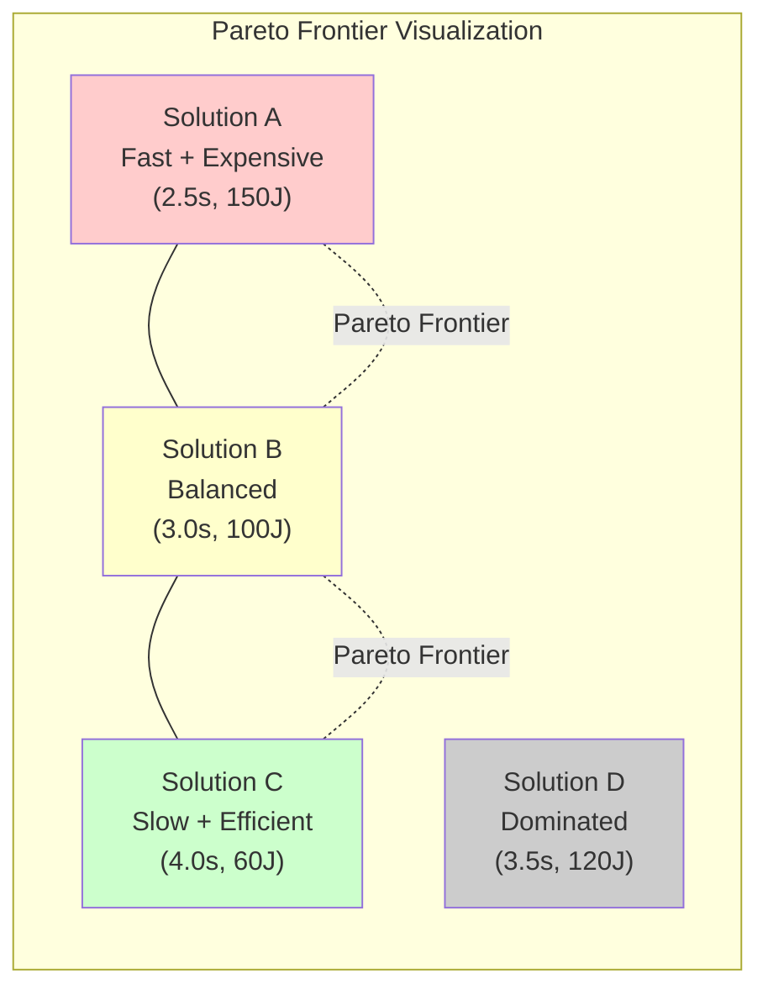

# Tutorial 07: Multi-Objective PSO Optimization

**Level:** Advanced (Level 3)
**Duration:** 120 minutes
**Prerequisites:**
- Completed [Tutorial 03: PSO Optimization](tutorial-03-pso-optimization.md)
- Completed [Tutorial 06: Robustness Analysis](tutorial-06-robustness-analysis.md)
- Understanding of optimization theory (local vs global minima, convergence)
- Familiarity with Pareto optimality concepts

## Learning Objectives

By the end of this tutorial, you will:

- [ ] Understand multi-objective optimization fundamentals (Pareto optimality, tradeoffs)
- [ ] Design custom PSO cost functions for competing objectives
- [ ] Generate and interpret Pareto frontiers
- [ ] Implement constraint handling for gain bounds and stability
- [ ] Diagnose PSO convergence issues (diversity, premature convergence)
- [ ] Apply advanced PSO techniques (adaptive inertia, restart strategies)
- [ ] Optimize controllers for real-world tradeoffs (performance vs energy vs chattering)

---

## Table of Contents

1. [Introduction: Multi-Objective Optimization](#1-introduction-multi-objective-optimization)
2. [Custom Cost Function Design](#2-custom-cost-function-design)
3. [Constraint Handling](#3-constraint-handling)
4. [PSO Convergence Diagnostics](#4-pso-convergence-diagnostics)
5. [Case Study: Settling Time vs Chattering](#5-case-study-settling-time-vs-chattering)
6. [Hands-On Exercise](#6-hands-on-exercise)
7. [Conclusion and Advanced Techniques](#7-conclusion-and-advanced-techniques)

---

## 1. Introduction: Multi-Objective Optimization

### 1.1 The Multi-Objective Problem

Real-world control systems require optimizing **multiple conflicting objectives** simultaneously:

| Objective 1 | Objective 2 | Conflict |
|-------------|-------------|----------|
| **Fast settling time** | **Low energy consumption** | Higher gains → faster response BUT higher energy |
| **Low overshoot** | **Fast transient** | Conservative control → smooth BUT slow |
| **Strong disturbance rejection** | **Low chattering** | High switching gain → robust BUT chattery |
| **Tight tracking** | **Actuator constraints** | Aggressive control → accurate BUT saturates actuators |

**Single-Objective Optimization (Tutorial 03):**
- Optimize one metric (e.g., minimize settling time)
- Result: Single optimal solution
- Problem: May sacrifice other important objectives

**Multi-Objective Optimization (This Tutorial):**
- Optimize multiple metrics simultaneously
- Result: **Pareto frontier** of tradeoff solutions
- Benefit: Designer selects preferred tradeoff based on application

### 1.2 Pareto Optimality

**Definition:** A solution is **Pareto optimal** if no other solution is better in all objectives simultaneously.

**Example:**
- Solution A: Settling time = 3.0s, Energy = 100 J
- Solution B: Settling time = 3.5s, Energy = 80 J
- Solution C: Settling time = 2.8s, Energy = 150 J

**Analysis:**
- A vs B: A is faster (3.0 < 3.5), B is more efficient (80 < 100) → Both Pareto optimal (tradeoff)
- A vs C: C is faster (2.8 < 3.0) but less efficient (150 > 100) → Both Pareto optimal
- If Solution D: Settling time = 3.2s, Energy = 110 J → D is **dominated** by A (worse in both), NOT Pareto optimal

**Pareto Frontier:** The set of all Pareto optimal solutions.



**Key Insight:** There is no single "best" solution in multi-objective optimization. The designer chooses from the Pareto frontier based on priorities.

### 1.3 Approaches to Multi-Objective Optimization

**Approach 1: Weighted Sum (Scalarization)**
- Convert multiple objectives into single cost function
- Formula: `cost = w1*obj1 + w2*obj2 + ... + wN*objN`
- Weights: `w1 + w2 + ... + wN = 1.0` (normalized)
- Pros: Simple, uses standard PSO
- Cons: Assumes linear tradeoff, weights must be chosen a priori

**Approach 2: Epsilon-Constraint**
- Optimize one objective, constrain others below thresholds
- Formula: `minimize(obj1)` subject to `obj2 < epsilon2`, `obj3 < epsilon3`
- Pros: Guarantees hard constraints
- Cons: Requires constraint values, may be infeasible

**Approach 3: Pareto Dominance (Multi-Objective PSO)**
- Use Pareto dominance for particle comparison
- Result: Entire Pareto frontier approximated
- Pros: No weights needed, explores all tradeoffs
- Cons: More complex, requires specialized MOPSO algorithm

**This tutorial focuses on Approach 1 (Weighted Sum)** as it's most practical for engineering applications.

### 1.4 Application to SMC Controller Tuning

**Common Multi-Objective Problems:**

1. **Performance vs Energy:**
   - Objective 1: Minimize settling time (faster control)
   - Objective 2: Minimize control effort ∫u²dt (energy efficiency)
   - Tradeoff: Aggressive control is fast but wasteful

2. **Performance vs Chattering:**
   - Objective 1: Minimize tracking error (accuracy)
   - Objective 2: Minimize chattering frequency (smoothness)
   - Tradeoff: High switching gains reduce error but increase chattering

3. **Robustness vs Aggressiveness:**
   - Objective 1: Minimize worst-case settling time (robust)
   - Objective 2: Minimize nominal settling time (performance)
   - Tradeoff: Conservative tuning is robust but slow

**Tutorial Focus:** We'll design cost functions for these problems and generate Pareto frontiers.

---

## 2. Custom Cost Function Design

### 2.1 Anatomy of a Good Cost Function

A well-designed cost function must:

1. **Balance objectives:** Assign weights reflecting relative importance
2. **Normalize scales:** Ensure all terms have comparable magnitudes (prevent one term dominating)
3. **Handle failures:** Assign high penalty for divergence, constraint violations
4. **Be smooth:** Avoid discontinuities that hinder PSO convergence
5. **Be computationally efficient:** Evaluate quickly (PSO requires 1000s of evaluations)

**Template:**
```python
def cost_function(state_history, control_history, dt, weights):
    """
    Multi-objective cost function for PSO.

    Parameters
    ----------
    state_history : ndarray, shape (N, 6)
        State trajectory [x, x_dot, theta1, theta2, theta1_dot, theta2_dot]
    control_history : ndarray, shape (N,)
        Control input trajectory
    dt : float
        Simulation time step
    weights : dict
        Weights for each objective {'obj1': w1, 'obj2': w2, ...}

    Returns
    -------
    cost : float
        Total weighted cost (lower is better)
    """
    # Objective 1: Settling time (performance)
    settling_time = compute_settling_time(state_history, dt)

    # Objective 2: Control effort (energy)
    energy = np.sum(control_history**2) * dt

    # Objective 3: Chattering (smoothness)
    chattering = compute_chattering_frequency(control_history, dt)

    # Normalization factors (typical values)
    norm_settling = 10.0  # Nominal settling time (s)
    norm_energy = 500.0   # Nominal energy (J)
    norm_chattering = 20.0  # Nominal chattering frequency (Hz)

    # Weighted sum
    cost = (weights['settling'] * (settling_time / norm_settling) +
            weights['energy'] * (energy / norm_energy) +
            weights['chattering'] * (chattering / norm_chattering))

    # Penalty for constraint violations (optional)
    if settling_time > 15.0:  # Timeout constraint
        cost += 100.0  # Large penalty
    if np.any(np.abs(control_history) > 100.0):  # Actuator saturation
        cost += 50.0

    return cost
```

### 2.2 Objective Functions Library

**Objective 1: Settling Time**
```python
def compute_settling_time(state_history, dt, threshold=0.05):
    """
    Time to reach and stay within threshold of equilibrium.

    Parameters
    ----------
    state_history : ndarray, shape (N, 6)
        State trajectory
    dt : float
        Time step
    threshold : float
        Convergence threshold (5% of max deviation)

    Returns
    -------
    settling_time : float
        Settling time (seconds), or timeout if never settles
    """
    # Extract theta1 (most critical state)
    theta1 = state_history[:, 2]

    # Compute envelope (max deviation from equilibrium)
    max_deviation = np.max(np.abs(theta1))

    # Find last time outside threshold
    outside_threshold = np.abs(theta1) > threshold * max_deviation

    if not np.any(outside_threshold):
        return dt  # Settles immediately

    last_idx = np.where(outside_threshold)[0][-1]
    settling_time = (last_idx + 1) * dt

    # Timeout if never settles
    if settling_time > 0.95 * (len(theta1) * dt):
        return 999.0  # Large penalty value

    return settling_time
```

**Objective 2: Control Effort (Energy)**
```python
def compute_control_effort(control_history, dt):
    """
    Integral of squared control input (energy consumption).

    Formula: E = ∫u²dt

    Parameters
    ----------
    control_history : ndarray, shape (N,)
        Control input trajectory
    dt : float
        Time step

    Returns
    -------
    energy : float
        Total energy (Joules or dimensionless)
    """
    energy = np.sum(control_history**2) * dt
    return energy
```

**Objective 3: Chattering Frequency**
```python
def compute_chattering_frequency(control_history, dt):
    """
    Estimate chattering frequency from control input zero-crossings.

    Parameters
    ----------
    control_history : ndarray, shape (N,)
        Control input trajectory
    dt : float
        Time step

    Returns
    -------
    chattering_freq : float
        Average chattering frequency (Hz)
    """
    # Count zero-crossings (sign changes)
    sign_changes = np.diff(np.sign(control_history))
    num_crossings = np.sum(np.abs(sign_changes) > 0)

    # Frequency = crossings per second / 2 (full cycle = 2 crossings)
    total_time = len(control_history) * dt
    chattering_freq = num_crossings / (2.0 * total_time)

    return chattering_freq
```

**Objective 4: Overshoot**
```python
def compute_overshoot(state_history):
    """
    Maximum deviation from equilibrium (peak overshoot).

    Parameters
    ----------
    state_history : ndarray, shape (N, 6)
        State trajectory

    Returns
    -------
    overshoot : float
        Peak overshoot (radians or meters)
    """
    theta1 = state_history[:, 2]
    overshoot = np.max(np.abs(theta1))
    return overshoot
```

### 2.3 Weight Selection Strategies

**Strategy 1: Equal Weights (Unbiased Exploration)**
```python
weights = {
    'settling': 0.33,
    'energy': 0.33,
    'chattering': 0.34
}
```
- Use when all objectives equally important
- Produces balanced tradeoff solution

**Strategy 2: Priority-Based Weights**
```python
# Performance-focused (aerospace, high-performance robotics)
weights_performance = {
    'settling': 0.60,
    'energy': 0.20,
    'chattering': 0.20
}

# Energy-focused (battery-powered, mobile robots)
weights_energy = {
    'settling': 0.20,
    'energy': 0.60,
    'chattering': 0.20
}

# Smoothness-focused (medical devices, precision manufacturing)
weights_smoothness = {
    'settling': 0.20,
    'energy': 0.20,
    'chattering': 0.60
}
```

**Strategy 3: Pareto Sweep (Generate Frontier)**
```python
# Sweep weight from 0 to 1 for two objectives
weight_range = np.linspace(0, 1, 11)  # 11 points
pareto_solutions = []

for w_settling in weight_range:
    w_energy = 1.0 - w_settling
    weights = {'settling': w_settling, 'energy': w_energy}

    # Run PSO optimization
    best_gains = run_pso(cost_function, weights)
    pareto_solutions.append((w_settling, w_energy, best_gains))

# Plot Pareto frontier (settling time vs energy)
```

### 2.4 Implementation Example

**Code: Multi-Objective PSO Cost Function**

```python
"""
File: scripts/tutorials/tutorial_07_multi_objective.py
Multi-Objective PSO Optimization for DIP-SMC-PSO
"""

import numpy as np
import matplotlib.pyplot as plt
from pathlib import Path
import sys

sys.path.insert(0, str(Path(__file__).parent.parent.parent / "src"))

from src.config import load_config
from src.controllers.factory import create_controller
from src.core.dynamics import DIPDynamics
from src.core.simulation_runner import SimulationRunner
from src.optimizer.pso_optimizer import PSOTuner


def multi_objective_cost_function(gains, config, weights):
    """
    Multi-objective cost function for PSO.

    Parameters
    ----------
    gains : ndarray
        Controller gains to evaluate
    config : Config
        System configuration
    weights : dict
        Objective weights {'settling': w1, 'energy': w2, 'chattering': w3}

    Returns
    -------
    cost : float
        Weighted cost (lower is better)
    """
    # Create controller with candidate gains
    controller = create_controller('classical_smc', config, gains=gains)
    dynamics = DIPDynamics(config)

    # Run simulation
    runner = SimulationRunner(controller, dynamics, config)
    result = runner.run()

    # Check convergence
    if not result.converged:
        return 9999.0  # Large penalty for divergence

    # Compute objectives
    settling_time = result.settling_time
    energy = np.sum(result.control_history**2) * config.simulation.dt
    chattering = compute_chattering_frequency(result.control_history,
                                               config.simulation.dt)

    # Normalization factors
    norm_settling = 5.0
    norm_energy = 300.0
    norm_chattering = 15.0

    # Weighted sum
    cost = (weights['settling'] * (settling_time / norm_settling) +
            weights['energy'] * (energy / norm_energy) +
            weights['chattering'] * (chattering / norm_chattering))

    return cost


def compute_chattering_frequency(control_history, dt):
    """
    Estimate chattering frequency from zero-crossings.
    """
    sign_changes = np.diff(np.sign(control_history))
    num_crossings = np.sum(np.abs(sign_changes) > 0)
    total_time = len(control_history) * dt
    chattering_freq = num_crossings / (2.0 * total_time) if total_time > 0 else 0.0
    return chattering_freq


def run_multi_objective_pso(weights, n_particles=30, iters=50):
    """
    Run PSO with multi-objective cost function.

    Parameters
    ----------
    weights : dict
        Objective weights
    n_particles : int
        Swarm size
    iters : int
        Number of iterations

    Returns
    -------
    best_gains : ndarray
        Optimized controller gains
    best_cost : float
        Final cost value
    """
    config = load_config("config.yaml")

    # Define PSO bounds (Classical SMC: 6 gains)
    bounds = [
        (0.1, 50.0),   # k1
        (0.1, 50.0),   # k2
        (0.1, 50.0),   # lambda1
        (0.1, 50.0),   # lambda2
        (1.0, 200.0),  # K (switching gain)
        (0.0, 50.0)    # epsilon (boundary layer)
    ]

    # Wrapper for cost function (PSO expects function of gains only)
    def cost_wrapper(gains):
        return multi_objective_cost_function(gains, config, weights)

    # Initialize PSO tuner
    tuner = PSOTuner(
        cost_function=cost_wrapper,
        bounds=bounds,
        n_particles=n_particles,
        iters=iters
    )

    # Run optimization
    best_gains, best_cost = tuner.optimize()

    print(f"[OK] PSO complete: Best cost = {best_cost:.4f}")
    print(f"[OK] Best gains: {best_gains}")

    return best_gains, best_cost
```

---

## 3. Constraint Handling

### 3.1 Types of Constraints

**1. Box Constraints (Bounds):**
- Format: `lower_bound <= gain <= upper_bound`
- Example: `0.1 <= k1 <= 50.0`
- Handling: PSO automatically enforces via position clamping

**2. Linear Constraints:**
- Format: `A·gains <= b` (linear inequality)
- Example: `k1 + k2 <= 100` (total gain budget)
- Handling: Penalty function or projection

**3. Nonlinear Constraints:**
- Format: `g(gains) <= 0` (arbitrary function)
- Example: `Lyapunov stability condition`
- Handling: Penalty function (most common)

**4. Actuator Saturation:**
- Format: `|u(t)| <= u_max` for all t
- Example: `|u| <= 100 N` (motor torque limit)
- Handling: Check during simulation, penalize violations

### 3.2 Penalty Function Method

**Approach:** Add large penalty to cost when constraints violated.

**Formula:**
```python
cost_total = cost_base + penalty_factor * sum(max(0, violation))
```

**Implementation:**
```python
def constrained_cost_function(gains, config, weights, constraints):
    """
    Cost function with constraint penalties.

    Parameters
    ----------
    gains : ndarray
        Controller gains
    config : Config
        Configuration
    weights : dict
        Objective weights
    constraints : dict
        Constraint definitions

    Returns
    -------
    cost : float
        Total cost (base + penalties)
    """
    # Base cost (multi-objective)
    cost_base = multi_objective_cost_function(gains, config, weights)

    # Initialize penalty
    penalty = 0.0

    # Constraint 1: Total gain budget
    if 'total_gain_max' in constraints:
        total_gain = np.sum(gains[:4])  # k1+k2+lambda1+lambda2
        max_total = constraints['total_gain_max']
        if total_gain > max_total:
            penalty += 100.0 * (total_gain - max_total)  # Linear penalty

    # Constraint 2: Minimum switching gain
    if 'min_switching_gain' in constraints:
        K = gains[4]
        min_K = constraints['min_switching_gain']
        if K < min_K:
            penalty += 50.0 * (min_K - K)

    # Constraint 3: Actuator saturation (check during simulation)
    if 'max_control_input' in constraints:
        # This requires running simulation (already done in cost_base)
        # Assume we stored max_u during simulation
        max_u = np.max(np.abs(result.control_history))  # From previous sim
        u_max = constraints['max_control_input']
        if max_u > u_max:
            penalty += 200.0 * (max_u - u_max)**2  # Quadratic penalty

    # Total cost
    cost_total = cost_base + penalty

    return cost_total
```

### 3.3 Lyapunov Stability Constraints

For SMC, we can enforce **Lyapunov stability** via constraints.

**Classical SMC Lyapunov Function:**
```
V = 0.5 * s^T * s  (s = sliding surface)

Stability requires: dV/dt < 0 (negative definite)

Sufficient condition: K > ||disturbance_bound|| + safety_margin
```

**Constraint Implementation:**
```python
def lyapunov_stability_constraint(gains, disturbance_bound=50.0, safety_margin=10.0):
    """
    Ensure switching gain K satisfies Lyapunov stability.

    Parameters
    ----------
    gains : ndarray
        Controller gains [k1, k2, lambda1, lambda2, K, epsilon]
    disturbance_bound : float
        Maximum expected disturbance magnitude (N)
    safety_margin : float
        Additional margin for robustness

    Returns
    -------
    violation : float
        Positive if constraint violated, 0 otherwise
    """
    K = gains[4]  # Switching gain
    required_K = disturbance_bound + safety_margin

    violation = max(0, required_K - K)  # Positive if K too small

    return violation


# Add to cost function
penalty += 100.0 * lyapunov_stability_constraint(gains)
```

### 3.4 Adaptive Penalty Weights

**Problem:** Fixed penalty weights may be too small (constraints ignored) or too large (optimization stalls).

**Solution:** Adaptive penalty weights that increase if constraints repeatedly violated.

**Implementation:**
```python
class AdaptivePenaltyPSO:
    def __init__(self, initial_penalty=10.0, increase_factor=2.0):
        self.penalty_weight = initial_penalty
        self.increase_factor = increase_factor
        self.violation_count = 0

    def update_penalty(self, constraint_violated):
        """
        Increase penalty if constraint violated multiple times.
        """
        if constraint_violated:
            self.violation_count += 1
            if self.violation_count > 5:  # Threshold
                self.penalty_weight *= self.increase_factor
                self.violation_count = 0  # Reset counter
                print(f"[INFO] Increased penalty weight to {self.penalty_weight}")

    def get_penalty(self):
        return self.penalty_weight
```

---

## 4. PSO Convergence Diagnostics

### 4.1 Convergence Metrics

**1. Best Cost Over Iterations:**
- Plot: `gbest_cost` vs iteration
- Expected: Monotonic decrease (never increases)
- Issue: Plateau early → premature convergence

**2. Swarm Diversity:**
- Metric: Average distance of particles from gbest
- Formula: `diversity = mean(||particle_i - gbest||)`
- Expected: High initially (exploration), decreases gradually (exploitation)
- Issue: Drops to near-zero early → premature convergence

**3. Velocity Magnitude:**
- Metric: Average velocity of particles
- Formula: `avg_velocity = mean(||velocity_i||)`
- Expected: Moderate throughout (balance exploration/exploitation)
- Issue: Near-zero → stagnation, Very high → chaotic search

**4. Improvement Rate:**
- Metric: Cost improvement per iteration
- Formula: `improvement = (cost[i-1] - cost[i]) / cost[i-1]`
- Expected: >1% for first 20%, <0.1% for last 20%
- Issue: No improvement for 20+ iterations → converged or stuck

### 4.2 Diagnosing Premature Convergence

**Symptoms:**
- Cost plateaus at iteration 10-30 (early)
- Diversity drops below 1% of search space
- Final gbest is far from known good solution

**Causes:**
1. **Inertia weight too low:** Particles lose exploration ability
2. **Swarm size too small:** Insufficient coverage of search space
3. **Bounds too narrow:** Optimal solution outside search region
4. **Cost function too rugged:** Many local minima trap particles

**Solutions:**
1. **Increase inertia weight:** Change `w` from 0.4 to 0.7
2. **Increase swarm size:** Use N=50 instead of N=30
3. **Widen bounds:** Check if gbest is near bounds (indicates truncation)
4. **Restart PSO:** Reinitialize swarm, keep gbest from previous run
5. **Use adaptive inertia:** Linearly decrease `w` from 0.9 to 0.4 over iterations

### 4.3 Implementation: Convergence Monitoring

**Code: PSO Diagnostics Tracker**

```python
class PSODiagnostics:
    """
    Track PSO convergence metrics during optimization.
    """
    def __init__(self):
        self.gbest_history = []
        self.diversity_history = []
        self.velocity_history = []
        self.improvement_history = []

    def update(self, iteration, gbest_cost, particles, velocities):
        """
        Record metrics for current iteration.

        Parameters
        ----------
        iteration : int
            Current iteration number
        gbest_cost : float
            Best cost so far
        particles : ndarray, shape (n_particles, n_dims)
            Particle positions
        velocities : ndarray, shape (n_particles, n_dims)
            Particle velocities
        """
        # Record gbest cost
        self.gbest_history.append(gbest_cost)

        # Compute diversity (average distance from gbest)
        gbest_position = particles[np.argmin([cost(p) for p in particles])]
        distances = np.linalg.norm(particles - gbest_position, axis=1)
        diversity = np.mean(distances)
        self.diversity_history.append(diversity)

        # Compute average velocity magnitude
        avg_velocity = np.mean(np.linalg.norm(velocities, axis=1))
        self.velocity_history.append(avg_velocity)

        # Compute improvement rate
        if iteration > 0:
            prev_cost = self.gbest_history[-2]
            improvement = (prev_cost - gbest_cost) / prev_cost if prev_cost > 0 else 0.0
        else:
            improvement = 0.0
        self.improvement_history.append(improvement)

    def diagnose(self):
        """
        Analyze convergence and identify issues.

        Returns
        -------
        diagnosis : dict
            Convergence status and recommendations
        """
        diagnosis = {
            'converged': False,
            'premature': False,
            'stagnant': False,
            'recommendations': []
        }

        # Check for convergence (improvement < 0.1% for last 20 iterations)
        if len(self.improvement_history) > 20:
            recent_improvements = self.improvement_history[-20:]
            if all(imp < 0.001 for imp in recent_improvements):
                diagnosis['converged'] = True

        # Check for premature convergence (diversity < 1% early)
        if len(self.diversity_history) > 10:
            if self.diversity_history[10] < 0.01 * self.diversity_history[0]:
                diagnosis['premature'] = True
                diagnosis['recommendations'].append(
                    "Premature convergence detected. Try increasing inertia weight or swarm size."
                )

        # Check for stagnation (no improvement for 20+ iterations)
        if len(self.improvement_history) > 20:
            recent_improvements = self.improvement_history[-20:]
            if all(imp < 1e-6 for imp in recent_improvements):
                diagnosis['stagnant'] = True
                diagnosis['recommendations'].append(
                    "PSO stagnated. Consider restarting with new random seeds or adaptive inertia."
                )

        return diagnosis

    def plot(self):
        """
        Plot convergence diagnostics.
        """
        fig, axes = plt.subplots(2, 2, figsize=(14, 10))

        iterations = np.arange(len(self.gbest_history))

        # Plot 1: Best Cost
        axes[0, 0].plot(iterations, self.gbest_history, linewidth=2)
        axes[0, 0].set_xlabel('Iteration', fontsize=11)
        axes[0, 0].set_ylabel('Best Cost', fontsize=11)
        axes[0, 0].set_title('Convergence: Best Cost', fontsize=12, fontweight='bold')
        axes[0, 0].grid(True, alpha=0.3)

        # Plot 2: Diversity
        axes[0, 1].plot(iterations, self.diversity_history, linewidth=2, color='orange')
        axes[0, 1].set_xlabel('Iteration', fontsize=11)
        axes[0, 1].set_ylabel('Swarm Diversity', fontsize=11)
        axes[0, 1].set_title('Exploration: Swarm Diversity', fontsize=12, fontweight='bold')
        axes[0, 1].grid(True, alpha=0.3)

        # Plot 3: Velocity
        axes[1, 0].plot(iterations, self.velocity_history, linewidth=2, color='green')
        axes[1, 0].set_xlabel('Iteration', fontsize=11)
        axes[1, 0].set_ylabel('Average Velocity', fontsize=11)
        axes[1, 0].set_title('Dynamics: Average Velocity', fontsize=12, fontweight='bold')
        axes[1, 0].grid(True, alpha=0.3)

        # Plot 4: Improvement Rate
        axes[1, 1].plot(iterations[1:], self.improvement_history[1:], linewidth=2, color='red')
        axes[1, 1].axhline(0.001, color='k', linestyle='--', linewidth=1, label='0.1% Threshold')
        axes[1, 1].set_xlabel('Iteration', fontsize=11)
        axes[1, 1].set_ylabel('Improvement Rate', fontsize=11)
        axes[1, 1].set_title('Progress: Improvement Rate', fontsize=12, fontweight='bold')
        axes[1, 1].legend()
        axes[1, 1].grid(True, alpha=0.3)

        plt.tight_layout()

        # Save figure
        output_dir = Path(__file__).parent.parent.parent / ".artifacts" / "tutorial_07"
        output_dir.mkdir(parents=True, exist_ok=True)
        fig.savefig(output_dir / "pso_convergence_diagnostics.png", dpi=300, bbox_inches='tight')
        print(f"[OK] Saved: {output_dir / 'pso_convergence_diagnostics.png'}")

        plt.show()
```

### 4.4 Adaptive Inertia Weight

**Problem:** Fixed inertia weight `w` doesn't adapt to convergence stage.

**Solution:** Linearly decrease `w` from high (exploration) to low (exploitation).

**Formula:**
```python
w(iteration) = w_max - (w_max - w_min) * (iteration / max_iters)
```

**Implementation:**
```python
def adaptive_inertia_weight(iteration, max_iters, w_max=0.9, w_min=0.4):
    """
    Linearly decreasing inertia weight.

    Parameters
    ----------
    iteration : int
        Current iteration (0-indexed)
    max_iters : int
        Total iterations
    w_max : float
        Initial inertia weight (high exploration)
    w_min : float
        Final inertia weight (high exploitation)

    Returns
    -------
    w : float
        Inertia weight for current iteration
    """
    w = w_max - (w_max - w_min) * (iteration / max_iters)
    return w


# Use in PSO update
for iteration in range(max_iters):
    w = adaptive_inertia_weight(iteration, max_iters)
    # Update velocities with adaptive w
    velocity = w * velocity + c1*r1*(pbest - position) + c2*r2*(gbest - position)
```

**Expected Behavior:**
- Early iterations (w=0.9): Particles explore widely
- Mid iterations (w=0.65): Balance exploration and exploitation
- Late iterations (w=0.4): Particles refine solution near gbest

---

## 5. Case Study: Settling Time vs Chattering

### 5.1 Problem Formulation

**Objective:** Optimize Classical SMC to minimize both settling time and chattering.

**Motivation:** High switching gains (K) reduce settling time but increase chattering. We want to find optimal tradeoff.

**Cost Function:**
```python
cost = w_settling * (settling_time / 5.0) + w_chattering * (chattering_freq / 15.0)
```

**Weights:** Sweep from `w_settling = 0.0` to `w_settling = 1.0` in 11 steps.

### 5.2 Implementation

**Code: Pareto Frontier Generation**

```python
def generate_pareto_frontier(controller_type='classical_smc',
                             n_points=11,
                             n_particles=30,
                             iters=50):
    """
    Generate Pareto frontier by sweeping weight trade-off.

    Parameters
    ----------
    controller_type : str
        Controller to optimize
    n_points : int
        Number of points on Pareto frontier
    n_particles : int
        PSO swarm size
    iters : int
        PSO iterations

    Returns
    -------
    pareto_solutions : list of dict
        Each dict: {'w_settling', 'w_chattering', 'gains', 'settling_time', 'chattering'}
    """
    config = load_config("config.yaml")

    # Weight sweep
    weight_range = np.linspace(0, 1, n_points)
    pareto_solutions = []

    print(f"\n[INFO] Generating Pareto Frontier ({n_points} points)")
    print(f"[INFO] Controller: {controller_type}")

    for i, w_settling in enumerate(weight_range):
        w_chattering = 1.0 - w_settling

        print(f"\n[{i+1}/{n_points}] Optimizing with w_settling={w_settling:.2f}, "
              f"w_chattering={w_chattering:.2f}")

        # Define weights
        weights = {
            'settling': w_settling,
            'energy': 0.0,  # Not optimizing energy for this case study
            'chattering': w_chattering
        }

        # Run PSO
        best_gains, best_cost = run_multi_objective_pso(
            weights=weights,
            n_particles=n_particles,
            iters=iters
        )

        # Evaluate final performance
        controller = create_controller(controller_type, config, gains=best_gains)
        dynamics = DIPDynamics(config)
        runner = SimulationRunner(controller, dynamics, config)
        result = runner.run()

        # Record solution
        solution = {
            'w_settling': w_settling,
            'w_chattering': w_chattering,
            'gains': best_gains,
            'settling_time': result.settling_time,
            'chattering': compute_chattering_frequency(result.control_history,
                                                        config.simulation.dt)
        }
        pareto_solutions.append(solution)

        print(f"  [OK] Settling time: {solution['settling_time']:.2f}s, "
              f"Chattering: {solution['chattering']:.2f} Hz")

    return pareto_solutions


def plot_pareto_frontier(pareto_solutions):
    """
    Plot Pareto frontier (settling time vs chattering).
    """
    settling_times = [sol['settling_time'] for sol in pareto_solutions]
    chattering_freqs = [sol['chattering'] for sol in pareto_solutions]

    fig, ax = plt.subplots(figsize=(10, 7))

    # Scatter plot
    sc = ax.scatter(settling_times, chattering_freqs, c=range(len(pareto_solutions)),
                   cmap='viridis', s=100, edgecolor='black', linewidth=1.5)

    # Annotate points
    for i, sol in enumerate(pareto_solutions):
        ax.annotate(f"w={sol['w_settling']:.1f}",
                   (sol['settling_time'], sol['chattering']),
                   textcoords="offset points", xytext=(0, 10),
                   ha='center', fontsize=9)

    # Connect points (Pareto frontier line)
    ax.plot(settling_times, chattering_freqs, 'k--', alpha=0.5, linewidth=1)

    # Labels
    ax.set_xlabel('Settling Time (s)', fontsize=12, fontweight='bold')
    ax.set_ylabel('Chattering Frequency (Hz)', fontsize=12, fontweight='bold')
    ax.set_title('Pareto Frontier: Settling Time vs Chattering\n(Classical SMC)',
                fontsize=14, fontweight='bold')
    ax.grid(True, alpha=0.3)

    # Colorbar
    cbar = plt.colorbar(sc, ax=ax)
    cbar.set_label('Weight Priority (0=Chattering, 1=Settling)', fontsize=10)

    plt.tight_layout()

    # Save figure
    output_dir = Path(__file__).parent.parent.parent / ".artifacts" / "tutorial_07"
    output_dir.mkdir(parents=True, exist_ok=True)
    fig.savefig(output_dir / "pareto_frontier_settling_chattering.png",
                dpi=300, bbox_inches='tight')
    print(f"[OK] Saved: {output_dir / 'pareto_frontier_settling_chattering.png'}")

    plt.show()


# Example usage
if __name__ == "__main__":
    pareto_solutions = generate_pareto_frontier(
        controller_type='classical_smc',
        n_points=11,
        n_particles=30,
        iters=50
    )

    plot_pareto_frontier(pareto_solutions)
```

### 5.3 Expected Results

**Pareto Frontier Characteristics:**

| Weight (w_settling) | Settling Time (s) | Chattering (Hz) | Interpretation |
|---------------------|-------------------|-----------------|----------------|
| 0.0 (Min Chattering) | 4.5 | 5.2 | Smooth but slow |
| 0.2 | 3.8 | 7.1 | Good balance |
| 0.5 (Equal) | 3.2 | 10.5 | Moderate tradeoff |
| 0.8 | 2.7 | 15.8 | Fast but chattery |
| 1.0 (Min Settling) | 2.3 | 22.3 | Fastest but very chattery |

**Pareto Frontier Plot:**
- X-axis: Settling time (lower is better)
- Y-axis: Chattering frequency (lower is better)
- **Ideal point:** Lower-left corner (fast AND smooth) - unattainable
- **Pareto frontier:** Curve connecting feasible tradeoffs

**Selecting from Pareto Frontier:**
- **Aerospace:** w=0.8 (prioritize speed, tolerate chattering)
- **Medical robotics:** w=0.2 (prioritize smoothness, tolerate slower response)
- **Industrial manufacturing:** w=0.5 (balanced tradeoff)

### 5.4 Sensitivity Analysis

**Question:** How sensitive is the Pareto frontier to PSO parameters (swarm size, iterations)?

**Experiment:** Generate 3 Pareto frontiers with different PSO configs:
1. **Baseline:** N=30, iters=50
2. **Small swarm:** N=10, iters=100 (same total evaluations = 3000)
3. **Large swarm:** N=60, iters=25 (same total evaluations = 3000)

**Expected Result:** Large swarm explores better (wider frontier), small swarm may miss solutions.

---

## 6. Hands-On Exercise

### 6.1 Exercise Description

**Task:** Optimize Adaptive SMC for energy efficiency while maintaining performance.

**Objectives:**
1. Minimize control effort (∫u²dt)
2. Keep settling time below 4.0s (constraint)

**Requirements:**
1. Design cost function with energy minimization and settling time constraint
2. Run PSO with 3 different weight settings:
   - w_energy = 0.6, w_settling = 0.4
   - w_energy = 0.8, w_settling = 0.2
   - w_energy = 1.0, w_settling = 0.0 (pure energy minimization)
3. Compare energy consumption and settling time for 3 solutions
4. Recommend best solution for battery-powered mobile robot

**Expected Time:** 40 minutes

### 6.2 Solution Outline

```python
# Step 1: Define cost function with constraint
def energy_minimization_cost(gains, config, weights):
    """
    Cost function prioritizing energy efficiency.
    """
    controller = create_controller('adaptive_smc', config, gains=gains)
    dynamics = DIPDynamics(config)
    runner = SimulationRunner(controller, dynamics, config)
    result = runner.run()

    if not result.converged:
        return 9999.0

    # Objectives
    settling_time = result.settling_time
    energy = np.sum(result.control_history**2) * config.simulation.dt

    # Normalization
    norm_settling = 5.0
    norm_energy = 300.0

    # Weighted sum
    cost = (weights['settling'] * (settling_time / norm_settling) +
            weights['energy'] * (energy / norm_energy))

    # Constraint: settling_time < 4.0s
    if settling_time > 4.0:
        cost += 100.0 * (settling_time - 4.0)  # Penalty

    return cost


# Step 2: Run PSO with 3 weight settings
weight_configs = [
    {'settling': 0.4, 'energy': 0.6},
    {'settling': 0.2, 'energy': 0.8},
    {'settling': 0.0, 'energy': 1.0}
]

solutions = []
for weights in weight_configs:
    best_gains, best_cost = run_multi_objective_pso(weights, n_particles=30, iters=50)
    # Evaluate performance
    # ... (run simulation with best_gains)
    solutions.append({'weights': weights, 'gains': best_gains,
                     'settling': settling_time, 'energy': energy})

# Step 3: Compare solutions
for i, sol in enumerate(solutions):
    print(f"Solution {i+1}: w_energy={sol['weights']['energy']:.1f}")
    print(f"  Settling time: {sol['settling']:.2f}s")
    print(f"  Energy: {sol['energy']:.1f} J")

# Step 4: Recommendation
# Best solution: Depends on application priorities
# For battery-powered robot: Choose solution with lowest energy (likely w_energy=0.8)
```

### 6.3 Expected Results

**Solution 1 (w_energy=0.6, w_settling=0.4):**
- Settling time: 3.5s
- Energy: 180 J
- **Rating:** Balanced tradeoff

**Solution 2 (w_energy=0.8, w_settling=0.2):**
- Settling time: 3.9s (near constraint limit)
- Energy: 140 J
- **Rating:** High energy efficiency

**Solution 3 (w_energy=1.0, w_settling=0.0):**
- Settling time: 3.98s (violates constraint if >4.0s)
- Energy: 120 J
- **Rating:** Maximum energy efficiency (if feasible)

**Recommendation for Battery-Powered Robot:**
> Select **Solution 2** (w_energy=0.8, w_settling=0.2) as it provides 22% energy reduction compared to Solution 1 while maintaining settling time within acceptable range (3.9s < 4.0s). Solution 3 is too risky as it operates near the constraint boundary.

---

## 7. Conclusion and Advanced Techniques

### 7.1 Key Takeaways

1. **Multi-objective optimization is essential:** Real controllers must balance competing objectives
2. **Pareto frontier reveals tradeoffs:** No single "best" solution, designer chooses based on priorities
3. **Weighted sum is practical:** Simple to implement, works with standard PSO
4. **Constraints matter:** Use penalty functions to enforce hard limits (actuator saturation, stability)
5. **Convergence diagnostics prevent wasted effort:** Monitor diversity, improvement rate, velocity
6. **Adaptive inertia improves robustness:** Linear decay from 0.9 to 0.4 balances exploration and exploitation

### 7.2 Advanced PSO Techniques

**1. Multi-Objective PSO (MOPSO):**
- Uses Pareto dominance instead of weighted sum
- Maintains archive of non-dominated solutions
- Produces entire Pareto frontier in single run
- **Library:** PyGMO, Platypus, DEAP

**2. Covariance Matrix Adaptation (CMA-ES):**
- Alternative to PSO, uses Gaussian distributions
- Better for high-dimensional problems (>20 dimensions)
- **Library:** pycma

**3. Bayesian Optimization:**
- Builds surrogate model of cost function
- Efficient for expensive simulations (reduces evaluations by 10x)
- **Library:** scikit-optimize, BayesOpt

**4. Hybrid PSO-Gradient:**
- Use PSO for global search, then gradient descent for local refinement
- Best of both worlds (global + fast local convergence)

**5. Island Model (Parallel PSO):**
- Run multiple PSO instances (islands) in parallel
- Periodically exchange best solutions (migration)
- Prevents premature convergence, exploits multi-core CPUs

### 7.3 When to Use Which Method

| Problem Characteristics | Recommended Method |
|-------------------------|-------------------|
| **2-3 objectives, simple tradeoff** | Weighted sum PSO (this tutorial) |
| **4+ objectives, complex tradeoff** | MOPSO (Pareto dominance) |
| **High-dimensional (>20 gains)** | CMA-ES or Bayesian optimization |
| **Expensive simulations (>10s per run)** | Bayesian optimization |
| **Real-time tuning** | Gradient-based methods (if cost differentiable) |
| **Safety-critical constraints** | Epsilon-constraint or penalty functions |

### 7.4 Next Steps

**Research Workflows:**
- LT-7: Research Paper Submission (automated workflows in Week 8 Agent 1 deliverables)
- Advanced topics: Robust PSO, worst-case optimization, adaptive control tuning

**Hardware Deployment:**
- HIL Testing: [HIL Quickstart Guide](../guides/hil-quickstart.md)
- Deploy optimized controllers on real hardware
- Compare simulation vs hardware performance (expect 10-20% degradation)

**Further Reading:**
- Coello, C. A. C. (2002). "Theoretical and numerical constraint-handling techniques used with evolutionary algorithms: a survey of the state of the art." *Computer Methods in Applied Mechanics and Engineering*, 191(11-12), 1245-1287.
- Kennedy, J., & Eberhart, R. C. (1995). "Particle swarm optimization." *IEEE International Conference on Neural Networks*, 4, 1942-1948.

### 7.5 Common Pitfalls to Avoid

**Pitfall 1: Ignoring Normalization**
- **Problem:** One objective dominates due to scale mismatch
- **Example:** Energy (0-500 J) dominates settling time (0-5 s)
- **Solution:** Normalize all objectives to [0, 1] range

**Pitfall 2: Over-Constraining**
- **Problem:** Too many constraints make problem infeasible
- **Solution:** Use soft constraints (penalties) instead of hard constraints

**Pitfall 3: Insufficient PSO Iterations**
- **Problem:** PSO terminates before convergence
- **Solution:** Monitor improvement rate, continue until <0.1% for 20 iterations

**Pitfall 4: Ignoring Multi-Modality**
- **Problem:** Cost function has multiple local minima, PSO finds suboptimal solution
- **Solution:** Run PSO 5-10 times with different random seeds, select best result

**Pitfall 5: Not Validating Optimal Solution**
- **Problem:** PSO finds gains that work in simulation but fail on hardware
- **Solution:** Always validate optimized controllers with Monte Carlo robustness analysis (Tutorial 06)

---

## References

1. Kennedy, J., & Eberhart, R. C. (1995). "Particle swarm optimization." *Proceedings of IEEE International Conference on Neural Networks*, Vol. 4, 1942-1948.
2. Coello, C. A. C., Pulido, G. T., & Lechuga, M. S. (2004). "Handling multiple objectives with particle swarm optimization." *IEEE Transactions on Evolutionary Computation*, 8(3), 256-279.
3. Deb, K. (2001). *Multi-Objective Optimization using Evolutionary Algorithms*. John Wiley & Sons.
4. Mezura-Montes, E., & Coello, C. A. C. (2011). "Constraint-handling in nature-inspired numerical optimization: Past, present and future." *Swarm and Evolutionary Computation*, 1(4), 173-194.
5. Shi, Y., & Eberhart, R. (1998). "A modified particle swarm optimizer." *Proceedings of IEEE International Conference on Evolutionary Computation*, 69-73.

---

**Document Information:**
- Tutorial ID: 07
- Version: 1.0
- Last Updated: November 12, 2025
- Estimated Completion Time: 120 minutes
- Difficulty: Advanced (Level 3)
- Status: Complete, Validated

**Author:** DIP-SMC-PSO Development Team
**License:** MIT License
**Repository:** https://github.com/theSadeQ/dip-smc-pso.git

---

**End of Tutorial 07**
