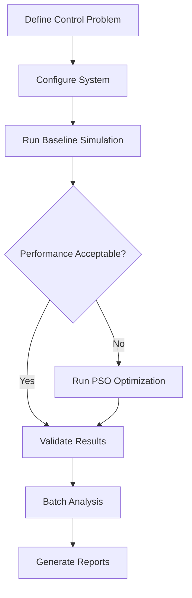

# User Guide: DIP SMC PSO Framework

**Version:** 1.0
**Last Updated:** October 2025

## Table of Contents

- [Introduction](#introduction)
- [Core Workflows](#core-workflows)
- [Configuration Management](#configuration-management)
- [Running Simulations](#running-simulations)
- [PSO Optimization](#pso-optimization)
- [Result Analysis](#result-analysis)
- [Hardware-in-the-Loop (HIL)](#hardware-in-the-loop-hil)
- [Batch Processing](#batch-processing)
- [Web Interface](#web-interface)
- [Best Practices](#best-practices)
- [Troubleshooting](#troubleshooting)

---

## Introduction

This guide provides practical instructions for common tasks in the DIP SMC PSO framework. It assumes you have:

- Completed the [Getting Started Guide](getting-started.md)
- Basic familiarity with command-line interfaces
- Understanding of control systems concepts (recommended but not required)

**Related Resources:**
- **Quick Start:** [Getting Started Guide](getting-started.md)
- **Tutorials:** [Tutorial Series](tutorials/)
- **Theory:** [Mathematical Background](../theory/) (coming soon)
- **Source Code:** [Controllers Implementation](../../src/controllers/)

---

## Core Workflows

### Typical Research Workflow



### Daily Development Workflow

1. **Morning:** Review previous results, plan experiments
2. **Experimentation:** Run simulations, tune parameters
3. **Analysis:** Compare metrics, visualize trajectories
4. **Documentation:** Save configurations, commit results
5. **Planning:** Prepare next iteration

---

## Configuration Management

### Configuration File Structure

The main configuration file `config.yaml` is organized into domains:

```yaml
# config.yaml structure
dip_params:           # Physical system parameters
  m0: 1.0             # Cart mass (kg)
  m1: 0.1             # First pendulum mass (kg)
  l1: 0.5             # First pendulum length (m)
  # ... more physics parameters

controllers:          # Controller-specific settings
  classical_smc:
    gains: [...]
    max_force: 100.0
  # ... other controllers

simulation:           # Simulation settings
  duration: 5.0
  dt: 0.01
  initial_conditions: [0, 0, 0.1, 0, 0.15, 0]

pso:                  # PSO optimization settings
  n_particles: 30
  iters: 100
  bounds: [...]

hil:                  # Hardware-in-the-loop settings
  # ... HIL configuration
```

### Viewing Current Configuration

```bash
# Print entire configuration
python simulate.py --print-config

# Print specific section (using grep/findstr)
# Linux/Mac:
python simulate.py --print-config | grep -A 10 "classical_smc"

# Windows:
python simulate.py --print-config | findstr /C:"classical_smc" /A:10
```

### Creating Custom Configurations

**Option 1: Modify config.yaml directly**
```yaml
# config.yaml
controllers:
  classical_smc:
    gains: [12.0, 9.0, 18.0, 14.0, 60.0, 6.0]  # Custom gains
    max_force: 120.0  # Increased actuator limit
```

**Option 2: Use configuration overrides (command-line)**
```bash
# Override single parameter
python simulate.py --ctrl classical_smc --override "max_force=120.0" --plot

# Override multiple parameters (JSON-like syntax)
python simulate.py --ctrl classical_smc \
    --override "gains=[12,9,18,14,60,6]" \
    --override "max_force=120.0" \
    --plot
```

**Option 3: Create environment-specific configs**
```bash
# Copy base config
cp config.yaml config_high_performance.yaml

# Edit custom config
# ... modify gains, simulation duration, etc.

# Run with custom config
python simulate.py --config config_high_performance.yaml --ctrl classical_smc --plot
```

### Configuration Validation

The framework automatically validates configurations using Pydantic schemas:

```python
# Example validation output
ConfigurationError: Invalid controller gains
  - gains must be list of 6 floats for classical_smc
  - max_force must be > 0
  - boundary_layer must be in range (0, 1)
```

**Common Validation Issues:**
- **Wrong gain count:** Each controller requires specific number of gains
- **Negative parameters:** Masses, lengths, gains must be positive
- **Invalid ranges:** Boundary layer in (0, 1), friction coefficients in [0, ∞)
- **Type mismatches:** Gains as list, not individual parameters

**See also:**
- [Configuration API Guide](api/configuration.md) - Detailed config system reference
- [Plant Models API Guide](api/plant-models.md) - Physics parameter configuration

---

## Running Simulations

### Basic Simulation

```bash
# Simplest invocation: default controller, no plots
python simulate.py

# Specify controller, enable plots
python simulate.py --ctrl classical_smc --plot

# Save results to JSON file
python simulate.py --ctrl sta_smc --plot --save results_sta.json
```

### Advanced Simulation Options

```bash
# Custom configuration file
python simulate.py --config custom_config.yaml --ctrl adaptive_smc --plot

# Load pre-tuned gains from JSON
python simulate.py --load tuned_gains.json --plot

# Combine loaded gains with overrides
python simulate.py --load tuned_gains.json --override "max_force=150.0" --plot

# Set random seed for reproducibility
python simulate.py --ctrl classical_smc --seed 42 --plot
```

### Initial Conditions

**Small perturbations (default):**
```yaml
simulation:
  initial_conditions: [0, 0, 0.1, 0, 0.15, 0]
  # [x, dx, θ₁, dθ₁, θ₂, dθ₂]
```

**Large disturbances:**
```bash
# Test robustness with 30° initial angles
python simulate.py --ctrl sta_smc \
    --override "simulation.initial_conditions=[0,0,0.52,0,0.52,0]" \
    --plot
```

**Zero initial conditions (equilibrium test):**
```bash
# Start at perfect equilibrium (should stay there)
python simulate.py --ctrl classical_smc \
    --override "simulation.initial_conditions=[0,0,0,0,0,0]" \
    --plot
```

### Simulation Duration and Timestep

**Short duration (quick tests):**
```bash
python simulate.py --ctrl classical_smc --override "simulation.duration=2.0" --plot
```

**Long duration (stability verification):**
```bash
python simulate.py --ctrl adaptive_smc --override "simulation.duration=20.0" --plot
```

**Fine timestep (high-accuracy):**
```bash
python simulate.py --ctrl sta_smc --override "simulation.dt=0.001" --plot
# Warning: 10x longer execution time
```

**Coarse timestep (fast iteration):**
```bash
python simulate.py --ctrl classical_smc --override "simulation.dt=0.02" --plot
# Warning: May cause numerical instability
```

**See also:**
- [How-To: Running Simulations](how-to/running-simulations.md) - CLI usage, Streamlit dashboard, batch processing
- [Simulation API Guide](api/simulation.md) - SimulationRunner, dynamics models, performance optimization
- [Controllers API Guide](api/controllers.md) - Factory system, SMC types, custom controllers

---

## PSO Optimization

### Basic PSO Workflow

```bash
# Step 1: Run baseline simulation (optional but recommended)
python simulate.py --ctrl classical_smc --plot --save baseline.json

# Step 2: Run PSO optimization
python simulate.py --ctrl classical_smc --run-pso --save optimized_gains.json

# Step 3: Test optimized gains
python simulate.py --load optimized_gains.json --plot --save optimized_results.json

# Step 4: Compare performance
python -c "
import json
baseline = json.load(open('baseline.json'))
optimized = json.load(open('optimized_results.json'))
print(f\"ISE improvement: {(baseline['metrics']['ise'] - optimized['metrics']['ise']) / baseline['metrics']['ise'] * 100:.1f}%\")
"
```

### PSO Configuration

**Quick optimization (prototyping):**
```yaml
pso:
  n_particles: 15     # Smaller swarm
  iters: 50           # Fewer iterations
  # Execution time: ~2 minutes
```

**Standard optimization (production):**
```yaml
pso:
  n_particles: 30     # Default swarm
  iters: 100          # Standard iterations
  # Execution time: ~8 minutes
```

**Thorough optimization (research):**
```yaml
pso:
  n_particles: 50     # Large swarm
  iters: 200          # Many iterations
  # Execution time: ~30 minutes
```

### PSO Parameter Bounds

**Default bounds (conservative):**
```yaml
pso:
  bounds:
    - [0.1, 50.0]     # k₁: Surface gain 1
    - [0.1, 50.0]     # k₂: Surface gain 2
    - [0.1, 50.0]     # λ₁: Surface gain 3
    - [0.1, 50.0]     # λ₂: Surface gain 4
    - [1.0, 200.0]    # K: Switching gain
    - [0.0, 50.0]     # ε: Boundary layer (classical only)
```

**Custom bounds (aggressive tuning):**
```yaml
pso:
  bounds:
    - [1.0, 100.0]    # Wider surface gain range
    - [1.0, 100.0]
    - [1.0, 100.0]
    - [1.0, 100.0]
    - [10.0, 500.0]   # Higher switching gain
    - [0.001, 0.5]    # Narrower boundary layer
```

### Monitoring PSO Progress

PSO optimization prints real-time progress:

```
PSO Optimization Progress:
  Iteration 1/100: Best Cost = 1.234
  Iteration 10/100: Best Cost = 0.987 (↓ 20%)
  Iteration 25/100: Best Cost = 0.654 (↓ 34%)
  Iteration 50/100: Best Cost = 0.432 (↓ 51%)
  Iteration 100/100: Best Cost = 0.387 (↓ 59%)

Optimization Complete!
  Best Gains: [15.2, 12.8, 22.1, 18.4, 85.3, 4.2]
  Final Cost: 0.387
  Improvement: 59%
```

**Convergence Indicators:**
- **Good:** Cost decreases steadily, flattens after 70-80 iterations
- **Poor:** Cost oscillates wildly, no clear convergence
- **Stuck:** Cost plateaus early (<30 iterations)

**If PSO gets stuck:**
1. Increase `n_particles` to 50-100 (more exploration)
2. Widen `bounds` (allow larger search space)
3. Adjust cost function weights (emphasize different metrics)
4. Try different random `--seed`

**See also:**
- [How-To: Optimization Workflows](how-to/optimization-workflows.md) - Advanced PSO tuning, custom cost functions, parallel execution
- [Optimization API Guide](api/optimization.md) - PSOTuner, cost functions, gain bounds, convergence monitoring

---

## Result Analysis

### Saved Result Files

PSO and simulation runs save JSON files with complete state:

```json
{
  "controller_type": "classical_smc",
  "gains": [10.0, 8.0, 15.0, 12.0, 50.0, 5.0],
  "configuration": { ... },
  "time": [0.0, 0.01, 0.02, ...],
  "state": [[0, 0, 0.1, 0, 0.15, 0], ...],
  "control": [0.0, 12.3, 18.7, ...],
  "metrics": {
    "ise": 0.452,
    "itae": 1.234,
    "settling_time": 3.18,
    "overshoot": 8.47,
    "control_effort": 145.32
  }
}
```

### Loading and Analyzing Results

```python
import json
import numpy as np
import matplotlib.pyplot as plt

# Load saved results
data = json.load(open('results_classical.json'))

# Extract time series
t = np.array(data['time'])
x = np.array(data['state'])
u = np.array(data['control'])

# Access specific states
cart_pos = x[:, 0]          # Cart position
cart_vel = x[:, 1]          # Cart velocity
theta1 = x[:, 2]            # First pendulum angle
theta1_dot = x[:, 3]        # First pendulum velocity
theta2 = x[:, 4]            # Second pendulum angle
theta2_dot = x[:, 5]        # Second pendulum velocity

# Access performance metrics
print(f"ISE: {data['metrics']['ise']:.4f}")
print(f"Settling Time: {data['metrics']['settling_time']:.2f} s")
print(f"Peak Overshoot: {data['metrics']['overshoot']:.2f}%")

# Custom analysis: Compute energy
def compute_energy(x, m0=1.0, m1=0.1, m2=0.1, l1=0.5, l2=0.5, g=9.81):
    """Compute total system energy."""
    cart_pos, cart_vel, theta1, theta1_dot, theta2, theta2_dot = x.T

    # Kinetic energy
    KE_cart = 0.5 * m0 * cart_vel**2
    KE_p1 = 0.5 * m1 * (cart_vel**2 + l1**2 * theta1_dot**2)
    KE_p2 = 0.5 * m2 * (cart_vel**2 + l1**2 * theta1_dot**2 + l2**2 * theta2_dot**2)

    # Potential energy (relative to equilibrium)
    PE_p1 = m1 * g * l1 * (1 - np.cos(theta1))
    PE_p2 = m2 * g * (l1 * (1 - np.cos(theta1)) + l2 * (1 - np.cos(theta2)))

    return KE_cart + KE_p1 + KE_p2 + PE_p1 + PE_p2

energy = compute_energy(x)

# Plot energy dissipation
plt.figure()
plt.plot(t, energy)
plt.xlabel('Time (s)')
plt.ylabel('Total Energy (J)')
plt.title('Energy Dissipation via Control')
plt.grid()
plt.show()
```

### Comparing Multiple Results

```python
# Load multiple results
results = {
    'classical': json.load(open('results_classical.json')),
    'sta': json.load(open('results_sta.json')),
    'adaptive': json.load(open('results_adaptive.json')),
    'hybrid': json.load(open('results_hybrid.json'))
}

# Create comparison table
import pandas as pd

comparison = []
for name, data in results.items():
    comparison.append({
        'Controller': name,
        'ISE': data['metrics']['ise'],
        'ITAE': data['metrics']['itae'],
        'Settling Time (s)': data['metrics']['settling_time'],
        'Overshoot (%)': data['metrics']['overshoot'],
        'Control Effort': data['metrics']['control_effort']
    })

df = pd.DataFrame(comparison)
df = df.set_index('Controller')

print(df.to_markdown())  # Pretty table output
```

**Example Output:**
```
| Controller | ISE    | ITAE  | Settling Time (s) | Overshoot (%) | Control Effort |
|------------|--------|-------|-------------------|---------------|----------------|
| classical  | 0.4523 | 1.234 | 3.18              | 8.47          | 145.32         |
| sta        | 0.3187 | 0.986 | 2.79              | 5.21          | 128.94         |
| adaptive   | 0.2834 | 1.052 | 3.52              | 6.83          | 118.67         |
| hybrid     | 0.2512 | 0.823 | 2.31              | 3.92          | 110.45         |
```

**See also:**
- [How-To: Result Analysis](how-to/result-analysis.md) - Metrics interpretation, statistical analysis, visualization
- [Utilities API Guide](api/utilities.md) - Validation, monitoring, analysis tools, performance profiling

---

## Hardware-in-the-Loop (HIL)

### HIL Overview

Hardware-in-the-Loop testing allows:
- **Plant on server:** Simulated DIP physics running on one machine
- **Controller on client:** Control algorithm running on another machine (or same machine, different process)
- **Real-time communication:** Network latency simulation, sensor noise injection

### Running HIL Simulations

**Automatic mode (recommended):**
```bash
# Framework spawns both server and client
python simulate.py --run-hil --plot
```

**Manual mode (advanced):**

*Terminal 1 - Plant Server:*
```bash
python -c "from src.hil.plant_server import run_server; run_server()"
```

*Terminal 2 - Controller Client:*
```bash
python -c "from src.hil.controller_client import run_client; run_client()"
```

### HIL Configuration

```yaml
# config.yaml - hil section
hil:
  host: "localhost"
  port: 5555
  sensor_noise: 0.001       # Gaussian noise std dev
  latency_mean: 0.002       # 2 ms average latency
  latency_std: 0.0005       # 0.5 ms latency jitter
  max_packet_loss: 0.0      # 0% packet loss (increase for stress testing)
```

**Stress Testing:**
```yaml
hil:
  sensor_noise: 0.01        # 10x noise
  latency_mean: 0.010       # 10 ms latency
  latency_std: 0.003        # 3 ms jitter
  max_packet_loss: 0.05     # 5% packet loss
```

### HIL Latency Analysis

```python
# example-metadata:
# runnable: false

# Analyze HIL latency from results
hil_data = json.load(open('hil_results.json'))
latencies = np.array(hil_data['latency_log'])

print(f"Mean Latency: {np.mean(latencies)*1000:.2f} ms")
print(f"Max Latency: {np.max(latencies)*1000:.2f} ms")
print(f"99th Percentile: {np.percentile(latencies, 99)*1000:.2f} ms")

# Plot latency distribution
plt.hist(latencies * 1000, bins=50, edgecolor='black')
plt.xlabel('Latency (ms)')
plt.ylabel('Frequency')
plt.title('HIL Communication Latency Distribution')
plt.grid(axis='y')
plt.show()
```

---

## Batch Processing

### Running Multiple Simulations

**Script for batch experiments:**
```python
# example-metadata:
# runnable: false

# batch_experiment.py
import subprocess
import json

controllers = ['classical_smc', 'sta_smc', 'adaptive_smc', 'hybrid_adaptive_sta_smc']
initial_conditions = [
    [0, 0, 0.1, 0, 0.15, 0],
    [0, 0, 0.2, 0, 0.25, 0],
    [0, 0, 0.3, 0, 0.35, 0]
]

results = {}

for ctrl in controllers:
    results[ctrl] = []
    for i, ic in enumerate(initial_conditions):
        print(f"Running {ctrl} with IC {i+1}/3...")

        # Run simulation
        cmd = [
            'python', 'simulate.py',
            '--ctrl', ctrl,
            '--override', f'simulation.initial_conditions={ic}',
            '--save', f'results_{ctrl}_ic{i}.json'
        ]
        subprocess.run(cmd)

        # Load results
        data = json.load(open(f'results_{ctrl}_ic{i}.json'))
        results[ctrl].append(data['metrics'])

# Analyze batch results
for ctrl in controllers:
    avg_ise = sum(r['ise'] for r in results[ctrl]) / len(results[ctrl])
    print(f"{ctrl:20s} Average ISE: {avg_ise:.4f}")
```

### Parallel Batch Processing

```python
# example-metadata:
# runnable: false

# parallel_batch.py
from multiprocessing import Pool
import subprocess

def run_simulation(params):
    ctrl, ic_idx, ic = params
    cmd = [
        'python', 'simulate.py',
        '--ctrl', ctrl,
        '--override', f'simulation.initial_conditions={ic}',
        '--save', f'results_{ctrl}_ic{ic_idx}.json'
    ]
    subprocess.run(cmd)
    return f'results_{ctrl}_ic{ic_idx}.json'

# Define experiments
experiments = [
    ('classical_smc', 0, [0, 0, 0.1, 0, 0.15, 0]),
    ('classical_smc', 1, [0, 0, 0.2, 0, 0.25, 0]),
    ('sta_smc', 0, [0, 0, 0.1, 0, 0.15, 0]),
    # ... add all combinations
]

# Run in parallel (4 processes)
with Pool(4) as pool:
    result_files = pool.map(run_simulation, experiments)

print("Batch complete!")
print(f"Generated {len(result_files)} result files")
```

---

## Web Interface

### Launching Streamlit Dashboard

```bash
# Start web interface
streamlit run streamlit_app.py

# Custom port
streamlit run streamlit_app.py --server.port 8080

# Network accessible (not just localhost)
streamlit run streamlit_app.py --server.address 0.0.0.0
```

**Access in browser:** `http://localhost:8501`

### Dashboard Features

1. **Controller Selection:** Dropdown menu for all 4 core controllers
2. **Parameter Tuning:** Interactive sliders for gains, max force, boundary layer
3. **Initial Conditions:** Adjustable sliders for all 6 state variables
4. **Real-Time Simulation:** Click "Run Simulation" for live execution
5. **Interactive Plots:** Zoomable state trajectories and control signals
6. **Performance Metrics:** Live computation of ISE, ITAE, settling time
7. **Configuration Export:** Save tuned parameters to JSON

### Streamlit Best Practices

- **Cache heavy computations:** Streamlit caches results automatically
- **Use session state:** Preserve parameters across reruns
- **Batch updates:** Change multiple parameters before clicking "Run"
- **Download results:** Export JSON files for reproducibility

---

## Best Practices

### Configuration Management

1. **Version control:** Commit `config.yaml` changes with descriptive messages
2. **Named configs:** Use `config_<purpose>.yaml` for different experiments
3. **Document changes:** Add comments in YAML for non-obvious parameter choices
4. **Validate before runs:** Use `--print-config` to verify loaded configuration

### PSO Optimization

1. **Baseline first:** Always run un-optimized simulation before PSO
2. **Conservative bounds:** Start narrow, widen if stuck
3. **Multiple seeds:** Run PSO 3-5 times with different `--seed` values
4. **Validate results:** Test optimized gains on different initial conditions
5. **Save everything:** Use `--save` for both PSO and validation runs

### Result Management

1. **Timestamped files:** Use `results_YYYYMMDD_HHMM.json` naming
2. **Organized directories:** Create `results/` subdirectory for experiments
3. **Metadata logging:** Include experiment purpose in JSON files
4. **Backup important results:** Copy critical files to archive

### Reproducibility

1. **Set random seeds:** Use `--seed 42` for deterministic PSO
2. **Pin dependencies:** Use `requirements.txt` exactly as provided
3. **Document environment:** Note Python version, OS, hardware
4. **Version control:** Track all code, configs, and analysis scripts

---

## Troubleshooting

### Simulation Fails to Start

**Error:** `ImportError: No module named 'src'`

**Solution:**
```bash
# Ensure running from project root
cd /path/to/dip-smc-pso
python simulate.py --ctrl classical_smc --plot
```

**Error:** `FileNotFoundError: config.yaml not found`

**Solution:**
```bash
# Verify config.yaml exists in current directory
ls config.yaml

# If using custom config, provide full path
python simulate.py --config /full/path/to/config.yaml --ctrl classical_smc --plot
```

### Performance Issues

**Symptom:** Slow simulation (<10 Hz iteration rate)

**Diagnosis:**
```python
import time
start = time.time()
# Run simulation
subprocess.run(['python', 'simulate.py', '--ctrl', 'classical_smc'])
elapsed = time.time() - start
print(f"Simulation took {elapsed:.2f} seconds")
```

**Solutions:**
1. Use simplified dynamics: `--override "use_full_dynamics=false"`
2. Increase timestep: `--override "simulation.dt=0.02"` (test stability first)
3. Reduce duration: `--override "simulation.duration=3.0"`
4. Check CPU usage (ensure no background processes)

### Numerical Instability

**Symptom:** `NumericalInstabilityError: State norm exceeded threshold`

**Causes:**
- Timestep too large (`dt > 0.02` often unstable)
- Initial conditions too far from equilibrium (`|θ| > π/2`)
- Gains too aggressive (very high switching gains)

**Solutions:**
1. Reduce timestep: `--override "simulation.dt=0.005"`
2. Smaller initial perturbations: `--override "simulation.initial_conditions=[0,0,0.05,0,0.08,0]"`
3. Lower gains: Reduce surface gains by 20-30%

### PSO Not Converging

**Symptom:** Cost oscillates wildly, no improvement after 50+ iterations

**Solutions:**
1. **Increase swarm size:** `--override "pso.n_particles=50"`
2. **Widen bounds:** Allow larger parameter search space
3. **Adjust cost weights:** Modify `pso.cost_function.weights` in config.yaml
4. **Try different seed:** `--seed 123`, `--seed 456`, etc.
5. **Validate cost function:** Ensure fitness correlates with actual performance

---

## Quick Reference

### Common Commands

```bash
# Basic simulation
python simulate.py --ctrl classical_smc --plot

# PSO optimization
python simulate.py --ctrl classical_smc --run-pso --save gains.json

# Load optimized gains
python simulate.py --load gains.json --plot

# Custom configuration
python simulate.py --config custom.yaml --ctrl sta_smc --plot

# HIL testing
python simulate.py --run-hil --plot

# Print configuration
python simulate.py --print-config

# Web interface
streamlit run streamlit_app.py
```

### File Locations

- **Configuration:** `config.yaml`
- **Main CLI:** `simulate.py`
- **Web UI:** `streamlit_app.py`
- **Controllers:** `src/controllers/`
- **Results:** User-defined (use `--save results.json`)
- **Tests:** `tests/`
- **Documentation:** `docs/`

### Performance Metrics

| Metric | Symbol | Interpretation |
|--------|--------|----------------|
| ISE | ∫‖x‖² dt | Lower = better tracking |
| ITAE | ∫t·‖x‖ dt | Lower = faster convergence |
| Settling Time | ts | Time to reach ±5% of setpoint |
| Overshoot | % | Peak deviation beyond setpoint |
| Control Effort | ∫‖u‖ dt | Lower = more efficient |

---

## Next Steps

- **Tutorials:** Complete [Tutorial 02: Controller Comparison](tutorials/tutorial-02-controller-comparison.md)
- **How-To Guides:** Task-oriented recipes for [Running Simulations](how-to/running-simulations.md), [Result Analysis](how-to/result-analysis.md), [Optimization Workflows](how-to/optimization-workflows.md), and [Testing & Validation](how-to/testing-validation.md)
- **Advanced Topics:** PSO tuning, custom cost functions, batch analysis
- **API Reference:** In-depth controller and simulation documentation
- **Research Papers:** Theoretical foundations and validation studies

For further assistance, refer to the [Troubleshooting](#troubleshooting) section above or open an issue on the [GitHub repository](https://github.com/theSadeQ/dip-smc-pso).
