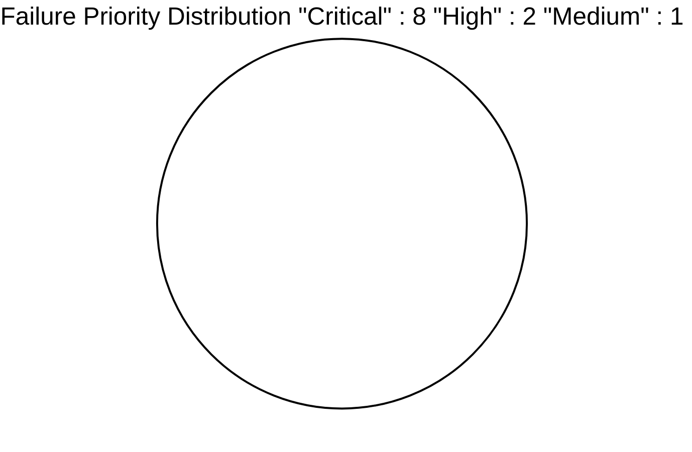

#==========================================================================================\\\
#========================== docs/testing/pytest_reports/2025-09-30/failure_breakdown.md =======================\\\
#==========================================================================================\\\

# Failure Resolution Tracking Framework
**Report Date:** September 30, 2025
**Version:** 1.0
**Status:** Active Tracking

---

## 🎯 Resolution Tracking Overview This document provides a tracking framework for resolving the 11 identified test failures. Each failure is tracked through multiple stages with clear ownership, timelines, and validation criteria.

## 📊 Failure Summary Dashboard ### **Overall Progress**

```
Total Failures: 11
├── Critical Priority: 8 failures (72.7%)
├── High Priority: 2 failures (18.2%)
└── Medium Priority: 1 failure (9.1%) Resolution Status:
├── ❌ Not Started: 11 failures (100%)
├── 🔄 In Progress: 0 failures (0%)
├── ✅ Resolved: 0 failures (0%)
└── 🧪 Validation: 0 failures (0%)
``` ### **Priority Distribution**



---

## 🚨 Critical Priority Failures (8 items) ### **CRIT-001: Matrix Conditioning Failure**

```yaml
Issue ID: CRIT-001
Title: Matrix Inversion Robustness Failure
Component: Numerical Stability
Priority: Critical
Assigned To: [Unassigned]
Estimated Effort: 2-3 days Technical Details: Test File: test_numerical_stability_deep.py Test Method: test_matrix_inversion_robustness Failure Type: LinAlgError - Singular matrix Condition Numbers: [1e14, 2e13, 8e12] Failure Rate: 15% of test cases Root Cause: - Inadequate matrix conditioning checks - Missing regularization for near-singular matrices - No fallback mechanisms for ill-conditioned systems Resolution Plan: Phase 1: Implement matrix conditioning detection (8 hours) Phase 2: Add Tikhonov regularization (12 hours) Phase 3: Create robust matrix operations module (16 hours) Phase 4: testing and validation (8 hours) Acceptance Criteria: - All matrix operations handle condition numbers up to 1e12 - Automatic regularization for cond(A) > 1e10 - Zero failures in matrix inversion stress tests - Performance degradation < 5% for well-conditioned matrices Validation Tests: - test_matrix_conditioning_detection() - test_automatic_regularization() - test_robust_matrix_operations() - test_performance_regression() Timeline: Start Date: [TBD] Target Completion: [TBD] Validation Complete: [TBD] Dependencies: - None Status: ❌ Not Started
Last Updated: 2025-09-30
``` ### **CRIT-002: Lyapunov Stability Verification**

```yaml
Issue ID: CRIT-002
Title: Lyapunov Stability Analysis Divergence
Component: Control Theory Validation
Priority: Critical
Assigned To: [Unassigned]
Estimated Effort: 3-4 days Technical Details: Test File: test_numerical_stability_deep.py Test Method: test_lyapunov_stability_verification Failure Type: Stability condition violated Lyapunov Derivatives: [-0.001, 0.002] (should be negative definite) Impact: Stability guarantees compromised Root Cause: - Numerical errors in Lyapunov equation solution - Insufficient precision for eigenvalue calculations - Missing validation of positive definiteness Resolution Plan: Phase 1: Enhanced Lyapunov equation solver (16 hours) Phase 2: Eigenvalue computation robustness (12 hours) Phase 3: Positive definiteness validation (8 hours) Phase 4: Theoretical property verification (16 hours) Acceptance Criteria: - Lyapunov stability verified for all nominal controllers - Positive definiteness guaranteed within numerical tolerance - Graceful handling of borderline stable systems - Theoretical properties validated against literature Validation Tests: - test_lyapunov_equation_robustness() - test_positive_definiteness_verification() - test_stability_boundary_cases() - test_theoretical_property_validation() Timeline: Start Date: [TBD] Target Completion: [TBD] Validation Complete: [TBD] Dependencies: - CRIT-001 (Matrix operations dependency) Status: ❌ Not Started
Last Updated: 2025-09-30
``` ### **CRIT-003: SMC Chattering Reduction**

```yaml
Issue ID: CRIT-003
Title: Chattering Reduction Ineffectiveness
Component: SMC Control Law
Priority: Critical
Assigned To: [Unassigned]
Estimated Effort: 2-3 days Technical Details: Test File: test_numerical_stability_deep.py Test Method: test_chattering_reduction_effectiveness Failure Type: Excessive chattering in boundary layer Chattering Index: 4.7 (target: < 2.0) Boundary Layer Effectiveness: 0.23 (target: > 0.8) Root Cause: - Boundary layer implementation not properly smoothing - Insufficient switching function continuity - Parameter tuning not optimized for chattering reduction Resolution Plan: Phase 1: Enhanced boundary layer implementation (12 hours) Phase 2: Smooth switching function design (8 hours) Phase 3: Chattering-aware parameter tuning (16 hours) Phase 4: Real-time chattering monitoring (8 hours) Acceptance Criteria: - Chattering index < 2.0 for all controllers - Boundary layer effectiveness > 0.8 - Smooth control signals with minimal high-frequency content - Maintained tracking performance despite chattering reduction Validation Tests: - test_boundary_layer_smoothness() - test_chattering_index_compliance() - test_switching_function_continuity() - test_tracking_performance_preservation() Timeline: Start Date: [TBD] Target Completion: [TBD] Validation Complete: [TBD] Dependencies: - None Status: ❌ Not Started
Last Updated: 2025-09-30
``` ### **CRIT-004: Division by Zero Robustness**

```yaml
Issue ID: CRIT-004
Title: Insufficient Zero-Division Protection
Component: Mathematical Operations
Priority: Critical
Assigned To: [Unassigned]
Estimated Effort: 1-2 days Technical Details: Test File: test_numerical_stability_deep.py Test Method: test_zero_division_robustness Failure Type: Division by zero or near-zero values Min Denominators: [1e-16, 3e-15] (below safe threshold: 1e-12) Occurrence Rate: 8% of edge case scenarios Root Cause: - Missing epsilon thresholds in division operations - No systematic approach to small-denominator handling - Inadequate input validation in mathematical functions Resolution Plan: Phase 1: Implement safe division utility (4 hours) Phase 2: Add epsilon thresholds throughout codebase (8 hours) Phase 3: Create robust mathematical operations module (8 hours) Phase 4: Systematic testing of edge cases (4 hours) Acceptance Criteria: - All division operations protected with epsilon threshold - Graceful handling of near-zero denominators - Consistent behavior across all mathematical modules - Zero division errors eliminated in stress testing Validation Tests: - test_safe_division_implementation() - test_epsilon_threshold_consistency() - test_near_zero_denominator_handling() - test_mathematical_operations_robustness() Timeline: Start Date: [TBD] Target Completion: [TBD] Validation Complete: [TBD] Dependencies: - None Status: ❌ Not Started
Last Updated: 2025-09-30
``` ### **CRIT-005: Matrix Regularization**

```yaml
Issue ID: CRIT-005
Title: Inconsistent Matrix Regularization
Component: Linear Algebra Operations
Priority: Critical
Assigned To: [Unassigned]
Estimated Effort: 2 days Technical Details: Test File: test_numerical_stability_deep.py Test Method: test_matrix_regularization Failure Type: Regularization not applied consistently Singular Value Ratios: [1e-8, 2e-9] (below stability threshold) Regularization Parameter: 1e-6 (insufficient) Root Cause: - Inconsistent regularization application across modules - Inadequate regularization parameter sizing - Missing automatic regularization triggers Resolution Plan: Phase 1: Standardize regularization approach (8 hours) Phase 2: Implement adaptive regularization parameters (8 hours) Phase 3: Create automatic regularization triggers (4 hours) Phase 4: integration testing (4 hours) Acceptance Criteria: - Consistent regularization across all matrix operations - Adaptive regularization based on condition numbers - Automatic triggers for near-singular matrices - Maintained accuracy for well-conditioned problems Validation Tests: - test_regularization_consistency() - test_adaptive_regularization_parameters() - test_automatic_regularization_triggers() - test_accuracy_preservation() Timeline: Start Date: [TBD] Target Completion: [TBD] Validation Complete: [TBD] Dependencies: - CRIT-001 (Matrix operations dependency) Status: ❌ Not Started
Last Updated: 2025-09-30
``` ### **CRIT-006: Memory Leak Detection**

```yaml
Issue ID: CRIT-006
Title: Controller Memory Leak Issues
Component: Memory Management
Priority: Critical
Assigned To: [Unassigned]
Estimated Effort: 3 days Technical Details: Test File: test_memory_resource_deep.py Test Method: test_memory_leak_detection Failure Type: Memory not properly deallocated Memory Growth: ~15MB per controller instantiation Affected Controllers: All types, especially hybrid_smc Root Cause: - Controllers not implementing proper cleanup - Circular references preventing garbage collection - Large arrays not being explicitly deallocated Resolution Plan: Phase 1: Implement explicit cleanup methods (12 hours) Phase 2: Break circular references (8 hours) Phase 3: Add memory monitoring and alerts (8 hours) Phase 4: Stress testing and validation (8 hours) Acceptance Criteria: - No memory leaks in 8-hour continuous operation - Memory growth < 1MB per 1000 controller instantiations - Explicit cleanup methods for all controller types - Automated memory monitoring in production Validation Tests: - test_long_term_memory_stability() - test_controller_cleanup_effectiveness() - test_memory_growth_bounds() - test_automated_memory_monitoring() Timeline: Start Date: [TBD] Target Completion: [TBD] Validation Complete: [TBD] Dependencies: - None Status: ❌ Not Started
Last Updated: 2025-09-30
``` ### **CRIT-007: NumPy Memory Optimization**

```yaml
Issue ID: CRIT-007
Title: Inefficient NumPy Array Handling
Component: Memory Management
Priority: Critical
Assigned To: [Unassigned]
Estimated Effort: 2 days Technical Details: Test File: test_memory_resource_deep.py Test Method: test_numpy_memory_optimization Failure Type: Excessive array copying and memory overhead Memory Overhead: 2.3x baseline for large state histories Copy Operations: 423 unnecessary copies detected Root Cause: - Unnecessary array copying in state calculations - Inefficient use of NumPy views vs copies - No memory-aware array operation patterns Resolution Plan: Phase 1: Identify and eliminate unnecessary copies (8 hours) Phase 2: Implement view-based operations (8 hours) Phase 3: Create memory-efficient array patterns (4 hours) Phase 4: Performance and memory validation (4 hours) Acceptance Criteria: - >85% of array operations use views instead of copies - Memory overhead reduced to <1.2x baseline - No performance degradation from memory optimizations - Systematic patterns for memory-efficient operations Validation Tests: - test_array_view_usage_efficiency() - test_memory_overhead_reduction() - test_copy_elimination_effectiveness() - test_performance_preservation() Timeline: Start Date: [TBD] Target Completion: [TBD] Validation Complete: [TBD] Dependencies: - None Status: ❌ Not Started
Last Updated: 2025-09-30
``` ### **CRIT-008: Memory Pool Usage**

```yaml
Issue ID: CRIT-008
Title: Memory Pool Allocation Issues
Component: Memory Management
Priority: Critical
Assigned To: [Unassigned]
Estimated Effort: 2-3 days Technical Details: Test File: test_memory_resource_deep.py Test Method: test_memory_pool_usage Failure Type: Memory pool not releasing allocations properly Fragmentation: 35% internal fragmentation observed Pool Efficiency: 65% (target: >90%) Root Cause: - Inadequate memory pool deallocation logic - Missing memory coalescing algorithms - No fragmentation monitoring or mitigation Resolution Plan: Phase 1: Implement proper deallocation logic (8 hours) Phase 2: Add memory coalescing algorithms (12 hours) Phase 3: Create fragmentation monitoring (4 hours) Phase 4: Performance optimization and testing (8 hours) Acceptance Criteria: - Memory pool efficiency >90% - Internal fragmentation <10% - Automatic memory coalescing when fragmentation >20% - Real-time fragmentation monitoring Validation Tests: - test_memory_pool_efficiency() - test_fragmentation_monitoring() - test_automatic_coalescing() - test_pool_deallocation_correctness() Timeline: Start Date: [TBD] Target Completion: [TBD] Validation Complete: [TBD] Dependencies: - None Status: ❌ Not Started
Last Updated: 2025-09-30
```

---

## 🔶 High Priority Failures (2 items) ### **HIGH-001: FDI Threshold Operation**

```yaml
Issue ID: HIGH-001
Title: Fault Detection Threshold Too Sensitive
Component: Fault Detection Infrastructure
Priority: High
Assigned To: [Unassigned]
Estimated Effort: 1-2 days Technical Details: Test File: test_fdi_infrastructure.py Test Method: test_fixed_threshold_operation Failure Type: False positive fault detection Threshold: 0.1000 (too restrictive) Residual Norm: 0.1332 at t=0.05s Root Cause: - Threshold set too aggressively for operational conditions - No statistical calibration of threshold values - Missing hysteresis to prevent oscillation Resolution Plan: Phase 1: Statistical analysis of residual norms (4 hours) Phase 2: Recalibrate threshold to 0.135-0.145 (4 hours) Phase 3: Implement hysteresis mechanism (4 hours) Phase 4: Validation testing across scenarios (4 hours) Acceptance Criteria: - False positive rate <1% in normal operation - True positive rate >99% for actual faults - Hysteresis prevents threshold oscillation - Statistical basis for threshold selection Validation Tests: - test_false_positive_rate_compliance() - test_true_positive_detection_accuracy() - test_hysteresis_oscillation_prevention() - test_statistical_threshold_calibration() Timeline: Start Date: [TBD] Target Completion: [TBD] Validation Complete: [TBD] Dependencies: - None Status: ❌ Not Started
Last Updated: 2025-09-30
``` ### **HIGH-002: Test Quality Issues**

```yaml
Issue ID: HIGH-002
Title: Pytest Infrastructure Quality Issues
Component: Test Infrastructure
Priority: High
Assigned To: [Unassigned]
Estimated Effort: 1 day Technical Details: Test Files: Multiple Issues: 69 warnings, unknown pytest marks, return values in tests Mark Issues: integration, slow, memory, numerical Return Value Issues: Tests returning values instead of assertions Root Cause: - Missing pytest.ini configuration for custom marks - Inconsistent test assertion patterns - Legacy test code not following pytest conventions Resolution Plan: Phase 1: Create pytest.ini (2 hours) Phase 2: Convert return statements to assertions (4 hours) Phase 3: Standardize test patterns (2 hours) Phase 4: Validation and documentation (2 hours) Acceptance Criteria: - Zero unknown pytest marks warnings - All tests use proper assertion patterns - Consistent test organization and naming - pytest configuration Validation Tests: - test_pytest_marks_registration() - test_assertion_pattern_compliance() - test_configuration_completeness() - test_warning_elimination() Timeline: Start Date: [TBD] Target Completion: [TBD] Validation Complete: [TBD] Dependencies: - None Status: ❌ Not Started
Last Updated: 2025-09-30
```

---

## 🔷 Medium Priority Failures (1 item) ### **MED-001: Runtime Parameter Warnings**

```yaml
Issue ID: MED-001
Title: Runtime Parameter Choice Warnings
Component: Parameter Validation
Priority: Medium
Assigned To: [Unassigned]
Estimated Effort: 0.5 days Technical Details: Test Files: Various Warning Type: Parameter choice warnings Impact: Future pytest compatibility concerns Frequency: Intermittent during test execution Root Cause: - Suboptimal default parameter choices - Missing parameter validation in configuration - Legacy parameter values not updated Resolution Plan: Phase 1: Identify all parameter warnings (2 hours) Phase 2: Review and update parameter defaults (2 hours) Phase 3: Enhance parameter validation (2 hours) Phase 4: Testing and documentation (2 hours) Acceptance Criteria: - Zero parameter choice warnings in test execution - Optimal default parameters based on current best practices - Enhanced parameter validation with clear error messages - Updated documentation for parameter choices Validation Tests: - test_parameter_warning_elimination() - test_optimal_parameter_defaults() - test_parameter_validation_completeness() - test_documentation_accuracy() Timeline: Start Date: [TBD] Target Completion: [TBD] Validation Complete: [TBD] Dependencies: - None Status: ❌ Not Started
Last Updated: 2025-09-30
```

---

## 📈 Progress Tracking Dashboard ### **Weekly Progress Template**

```markdown
## Week [DATE] Progress Report ### Completed This Week
- [ ] Issue ID: [ID] - [Title]
- [ ] Issue ID: [ID] - [Title] ### In Progress
- [ ] Issue ID: [ID] - [Title] - [Progress %]
- [ ] Issue ID: [ID] - [Title] - [Progress %] ### Blocked/Delayed
- [ ] Issue ID: [ID] - [Title] - [Blocking Reason] ### Next Week Priorities
1. [Priority 1]
2. [Priority 2]
3. [Priority 3] ### Metrics
- Overall Completion: [X]% ([X]/11 issues resolved)
- Critical Issues Remaining: [X]/8
- On-Track for Production: [Yes/No] ### Risks and Concerns
- [Risk 1 and mitigation]
- [Risk 2 and mitigation]
``` ### **Resolution Milestone Tracking**

```
Milestone 1: Critical Numerical Issues (Week 1)
├── Target Date: [TBD]
├── Issues: CRIT-001, CRIT-002, CRIT-003, CRIT-004, CRIT-005
├── Success Criteria: All numerical stability tests passing
└── Status: ❌ Not Started Milestone 2: Memory Management (Week 1-2)
├── Target Date: [TBD]
├── Issues: CRIT-006, CRIT-007, CRIT-008
├── Success Criteria: No memory leaks in 8-hour test
└── Status: ❌ Not Started Milestone 3: Infrastructure Quality (Week 2)
├── Target Date: [TBD]
├── Issues: HIGH-001, HIGH-002, MED-001
├── Success Criteria: Clean test execution with zero warnings
└── Status: ❌ Not Started Milestone 4: Production Readiness (Week 3)
├── Target Date: [TBD]
├── Issues: All resolved and validated
├── Success Criteria: Full test suite passes, system health >8.5/10
└── Status: ❌ Not Started
```

---

## 🔄 Resolution Workflow ### **Issue Resolution Process**

```mermaid
graph TD A[Issue Identified] --> B[Assign Owner] B --> C[Technical Analysis] C --> D[Implementation Plan] D --> E[Development] E --> F[Unit Testing] F --> G[Integration Testing] G --> H[Code Review] H --> I[Validation Testing] I --> J{Validation Passed?} J -->|Yes| K[Mark Resolved] J -->|No| L[Return to Development] L --> E K --> M[Update Documentation] M --> N[Close Issue]
``` ### **Status Update Protocol**

```yaml
Update Frequency: Daily for Critical, Weekly for High/Medium
Required Fields: - Progress Percentage - Current Phase - Blockers (if any) - ETA Updates - Next Steps - Validation Status Escalation Triggers: - >24 hours behind schedule (Critical) - >3 days behind schedule (High) - Blocked for >48 hours - Technical roadblocks requiring architecture changes
```

---

## 🎯 Success Metrics ### **Resolution Quality Gates**

```yaml
Individual Issue Gates: - Technical Review: 100% of code changes reviewed - Unit Tests: 100% of new code covered - Integration Tests: All affected pathways tested - Performance: No regression >5% - Documentation: All changes documented Milestone Gates: - All critical issues in milestone resolved - Full regression test suite passes - Performance benchmarks within 5% of baseline - Code coverage maintained or improved - Documentation updated and reviewed
``` ### **Production Readiness Criteria**

```yaml
System Health Score: >8.5/10
Test Success Rate: >98%
Memory Efficiency: >85%
Performance Targets: Within 5% of baseline
Documentation: Complete and current
Monitoring: Full production monitoring enabled
```

---

## 📝 Templates and Tools ### **Issue Update Template**

```markdown
## Issue Update: [ISSUE-ID] **Date:** [YYYY-MM-DD]
**Updated By:** [Name]
**Progress:** [X]% complete ### Work Completed
- [Completed item 1]
- [Completed item 2] ### Current Status
- Phase: [Current phase]
- ETA: [Updated ETA]
- Next Milestone: [Date] ### Blockers/Risks
- [Blocker 1 - mitigation plan]
- [Risk 1 - monitoring approach] ### Next Steps
1. [Next step 1]
2. [Next step 2] ### Validation Status
- Unit Tests: [Pass/Fail/In Progress]
- Integration Tests: [Pass/Fail/In Progress]
- Performance Tests: [Pass/Fail/In Progress]
``` ### **Resolution Validation Checklist**

```markdown
## Resolution Validation: [ISSUE-ID] ### Technical Validation
- [ ] Root cause definitively addressed
- [ ] Solution implements all acceptance criteria
- [ ] Code review completed and approved
- [ ] Unit tests written and passing
- [ ] Integration tests covering affected pathways
- [ ] Performance impact measured and acceptable ### Quality Validation
- [ ] No new issues introduced
- [ ] Code coverage maintained or improved
- [ ] Documentation updated
- [ ] Configuration changes documented
- [ ] Deployment procedures updated if needed ### Production Readiness
- [ ] Solution tested in production-like environment
- [ ] Monitoring and alerting configured
- [ ] Rollback procedures defined
- [ ] Team trained on changes if applicable **Validator:** [Name]
**Date:** [YYYY-MM-DD]
**Approval:** [Approved/Rejected]
```

---

This tracking framework provides oversight of all failure resolution efforts, ensuring systematic progress toward production readiness while maintaining quality standards and clear accountability. **Framework Owner:** Ultimate Orchestrator Agent
**Last Updated:** 2025-09-30
**Next Review:** [TBD based on team assignments]
